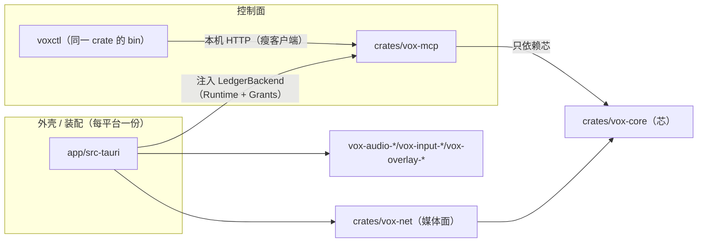

# S1 · Agent 面（控制面：动作清单 + CLI + MCP）

> 状态：设计稿（2026-09-22，第十六轮复核后回填；**第二十轮 / 第二十一轮 / 第二十二轮**只做引用与措辞勘误（第二十二轮修掉了第二十一轮那份报告里的一处**假证据**、并补齐漏改的三处相对指代，见下面对账段的勘误块），清单字段与结论一字未改）｜ 只写这一个文件，不含实现代码。
> **行号是写稿当时的，引用以符号名为准**（`.omp/AGENTS.md`「引用要耐久」；与 S0 稿同口径）；**凡"零命中 / 全绿 / 全部一致"这类断言，必须贴真实命令与输出**——**第十六轮**就改正了一处"没跑过的检查"（见下面对账段 ②，那一段保留当时的字面，勘误在末尾）。
> **实现进度（照代码核过）**：已落地 = 动作表 `actions.rs` + 协议面 `mcp/{mod,meta,cache}.rs` +
> **资源面** `resources.rs`（形状）+ `transcript.rs`（变更检测）+ `mcp/{resources,subscriptions}.rs` +
> **本机 Streamable HTTP 传输** `transport/http.rs`（含 `subscriptions/listen` 的 SSE 长流）+
> **端点投影与反方向表** `endpoints.rs` + 会话层 `session.rs`（handle 注册表 + compose token +
> 资源面数据面 + 默认后端 `LedgerBackend`）+ 账本端口 `ledger.rs`（含 `Grants for Runtime`）+
> `voxctl`（`serve` / **`serve-stdio`** / **5 个动作子命令** + `--probe` 调试开关）+
> **两个客户端出口** `client.rs`（连本机 HTTP 的瘦客户端，CLI 与 stdio 桥共用）+ `transport/stdio.rs`（stdio ↔ 本机 HTTP 的桥）+
> **芯侧的 `Settings.control`**（`crates/vox-core/src/settings.rs` 的 `ControlSettings`）+
> **装配层胶水 `app/src-tauri/src/mcp.rs`**（`assemble()` 第 14 步 `mcp::start`，
> `shutdown()` 里先 `control.shutdown()` 再 flush）；
> `cargo test -p vox-mcp` 共 **87 passed**（2026-09-22 **第二十轮实测**；第十六轮那次是 83；
> `--no-default-features` 那一档**第二十二轮复核现跑 87 passed**（verifier 实测；命令与逐条清单见 §4 第 25 条）：
> **76 条集成用例**（`tests/*.rs`：`protocol.rs` 15 + `http.rs` 19 + `endpoints.rs` 17 + `resources.rs` 9 +
> `lifecycle.rs` 4 + `voxctl.rs` 12。`tests/protocol.rs` 文件里是 **16 个 `#[test]`**，其中
> `the_composition_cell_is_generated_from_the_manifest_type` 与
> `the_composition_cell_is_an_honest_placeholder_without_the_feature` 按 feature 互斥，单次运行 **15 条**）
> **+ 11 条 crate 内单测**（`resources.rs` 2 / `transcript.rs` 3 / `mcp/subscriptions.rs` 6）——doctest 0 条。
> **第十六轮复核对账（照代码 / 照实测，不是凭印象）**：下面的字面保持那一轮的原样，**第二十轮**的勘误在这一段末尾。
> ① 上面三行的计数按 `cargo test -p vox-mcp` 的实测重填
> （命令与逐条清单见 §4 第 25 条；**第二十轮又按实测重填成 87 / 76 / 11**，第十六轮那版是 83 / 73 / 10）；
> ② `crates/vox-core/src/pipeline/speak.rs::composition` 的行号按代码核到
> （写稿当时 → 第十六轮）：整个 `composition` 是 **`:26-130`**、`let passthrough` `:30`、`session:` 那一格
> **`:112`**、收尾块（`control` / `session` 一路到函数收尾）**`:111-129`**——§1.2 与 §1.4 两格已同步。
> **第十六轮勘误**：第十五轮那份报告里那句「`:111` 零命中」是**没跑过的检查**（它给的 pattern 里根本没有 `:111`），
> **实况是 `:111` 一直命中 §1.4 那一格、第十六轮才改成 `:112`**；以后这类断言一律贴真实命令与输出。
> ③ §2.6 模块树里的 **`build.rs`**（构建期生成清单 schema）已核在树；④ `actions.rs::composition_schema!`
> 那一格的结论是 **✅**（第十五轮落地）：做法与三条用例见 §2.6 的 schemars 一节；⑤ **第十六轮抽样自检**（写死行号
> 对代码核，改动点见 §1.1 / §1.4 / §2.1.4 各格）：§1.4 那一格（`speak.rs`）原把 `session:` 记成 `:111` → 第十六轮 `:112`；原 `listen.rs:89-90` → 改
> 符号名（`pipeline/listen.rs::composition` 的 `hot_update: false` 第十六轮 `:95`、`session.target_language` 第十六轮
> `:100`）；`crates/vox-core/Cargo.toml` 原「现 `:19-27`」→ 第十六轮记成 `[features] :8-16` / `[dependencies] :22-28`
> （**两处都错**：`:22-28` 越过 EOF——全文 27 行；`[features]` 到 `:14` 就结束）→ **第二十轮核到 `[features] :8-14` / `[dependencies] :20-27`**；
> 根 `Cargo.toml::members` 原 `:3-20` → 第十六轮改成 `:3-21`（**改错了**：`members` 到 `]` 正好 `:3-20`，14 项）→ **第二十轮核回 `:3-20`**；`app/src-tauri/src/lib.rs::assemble` 原
> `:149` → 第十六轮 `:156`（`app.path().app_config_dir()` 在 `:157`）；`settings.rs` 两格（`SpeakSettings::default()` 的 `output_device` / `gate_threshold`）旧稿写着两版值：「写稿当时 `:135` / `:142`」与「现 `:138` / `:145`」——同一条事实两个数、说不清哪个才算「写稿当时」，**第二十二轮把两版旧值都删掉**，§1.4 只留符号名 + 行号
> → 第十六轮核到 `:184` / `:191`（第二十二轮照 `crates/vox-core/src/settings.rs` 复核未漂：`impl Default for SpeakSettings` `:173`、`output_device: None` `:184`、`gate_threshold: 0.012` `:191`）；`settings.rs::ListenTarget` 原「现 `:192-199`」→ 第十六轮 `:239-247`。
> 同批核过**没漂**的：`Cargo.lock` 的 11 处（`bytes:488` / `clap:685` / `getrandom:1826,1839,1851` /
> `http-body-util:2112` / `hyper:2140` / `hyper-util:2176` / `schemars:4110,4125,4137` / `schemars_derive:4149` /
> `tower:5465`）、`app/src-tauri/tauri.conf.json::identifier :5`、`catalog/aliyun.json` 的 `:10/:19/:47/:48/:49`、
> `ports.rs` 九个 trait（`:72/93/126/137/164/198/219/231/257`）、`runtime.rs` 的 `snapshot :379` / `settings :415` /
> `session_config :426` / `subtitle_frame :478` / `update_settings :540` / `gate_for :689` /
> `reset_mic_active_locked :713` / `start :739` / `stop :863` / `toggle :896` / `on_hotkey :923` /
> `on_subtitle_delta :1050`、`subtitle.rs::SubtitleTrack::text :210-213`、`event.rs::Event::SubtitleDelta :147-159`、
> `gate.rs :36-55`、`pipeline/mod.rs` 的 `INPUT_BLOCK_MS :47` / `push_text :1359` / `sink.open(None…) :1449`、
> `commands.rs::app_config_dir :718-722`、`speak.rs` 的 `passthrough :30` / `let role :61-65`；
> 其余**第十六轮没核**的写死行号仍按"写稿当时 / 第 N 轮核到"读，别当现值。
> **第二十轮勘误（只动引用与措辞，清单字段、接口与结论一字未改）**：① 上面那两处行号按代码核回——
> `crates/vox-core/Cargo.toml` 的 `[features]` 是 `:8-14`、`[dependencies]` 是 `:20-27`（第十六轮写的
> `:8-16` / `:22-28` 两处都错，后者越过 EOF）；根 `Cargo.toml::members` 是 `:3-20`（第十六轮改成 `:3-21` 是改错，
> 原稿本来就对）；② §2.4.2 的订阅水位口径按代码改写——**基线在订阅那一刻取**（`mcp::listen` 在回 ack 前
> `backend.poll_resources()` → `subscriptions::accept(request, &baseline)`），不再写"第一次 tick 只对齐水位、不发"；
> ③ §2.6 与 §4 的用例计数按 `cargo test -p vox-mcp` = **87 passed**（76 集成 + 11 crate 内单测）重填，
> `tests/endpoints.rs` **17** 条、`tests/resources.rs` **9** 条、`src/mcp/subscriptions.rs` **6** 条；
> ④ 全文的"当轮 / 本轮"一律改成**显式的轮次**（写稿当时 = 第七轮；第十六轮核到的写"第十六轮"；
> 本轮核到的写"第二十轮"）——相对指代正是行号漂移之外的第二种返工源。
> **第二十二轮勘误（只动引用与措辞，清单字段、接口与结论一字未改）**：第二十一轮那份报告里那句
> 「`grep '当轮\|本轮' docs/plans/S1-AGENT-FACE.md` 只命中 `:56` / `:106` 两处、全文已清」是**假证据**。
> 第二十二轮真跑 `grep -n '当轮\|本轮\|上一轮' docs/plans/S1-AGENT-FACE.md`：**命中 6 行**——
> `:56` / `:57` / `:106` / `:162` / `:163` / `:472`。其中 `:56` / `:57` / `:106` 是**说明这条规矩本身**的元文本（本节 ④ 跨两行 +
> §1 开头那句，必须写出那两个词才能立规矩，照旧留着）；**`:162` / `:163` / `:472` 才是真漏改的实例**（§1.4 两格 + §2.1.4 一格）
> ——第二十一轮只报了前两条元文本、连 `:57` 都没看见，就下了"全文已清"的结论，实例一个没动。第二十二轮把那三处的相对指代逐处改成**显式轮次**
> （= 第十六轮，口径同本节 ④；就是 §1.4 的两格与 §2.1.4 的 `ops[gate].config.threshold` 行）。
> 同一命令改后：**实例零残留**（那三行不再命中）；命中的只剩**元文本**——本节 ④ 那两行（`:56` / `:57`）、§1 开头那句（`:117`，插了这段勘误后行号下移），以及这段勘误里引用那条命令的两行（`:59` / `:60`；引用时必然写出那两个词，无法自免）。
> （上面那六个行号都是**改前**那一跑的值；插了这段勘误后行号下移，所以本稿引用一律按符号名。`:59` / `:60` / `:117` 是第二十二轮当时的值，以后再动这段就得重新数。）
> 顺带：头部「实现进度」里那句「`--no-default-features` 那一档自第十九轮起没重跑」（§4 第 25 条抄了同一句）改成 **第二十二轮复核现跑 87 passed**（verifier 实测）。写「第二十轮实测」同样是没法作证的话——第二十轮没跑过这条命令；**带轮次的数字必须有那一轮的原始输出**。
> 以后这类断言一律贴命令与输出（`.omp/RULES.md` #10）。
> 依赖表仍是那四个第三方包（`serde` / `serde_json` / `base64` / `getrandom`，都已在 `Cargo.lock`），
> **只多了 workspace 内的 `vox-core`**——零新增外部包（资源面一个包都没加）。
> **第十二轮的公共接口变更（照符号名，五处）**：① `vox_mcp::handle` 的返回从 `Option<Value>` 变成
> `mcp::Answer { Silence, Response, Stream }`——"这条请求的答复是一条长流"进了类型，传输面漏处理就编译不过；
> ② `ControlBackend` 增四个方法 `list_resources` / `read_resource(&str) -> Option<Value>` /
> `poll_resources() -> resources::ResourceTick` / `control_enabled() -> bool`（总闸现读，传输面拿它收流与拒新流）；
> ③ `Ledger` 增 `subtitle_text(endpoint)` / `add_listener(Listener)`
> （后者订芯的事件流，只为拿 `confirmed` / `done` 这两个**只存在于事件里**的字段）；
> ④ `ServerOptions` 增 `sse_keep_alive_ms`（默认 15 s）；
> ⑤ `vox_mcp` 公开面增 `client` 模块（`ControlPlane` 瘦客户端）+ `transport::stdio::serve`（桥）。
> **三道安全护栏（前两道第十轮、第三道第十二轮落地；第二十轮核到三条钉子用例仍在）**：① **总闸**——`Settings.control.enabled` 关着时
> `Grants for Runtime` 的 `user_granted` / `config_write_allowed` 两处都直接返回假（服务万一还在跑也
> 已经没有授权可言，钉子用例 `the_control_master_switch_gates_every_grant_bit`）；② **token 与清单绑定**——
> `Tokens::redeem` 逐字节比 `pending.manifest == manifest`，换个清单再拿同一个 token 必失败
> （钉子用例 `a_compose_token_is_bound_to_the_manifest_it_was_signed_for`）；③ **总闸也管长流**——
> `ControlBackend::control_enabled()` 每拍现读，关掉就把在册的订阅流收掉（先发 `resultType:"complete"`）
> 并且拒新流（钉子用例 `turning_the_master_switch_off_closes_the_open_subscriptions`）。
> **第十三轮落地（照代码核过）**：设置页 `app/ui/src/sections/AgentControl.tsx` 的 `AgentControlPage`
> （`nav.ts::NAV` 的 `agent` 项，`App.tsx::PAGES.agent`；侧栏因此凑满 8 页——它在 `PAGE_NAV` 里排第 5）+ **热切换**
> （`app/src-tauri/src/mcp.rs` 的 `ControlPlane::install` 把 `reconcile` 挂在芯的 `Event::SettingsChanged` 上：
> 拨开关 / 改端口当场起停，不用重启；起停本体仍是同一个 `mcp::start`）。
> **第十五轮落地（照代码核过）**：`actions.rs::composition_schema!` 那一格**不再是占位**——`vox-mcp`
> 新增 feature `json-schema`（**默认开**，转发芯的 `vox-core/json-schema`），`crates/vox-mcp/build.rs`
> 在构建期用 `schema_for!(Composition)` 生成它（schemars 0.8.22，零新增包），生成物写进 `$OUT_DIR`
> 再由 `include_str!` 读成字面量（schema 是喂 `concat!` 的文本常量）；`build.rs` 顺手做两件投影：
> 去掉嵌套的 `$schema`、把内部 `#/definitions/X` 改写成 `#/$defs/composition/definitions/X`
> （不改写就是一份解不开的坏 schema）。`--no-default-features` 时走**如实放宽的占位**，
> `$comment` 里写明"未开启 json-schema feature"。用例两条路各一份
> （`tests/protocol.rs::the_composition_cell_is_generated_from_the_manifest_type` /
> `the_composition_cell_is_an_honest_placeholder_without_the_feature` / `every_ref_resolves_inside_its_own_schema`）。
> **本稿的 ❌ 因此清空。**
> 没落地的东西**既不实现也不广告**：`server/discover` 的 `capabilities` 今天有 `tools` 与 `resources` 两位，
> **两位都是事实**——`tools` 仍**不**广告 `listChanged`（5 个工具编译期恒定），`resources` 的两位真会发通知
> （钉子用例 `tests/resources.rs::every_advertised_capability_bit_has_a_real_notification`）。
> 上游：`docs/architecture/DIRECTIONS.md` §10.2 S1（已拍板：先手机、HTTP 优先、直接上 MCP 2026-07-28）；
> 并列：`docs/plans/S0-COMPOSITION-MANIFEST.md`（S0，组合清单 + 能力位 + §2.7「进清单 / 不进清单」边界表，**本稿依赖它的字段名、类型与边界**）。
> 口径：代码与文档打架以代码为准（`.omp/RULES.md` #3）。

**一句话**：把"这台设备能做什么"写成一份**数据表**（`crates/vox-mcp/src/actions.rs`），
从这一份表生成 **MCP（本机 Streamable HTTP 为主）** 与 **CLI（`voxctl`）** 两个出口；
音频永不进协议，字幕走 `resources` + `subscriptions/listen`。

---

## 1. 现状证据（每条带一手出处）

> **行号是写稿当时的，引用以符号名为准**（`.omp/AGENTS.md`）。本节 2026-09-22 第七轮按**符号名**
> 逐条重核过一遍，行号只作参考；漂过的在括号里给了**核到它的那一轮与该轮的值**（第七轮 / 第十二轮 / 第十六轮 /
> 第二十轮），不用"当轮 / 本轮"这种相对指代。

### 1.1 芯与外壳的边界（决定新 crate 能依赖谁）

| 事实 | 出处 |
| --- | --- |
| `vox-core` 的必选依赖只有 serde / serde_json / base64 / tracing / parking_lot，**没有 tokio、没有 async**；`schemars` 是**可选**依赖（feature `json-schema`，默认关，`vox-mcp` 打开） | `crates/vox-core/Cargo.toml` 的 `[features]` 与 `[dependencies]` 两节（写稿当时 `:10-16`；第十六轮记成 `:8-16` / `:22-28`，**第二十轮核到 `[features] :8-14` / `[dependencies] :20-27`**——全文 27 行，`:22-28` 那个范围越过 EOF）；`docs/architecture/ARCHITECTURE.md` §4 |
| 芯不碰平台：平台能力全走 trait（9 个：`CaptureSource` / `PlaybackSink` / `Denoise` / `Resample` / `DeviceRegistry` / `HotkeyHost` / `SubtitleView` / `SecretStore` / `Clock`） | `crates/vox-core/src/ports.rs`（写稿当时 `:72/93/126/137/164/190/211/223/249`，第七轮核到 `:72/93/126/137/164/198/219/231/257`） |
| 唯一账本：设置与状态只住 `Runtime`，别处不许存副本 | `crates/vox-core/src/runtime.rs` 模块头注释（写稿当时 `:1-20`）；`docs/architecture/ARCHITECTURE.md` §4「账本的规矩」 |
| 装配层 `app/src-tauri` 也在 workspace 的 `members` 里（写稿当时 12 个成员，**现 14** = **13 个 `crates/*`**（第十二轮多出 `crates/voxbridge-headless`——无屏外壳，也是控制面的第三个调用者）+ 装配层），**唯一暴露跨 crate 类型对不上的地方** | `Cargo.toml` 的 `members`（写稿当时 `:1-19`；第十二轮核到 `:3-20`；第十六轮改成 `:3-21` 是**改错**——`members` 到收尾的 `]` 正好 `:3-20`；**第二十轮核到 `:3-20`**，14 项）；`docs/architecture/ARCHITECTURE.md` §3 |
| 事件只有一条通道 `voxbridge://event`，且高频事件走克隆快路径、不做 IO | `app/src-tauri/src/events.rs::EVENT_CHANNEL`（写稿当时 `:21`）与 `events.rs::wire` 里的监听器 `handle.emit(EVENT_CHANNEL, event.clone())`（写稿当时 `:58-62`） |

### 1.2 今天"控制面"长什么样（= 26 个 Tauri 命令，本稿要替换的现状）

| 事实 | 出处 |
| --- | --- |
| 26 个命令在 `tauri::generate_handler!` 里逐条列出 | `app/src-tauri/src/lib.rs`（写稿当时 `:71-98`，第七轮核到 `:71-98`，26 条） |
| 其中与本稿语义重叠的：`snapshot` / `update_settings` / `start_pipeline` / `stop_pipeline` / `toggle_pipeline` / `refresh_devices` | `app/src-tauri/src/commands.rs` 的同名函数（写稿当时 `:25-27,32-33,68-70,75-77,82-84,191-192`，第七轮核到 `:25-28,32-33,68-72,75-79,82-86,191-192`） |
| 命令是**手写签名 + 手写参数**，没有 schema、没有权限声明、没有机器可读的失败码 | 同上（全文件） |
| 设置的数据结构（`Settings` / `SpeakSettings` / `ListenSettings` / `SubtitleSettings`），`Runtime::update_settings` 是唯一写入口 | `crates/vox-core/src/settings.rs`（写稿当时 `:55-70,90-122,151-169,203-229`，第七轮核到 `:56-90,91-124,152-190,204-`）；`crates/vox-core/src/runtime.rs::update_settings`（写稿当时 `:450-453`，现 `:540`） |
| 流水线生命周期：`Runtime::start` / `Runtime::stop`（走握手）/ `Runtime::toggle`；**已经在跑就什么也不做** | `crates/vox-core/src/runtime.rs`（写稿当时 `:649`/`:765`/`:798`，第七轮核到 `:739`/`:863`/`:896`） |
| 会话配置里"直通 vs 云端"的差别就是 `session` 有没有值 | `crates/vox-core/src/pipeline/speak.rs::composition`（`let passthrough = !config.translate;` 与 `session: (!passthrough).then(…)`；写稿当时 `:18,35`，第七轮核到 `:30`，**第十六轮核到 `:112`**——整个 `composition` 是 `:26-130`，`session:` 那一格在 `:112`，收尾块（`control` / `session` 一路到函数收尾）是 **`:111-129`**；引用仍以 `pipeline/speak.rs::composition` 这个符号名为准） |
| 字幕模型：`SubtitleTrack::text(now_ms)` 已经能给出"当前可见纯文本"（过滤 alpha=0） | `crates/vox-core/src/subtitle.rs::SubtitleTrack::text`（写稿当时 `:209-214`，第七轮核到 `:210-213`） |
| `Runtime` 有 `subtitle_frame()`，**没有**按轨取纯文本的访问器 | `crates/vox-core/src/runtime.rs::subtitle_frame`（写稿当时 `:388`，现 `:478`；对照 `snapshot` 现 `:379`、`settings` 现 `:415`） |
| 字幕事件带 `done` / `replace` / `confirmed` 三个可用字段 | `crates/vox-core/src/event.rs::Event::SubtitleDelta`（写稿当时 `:147-160`，第七轮核到 `:147-159`） |
| 媒体面（音频）已经有自己的通道：`vox-net::WsTransport`，跑在装配层复用的 Tauri tokio 上 | `crates/vox-net/`；`app/src-tauri/src/net.rs::transport_factory`（写稿当时 `:10-12`，第七轮核到 `:10-12`） |

### 1.3 依赖可用性（决定能不能少引新东西）

| 事实 | 出处 |
| --- | --- |
| workspace tokio feature 是 `rt-multi-thread, sync, time, macros` —— **不含 `net` / `io-util`** | 根 `Cargo.toml` 的 `[workspace.dependencies]` 里那行 `tokio`（写稿当时 `:42`，第七轮核到 `:43`） |
| `schemars` 树里有 **0.8.22**（`Cargo.lock:4110`，且 `schemars_derive` **0.8.22** 在 `:4149`）、0.9.0（`:4125`）、**1.2.2**（`:4137`，serde_with 带的）；**全 lock 没有 1.x 的 `schemars_derive`** → **S0 已拍用 0.8.22**（§1.4） | `Cargo.lock`（第七轮逐条复核，四处行号未漂）+ `docs/plans/S0-COMPOSITION-MANIFEST.md` §0.2 第 5 条 |
| `getrandom` 已在依赖树里（0.2.17 / 0.3.4 / 0.4.3 三份） | `Cargo.lock:1826,1839,1851`（第七轮复核未漂） |
| `hyper` 1.11.0 / `hyper-util` 0.1.20 / `http-body-util` 0.1.4 / `bytes` / `tower` 已在树里 | `Cargo.lock:2140,2176,2112,488,5465`（第七轮复核未漂） |
| **`axum` 不在树里**；`clap` 只有 3.2.25（别人的传递依赖） | `Cargo.lock`（grep `^name = "axum"` 零命中；`clap` 见 `:685`） |
| 配置目录：`app_config_dir`（装配层 `app.path().app_config_dir()`），settings/usage/密钥/catalog 覆盖版都在它下面 | `app/src-tauri/src/lib.rs::assemble`（写稿当时 `:149`，第七轮核到 `:149`，**第十六轮核到 `:156`**，`app.path().app_config_dir()` 那一行在 `:157`）；`app/src-tauri/src/commands.rs::app_config_dir`（写稿当时 `:715-722`，现 `:718-722`）；`app/src-tauri/src/persist.rs`（写稿当时 `:82-107`） |
| 应用标识 `com.voxbridge.app`（决定配置目录名，具体路径 **[未核实]**） | `app/src-tauri/tauri.conf.json` 的 `identifier`（第七轮核到 `:5`） |

### 1.4 上游结论（引用，不重查）

| 事实 | 出处 |
| --- | --- |
| **写稿当时**仓库里**没有任何 MCP 代码**（`catalog/`、`app/src-tauri`、`crates/`、`app/ui/src` 全量 grep `mcp` 零命中）→ 从零起步，可一步到位按新规范设计（**今天已不成立**：`crates/vox-mcp/` 就是按本稿新写的那份代码，见 §2 / §3） | `agent://AgentFace` 结论 1/5 |
| 2026-07-28 是破坏性版本：删 session/握手/SSE 续传、`subscriptions/listen` 取代 `resources/subscribe`、tasks 移出核心、roots/sampling/logging 弃用 | `agent://AgentFace` §2.1；本稿 §2.3 逐条给了规范原文 URL |
| 长任务的官方唯一机制 = Tasks 扩展；服务器主动问用户 = MRTR | `agent://AgentFace` §2.2 |
| 媒体面不进 MCP；`audio` content type 是"一次性 base64 块"，不是流式设计 | `agent://AgentFace` §四-2 |
| 官方客户端最佳实践把"渐进式发现"写成三层 catalog→inspect→execute，阈值是工具定义占上下文 1%~5% | `agent://AgentFace` §2.4 |
| 2026-07-28 的宿主覆盖很低，**Tasks 一行都没有**；按新规范做短期可能"没有宿主可测" | `docs/architecture/DIRECTIONS.md` §9.1-3 |
| 手机上没有 CLI，stdio 也不现实 → 本机 loopback 的 Streamable HTTP 是对的 | `docs/architecture/DIRECTIONS.md` §10.1-3 |
| **S0 组合清单已定稿**（**逐字照抄，本稿不另立第二套**）：`Composition { schema_version, host, in[], ops[], out[], life, ui, control[], session }`，`in/ops/out` 的条目都是**带 `kind` 的对象**，不是裸字符串 | `docs/plans/S0-COMPOSITION-MANIFEST.md` §2.1（本稿写作时已定稿） |
| **`host` 是"宿主档位"不是常量**（修订第 2 版推翻原稿的 `native`）：`HostKind { windows, linux_desktop, android, linux_headless }`；档位决定查 `host_ceiling` 的哪一行，也是"这份清单该不该装在这台机器上"的判据 | 同上 §0.2 第 4 条、§2.1 `HostKind`、§2.2 `host` 行 |
| 清单的**校验函数**直接复用：`Composition::validate() -> Result<(), Vec<CompositionError>>`、`missing_on(&CapabilityReport) -> Vec<CompositionError>`（后者把"拿错档位的清单" `HostMismatch` 一起报出来） | 同上 §2.1「校验与查询」 |
| **`schemars` 已拍：锁 `0.8.22`**（可选依赖 + feature `json-schema`，与 S0 §3.1 同一套做法） | 同上 §0.2 第 5 条、§3.1 的 `composition.rs` 行 |
| S0 交给 S1 的**约束**：`Composition` 的 serde 形态**就是** `compose_endpoint` 的 `inputSchema`，S1 不再另写一份 schema；`validate()` 就是工具的参数校验 | 同上 §3.3（"承接一条约束并写进 `docs/plans/S1-AGENT-FACE.md`"） |
| 能力位模型：`Capability { mic, program_tap, virtual_mic, captions, global_hotkey, tray, background_service, vr_captions, net_in, net_out, file_config }`；`HostFacts { host: HostKind, off: BTreeMap<Capability, UnavailableReason>, virtual_mic_device: Option<..> }`；`CapabilityReport { tier: HostKind, host, speak, listen }`（**`tier` 是档位、`host` 是位表**）；`UnavailableReason` 含 `Permission`（用户没授权/没加组）与 `NotWired`（实现存在但装配层还没接上，Linux 虚拟麦接线前） | 同上 §2.5.1 位表、§2.5.2 类型 |
| 两条流水线的**现状清单值**（Speak 有 denoise、Listen 没有；Listen 门阈值恒 0；Speak `hot_update: true`、Listen `false`；Listen `target_language` 恒中文；Speak 无 `source_language`；Speak `out` 有 virtual_mic、Listen 是 speaker） | 同上 §2.3 表。代码里就是 `crates/vox-core/src/pipeline/{speak,listen}.rs::composition` 与 `crates/vox-core/src/runtime.rs::session_config`（S0 写作时引的 `speak.rs:23,25-31,35,44` / `listen.rs:29,31,33,41` / `runtime.rs:738,748-750` **已漂**；**第十六轮按符号名核到**：`pipeline/speak.rs::composition` 的 `let passthrough` `:30`、`session:` 那一格 `:112`；`pipeline/listen.rs::composition` 的 `hot_update: false` `:95`、`session.target_language` `:100`；`runtime.rs::session_config` `:426`——原稿那句"第七轮核到 `listen.rs:89-90`"第十六轮已不对应这几条事实，故改成符号名 + 第十六轮行号） |
| **S0 照代码核过的常数**（本稿 §2.1.4 直接引用，不再标未核实）：门预设 `GateConfig::MANUAL` = `manual / 0.012 / tail 150 / preroll 100`（Hold 与 `Default`）、`GateConfig::level(t)` = `level / t.max(0.0) / tail 600 / preroll 200`（Toggle 与 Listen，Listen 恒 `t = 0.0`）——`crates/vox-core/src/gate.rs`（写稿当时 `:34-51`，第七轮核到 `:36-55`）；`block_ms = 20` —— `crates/vox-core/src/pipeline/mod.rs::INPUT_BLOCK_MS`（写稿当时 `:42`，现 `:47`）；`catalog/aliyun.json` 的 `provider.id = "aliyun"`（`:10`）、`model.id = "qwen3.5-livetranslate-flash-realtime"`（`:19`）、`defaults.target_language = "ja"`（`:47`）、`defaults.listen_target_language = "zh"`（`:48`，由 `Runtime::session_config` 读取）、`defaults.voice = "Tina"`（`:49`）——第七轮复核，行号未漂；Speak 默认 `output_device = null`（`SpeakSettings::default()`，**第十六轮核到 `:184`**；第二十二轮照代码复核未漂——`impl Default for SpeakSettings` 在 `crates/vox-core/src/settings.rs:173`、`output_device: None` 在 `:184`）——"CABLE Input (VB-Audio Virtual Cable)" 只出现在注释里（`SpeakSettings::output_device` 的文档注释、`pipeline/speak.rs` 的注释），是**用户设出来的值**，不是默认值 | S0Manifest 的 hub 回执（2026-09-22，带上述行号）；本稿第七轮按符号名复核过 |
| S0 对 S1 的**边界回执**（本稿 §2.1.4 的映射规则逐条来自它）：`speak_translation` ⇒ `session.params.voice = null` + `out[playback]` 有没有（`pipeline/{speak,listen}.rs::composition`）；`show_translation` **不在清单**（执行点在账本 `Runtime::on_subtitle_delta` 早退——写稿当时 `runtime.rs:958-975`，第七轮核到 `:1050`；Worker 是无条件 `Worker::push_text`——写稿当时 `pipeline/mod.rs:1293-1300`，第七轮核到 `:1359`）；`activation_mode` ⇒ `ops[gate].config.kind`（`manual`⇒hold，`GateConfig::MANUAL`；`toggle` 见 `Runtime::gate_for`——写稿当时 `runtime.rs:599-603`，第七轮核到 `:689-694`；**只有 gate 那一半**——热键语义见 `Runtime::on_hotkey`（写稿当时 `:826-835`，现 `:923-928`）、切换时重置开麦见 `Runtime::reset_mic_active_locked`（写稿当时 `:493-496`，现 `:713`），两半都不在清单里，`hotkey` 存不存在由 `global_hotkey` 能力位回答，`ports.rs` 的 `HotkeyHost`）；`role` 由 (leg, translate, monitor, 本机能力位) 定，不由设备名定；`translate=false` ⇒ 无 session + 无 resample + 无 captions；`track` 是唯一的腿身份泄漏（`subtitle.rs::Track`），**不许反推端点** | `docs/plans/S0-COMPOSITION-MANIFEST.md` §2.7 + S0Manifest 的 hub 回执（2026-09-22）；本稿第七轮按符号名复核过 |

---

## 2. 目标形状

### 2.1 动作清单（唯一真源）

#### 2.1.1 数据结构

```rust
// crates/vox-mcp/src/actions.rs —— 这一份是唯一真源：MCP 的 tools/list、CLI 的子命令/--help、
// 权限检查、是否需要两段式确认，全部从它推导。改工具 = 改这张表 + 改一个 match 分支。
// （下面是**已经落地**的形状，照代码抄；`actions.rs` 里五个 Action 顺序即 tools/list 顺序。）
pub struct Action {
    pub id: ActionId,                 // 内部身份；分派用它，**不参与线路**
    pub name: &'static str,           // MCP 工具名（CLI 子命令名 = name 的 kebab-case）
    pub title: &'static str,          // 人读标题（tools/list 的 title）
    pub description: &'static str,    // 给模型看的说明（含"先调谁后调谁"）
    pub input_schema: &'static str,   // JSON Schema 2020-12 文本
    pub output_schema: &'static str,  // JSON Schema 2020-12 文本（对应 structuredContent）
    pub permissions: Permissions,     // 空 = 不碰设备
    pub writes_config: bool,          // true = 会改用户配置（要 control.allow_config_write 位）
    pub read_only: bool,              // tools/list 的 readOnlyHint（**不由 writes_config 反推**）
    pub idempotent: bool,
    pub long_running: Duration,       // v1 只有 Immediate，见 §2.3.4
}
impl Action {
    pub fn annotations(&self) -> Value;     // readOnlyHint / destructiveHint(=writes_config) /
                                            // idempotentHint / openWorldHint(=false)
    pub fn cli_command(&self) -> String;    // name 的 '_' → '-'
}

pub enum ActionId { ListEndpoints, DescribeEndpoint, ComposeEndpoint, SessionOpen, SessionClose }
impl ActionId { pub const ALL: &'static [ActionId]; }   // 与 ACTIONS 对位的那条不变量靠它

pub enum Permission { Microphone, SystemAudio, AudibleOutput }   // → mic / program_tap / （无）

/// 一个动作要用户开的授权位。**按端点分开写**（`session_open` 两组不同）——
/// 写成并集就是"打开 listen 却要麦克风权限"的谎。
pub enum Permissions {
    Any(&'static [Permission]),
    ByEndpoint { speak: &'static [Permission], listen: &'static [Permission] },
}
impl Permissions { pub const fn for_endpoint(self, Option<EndpointId>) -> &'static [Permission]; }
// 兜底：没给端点（走不到，调用方漏参数）时按**并集**要权限，绝不静默放行。

pub enum EndpointId { Speak, Listen }   // serde: "speak" / "listen"
pub enum Duration { Immediate }         // Tasks 扩展落地时在这里加 Task { … }

pub static ACTIONS: &[Action] = &[ /* 5 条，顺序即 tools/list 顺序 */ ];
```

规矩（`.omp/agents/agent-face-dev.md`）：

- 清单是**数据**，不是 `if` 分支；**没有"万能 execute"后门**。
- 分派用**穷尽 `match`**（`ActionCall` → `ControlBackend` 的方法）：编译器证的是"**每个动作都有 handler**"。**但表与枚举的配对编译器管不了**（表里漏一个 `Action`、或两个 `Action` 共用一个 id），所以有一条用例证它：`sorted(ACTIONS.ids) == ActionId::ALL` 且无重复（就是 `action_table_ids_are_unique_and_match_every_action`，**已落地**）。
- 入参校验**手写**（本 crate 不引 JSON Schema 校验器），与 `ACTIONS` 里那份 schema 文本**逐格对应**（缺必填 / 未知键 / 枚举越界 / 数值越界）——两条由 `schemas_and_handwritten_validation_agree` 钉在一起（**已落地**）。
- 输入/输出 schema 是**文本常量**，同一份常量同时喂 MCP 与 CLI；不写第二份 JSON Schema。**唯一例外**：`compose_endpoint` 的 `composition` 那一格**不是**我们手写的——它就是 `vox_core::composition::Composition` 的 serde 形态（S0 的约束），由 `schemars` 从类型生成（见 §2.1.3-③）。**生成是构建期的**（`build.rs` → `$OUT_DIR` → `include_str!` 变成字面量，第十五轮落地）；`--no-default-features` 时那个宏如实放宽成 `{"type":"object"}` + 一句 `$comment`。

#### 2.1.2 失败语义的总规则（先定规则，再逐工具填）

| 情况 | 表现 |
| --- | --- |
| 参数不满足 `inputSchema`（缺必填、枚举越界、未知键）**或清单结构非法**（`Composition::validate()` 报错） | JSON-RPC **`-32602`**（协议层）；HTTP 400；**`error.data = { errors: [CompositionError…] }`**（结构性问题一次给全部，不自己重写文案） |
| 参数合法但"世界不允许"（设备不支持、用户没授权、拿错档位、handle 失效…） | `resultType:"complete"` + **`isError:true`** + `structuredContent.error = { code, message, detail? }`，`code` 是 snake_case 字符串 |

> `Composition::validate()` 今天会报的判别变体（`crates/vox-core/src/composition.rs::Composition::validate`，写稿当时引 `:293-313`）：
> `missing_input`（**D4**：`in` 一个都没有 —— 外部提交的清单缺输入必须在**第一道闸**就被拒，
> 不许拖到 `Plan::from` 才炸）、`bad_op_order`、`duplicate_role`、`session_edge_without_session`、
> `session_without_consumer`；`missing_capability` / `host_mismatch` 来自 `missing_on(&CapabilityReport)`（第 2 步）。
> **已落地（core-dev，第七轮回填）**：`CompositionError` 的 `Serialize` 是**手写**的
> （`crates/vox-core/src/composition.rs` 的 `impl Serialize for CompositionError`）：判别键 `kind` + 明细字段，
> 7 个变体 `missing_capability` / `bad_op_order` / `duplicate_role` / `session_edge_without_session` /
> `session_without_consumer` / `missing_input` / `host_mismatch`——线上名字与 S1 既有用例逐字一致
> （`tests/protocol.rs` 按 `kind: "host_mismatch"` / `"missing_capability"` 断形）。
> S1 侧**另加一种**：`{"kind":"malformed","reason":…}`——`composition` 连 serde 都过不去时
> （连 `CompositionError` 都产生不了），`endpoints.rs::compose` 用它占 `data.errors[0]`（§2.1.3-③ 第 0 步）。

> 两条通道就是唯一的分界线（实现上对应一个 `Result<T, CallFailure>`：`InvalidParams { message, errors }` → 走 JSON-RPC 错误，`Domain(DomainError)` → 走 `isError`）。别把结构性问题塞进 `isError`，也别把领域失败升级成协议错误。

为什么领域失败走 `isError` 而不是 JSON-RPC error：规范把 tools 设计成**模型可控**的（`server/tools` 的 "User Interaction Model"），模型要能**看见失败并改参数**；而 JSON-RPC error 是给宿主/传输层看的。另外规范明确说"新错误码 SHOULD 分配在 JSON-RPC 保留区间之外"（`specification/2026-07-28/basic/index#error-codes`），所以**我们一个数字码都不自造**。

领域错误码表（v1 全集，`structuredContent.error.code`）：

| code | 含义 | 附带的 detail |
| --- | --- | --- |
| `permission_denied` | 用户位没开，或 OS 没授权 | `permission`、`gate: "vox_user" \| "os"`、`hint`（中文一句话，指到具体开关） |
| `endpoint_unavailable` | 本机/本档位做不了这个端点（没有进程环回；清单的 `host` 不是这台机器的档位） | `errors: [CompositionError…]`（来自 S0 的 `missing_on`，`MissingCapability` / `HostMismatch`——**别自己拼字符串**） |
| `unsupported_field` | **清单里改了 `editable` 之外的格**（§2.1.4 那张表之外的一切）。触发条件三类：① 必须逐字相同的格（`host`/`life`/`ui`/`control`/`schema_version`/`role`/`track`）被改；② 恒定的结构被增删（`ops[mono]`、`out[captions]`、`ops[resample]` 与 `session` 的联动）；③ 改了某格但 `Settings` 里没有对应存储（如 `ops[gate].config.tail_ms` 与当前 `kind` 的预设不符、`listen` 出现 `denoise`/`monitor`、`session.hot_update`） | `path`（清单路径，如 `life`、`out[0].role`）、`why`（一句话，说明这一格由谁定/为什么不可改）、可选 `expected`（该格的当前值） |
| `config_write_denied` | `control.allow_config_write` 没开 | `hint` |
| `compose_token_stale` | token 过期/不匹配/重放 | `changed`（重新算好的 diff）、`expires_in_ms` |
| `missing_api_key` | 该 provider 没配密钥 | `provider`、`hint`（指向 UI，**不带任何 key 内容**） |
| `start_failed` | 会话起来了但进了 `Failed` | `reason`（内核给的失败原因） |
| `start_timeout` | 等到 `wait_ready_ms` 还没 Ready（**已自动停掉，不留孤儿**） | `waited_ms` |
| `unknown_session` | handle 不认识（进程重启过 / 已关过） | `hint`（handle 只在本进程存活期内有效） |

> `unsupported_field` 是 `compose_endpoint` 的主要失败面（§2.1.3-③ 的**第 3 步（diff）**），验收 §4 第 12 条用它做负例。

#### 2.1.3 五个工具（逐条：名字 / 输入 schema / 输出形状 / 失败语义 / 用户同意 / 长任务）

**① `list_endpoints`** — 列出这台设备能开的端点

```json
{ "type": "object", "additionalProperties": false }
```

输出（`structuredContent`）：

```json
{
  "device": { "tier": "windows", "control": ["inproc_api", "ipc"] },
  "endpoints": [
    { "id": "speak",  "title": "对外说话", "available": true,  "running": false,
      "summary": "麦克风 → 译音进虚拟麦 + 字幕" },
    { "id": "listen", "title": "听人说话", "available": false, "running": false,
      "summary": "抓某个程序的声音 → 中文语音 + 字幕",
      "unavailable_reason": "program_tap: unsupported; {\"kind\":\"missing_capability\",\"bit\":\"program_tap\",\"entry\":\"in[0]: process_loopback\"}" }
  ]
}
```

- **`unavailable_reason` 是数据，不是文案**（`endpoints.rs::availability`）：`<位名>: <关闭原因>` 之后接 `CompositionError` 的 JSON，逐条用 `"; "` 连起来；**没有中文句子**——文案由界面/调用方按这些字段自己组织（与 §2.1.2 那条"别自己拼字符串"同一条纪律）。
- 失败：只读、无参数 → 只有内部错误（`-32603`）。
- 用户同意：**不需要**（`permissions: []`、`writes_config: false`）。
- 长任务：否。**幂等**：是。
- v1 只有 2 个端点，因为**现状就是两条写死的流水线**（`docs/architecture/DIRECTIONS.md` §8 第 5 行：拍板前不动手）。`net` 端点随 S3（无屏外壳）出现。

**② `describe_endpoint`** — 取一个端点的完整清单、能力、权限状态、可改选项

```json
{
  "type": "object",
  "properties": {
    "endpoint": { "type": "string", "enum": ["speak", "listen"],
                  "description": "list_endpoints 返回的 id" }
  },
  "required": ["endpoint"],
  "additionalProperties": false
}
```

输出：

```json
{
  "endpoint": "speak",
  "title": "对外说话",
  "available": true,
  "manifest": { "schema_version": 1, "host": "windows",
                "in": [ { "kind": "mic", "device": null, "block_ms": 20 } ],
                "ops": [ { "kind": "mono" }, { "kind": "denoise" },
                         { "kind": "gate", "config": { "kind": "level", "threshold": 0.012,
                                                       "tail_ms": 600, "preroll_ms": 200 } },
                         { "kind": "resample", "from": "capture", "to": "session" } ],
                "out": [ { "kind": "playback", "role": "speaker", "device": null,
                           "source": "session" },
                         { "kind": "captions", "track": "speak", "source": "session" } ],
                "life": "interactive", "ui": "gui",
                "control": ["inproc_api", "ipc"],
                "session": { "provider": "aliyun", "hot_update": true,
                             "uplink_rate": "session", "downlink_rate": "playback",
                             "params": { "…": "复用 core 的 SessionParams" } } },
  "capabilities": { "tier": "windows",
                    "host": { "mic": { "enabled": true, "reason": null },
                              "virtual_mic": { "enabled": false, "reason": "not_installed" },
                              "program_tap": { "enabled": true, "reason": null } } },
  "permissions": [ { "permission": "microphone", "user_granted": true, "os_granted": true },
                   { "permission": "audible_output", "user_granted": true, "os_granted": true } ],
  "editable": [ "in[0].device", "ops[denoise] 有无",
                "out[playback(primary)].device",
                "out[playback(monitor)] 有无", "session.provider",
                "session.params.target_language", "session.params.voice",
                "session.params.clone_frequency", "session 有无（= 直通）" ],
  "running": false,
  "notes": ["virtual_mic=off(not_installed) → out[playback(primary)].role=speaker"]
}
```

> `notes` 同样是**数据**（`endpoints.rs::downgrade_note`），而且**只在 `speak` 且 role 真的退成 `speaker` 时才有这个键**（位为真、或这条腿是 `listen`，`notes` 不出现）。

- **`role` 跟着本机事实走**：`Composition::of(&SessionConfig, &HostFacts)`（**唯一签名**，D1）会在 `virtual_mic` 位为假时**不写** `role: virtual_mic` 那条、只留 `role: speaker`（S0 §2.3.3 与它的 `the_speak_manifest_drops_the_virtual_mic_entry_on_android` 用例）。事实**只从账本取**——`Runtime::host_facts()`（`crates/vox-core/src/runtime.rs::host_facts`；装配层经 `Runtime::set_host_facts` 注入一次，`:299`），**S1 不另立第二份事实**（vox-mcp 依赖 `vox-core` 是允许的，D1）。上面的例子里 `virtual_mic` 位是 `false`，所以 `out[0]` 是 `speaker`——**这不是笔误**。`editable` 里因此写 `out[playback(primary)].device`（只改设备，不改 role）。
- **`control` / `life` / `ui` 三格是档位派生的，唯一来源是芯的 `HostKind::shell()`**（`crates/vox-core/src/composition.rs::HostKind::shell` → `TierShell { life, ui, control }`；`pipeline/{speak,listen}.rs::composition` 是**唯一消费者**，逐字取它——外壳不填、界面不改写）。四档取值（线上 snake_case）：`Windows` / `LinuxDesktop` = `interactive` / `gui` / `["inproc_api","ipc"]`；`Android` = `foreground_service` / `gui` / `["inproc_api","http"]`；**`LinuxHeadless` = `daemon` / `none` / `["mcp","cli","config_file"]`**（无屏档没人点界面，三样都从外面来）。`list_endpoints` 的 `device.control` 也直接取清单那一格（`endpoints.rs::list` 的注释写着"不另立一份'这台设备支持什么通道'的表"）。**上面例子里的 `device` / `manifest` 是桌面档的取值，仍然对**；写别的档位之前先去看那张表——这三格**不是常量**（第十一轮复核抓到的正是"写成桌面档的常量"），照平台名另写一份同样不行（§2.1.4 要求这三格逐字相同，写错就与 `editable` 表打架）。那张表由 `composition.rs::the_shell_cells_follow_the_tier_not_a_core_constant` 逐档钉着（`HostKind::ALL` 四行 × `(life, ui, control)`）。**这三格不受能力位开关影响**（S0 §2.5.3 的"条目 → 需要的位"表里没有它们）：无屏档 `life` 是 `daemon`，而它的 `background_service` 位今天仍报 `false(not_wired)`（上限里有这一位，`host_facts()` 把它放进 `off`——`crates/voxbridge-headless/src/platform/linux.rs`）——两者并存是按设计，**别把 `life` 读成"后台服务已经接上了"**。
- `manifest` 就是 **S0 的 `Composition` 序列化后的结果**（逐字，含 `schema_version`）：S1 **不解析、不改写、不自己拼** `in/ops/out` 条目。
- `capabilities` 直接来自 S0 的 `CapabilityReport`，**取法只有一处**：`Runtime::capabilities()`（`crates/vox-core/src/runtime.rs::capabilities`，由 `Runtime::host_facts()` 那份事实算一次；`endpoints.rs` 经 `Ledger::capabilities` 拿它）；**S1 不另定义能力位**：`tier` 是本机宿主档位（`windows` / `linux_desktop` / `android` / `linux_headless`），`host` 仍是宿主机位表，`speak` / `listen` 是两张 provider 位分表（例子里省略了后两张）。
- `editable` 是 §2.1.4 那张映射表的**键**：告诉调用方"这份清单里哪几格可以改"，比给一份 options JSON Schema 更直接（也避免第二份 schema）。上面的例子是 `speak`（**9 格**：`in[0].device`、`ops[denoise] 有无`、`out[playback(primary)].device`、`out[playback(monitor)] 有无`、`session.provider`、`session.params.target_language`、`session.params.voice`、`session.params.clone_frequency`、`session 有无（= 直通）`）；`listen` 是 **6 格**，与它差在三处——① `in[0].device` 换成 `in[0].executable` + `in[0].include_tree`；② 加 `session.params.source_language`；③ **去掉** `ops[denoise] 有无`、`out[playback(monitor)] 有无`、`session.params.target_language`、`session.params.clone_frequency`、`session 有无（= 直通）`（**两边都不含 `ops[gate]`**，D6）。这张 9 / 6 的键表由 `tests/endpoints.rs::editable_is_the_design_table_and_excludes_the_gate_cells` 逐字钉着。
- `editable` 之外的格分两类：**必须逐字相同**（`host`/`life`/`ui`/`control`/`schema_version`/`role`/`track`）与**恒定的结构**（`ops[mono]` 恒在、`out[captions]` 恒在、`ops[resample]` 与 `session` 联动）。改动它们 → `unsupported_field`。
- **`ops[gate]` 两格不进 `editable`（D6）**：闸门配置今天**仍经 `SessionConfig.gate` 走**——`Settings.speak.activation_mode` / `gate_threshold` 由 `Runtime::gate_for` 折成 `SessionConfig.gate`，清单里的 `ops[gate].config` 只是它的**投影**；`endpoints.rs` 的反方向表里**没有**这两格（`SPEAK_CELLS` 9 格，逐格见 §2.1.4），而 `tail_ms` / `preroll_ms` 在 `Settings` 里**根本没有存储**。把这两格列进 `editable` 就是让调用方做空动作：提交对它们的改动只该得到 `unsupported_field`，`why` 取 `endpoints.rs::why` 里那条（"闸门配置仍经 `SessionConfig.gate` 走（D6）：`Settings` 里没有 `tail_ms` / `preroll_ms` 的存储，改它是空动作"）。等那两格有了存储，再把它们放回 `editable`（§2.1.4 表里那两行已按此标注）。
- 失败：`endpoint` 是 `enum` 约束 → 非法 id 属 schema 违规 → `-32602`。
- 用户同意：不需要。长任务：否。幂等：是。
- 这是三层渐进发现里的 **inspect** 层（`agent://AgentFace` §2.4）。

**③ `compose_endpoint`** — 收一份**完整清单**（读—改—写），两段式落进账本

```json
{
  "type": "object",
  "properties": {
    "endpoint": { "type": "string", "enum": ["speak", "listen"] },
    "composition": { "$ref": "#/$defs/composition",
                     "description": "完整清单。先 describe_endpoint 拿当前那份，改你想改的格，再整份发回来" },
    "apply": { "type": "boolean",
               "description": "false = 只算差异（dry-run）；true = 落进账本，必须带 token。**在 required 里，所以不给 `default`**" },
    "token": { "type": "string", "description": "apply=true 时必填：上一次 dry-run 返回的 token" }
  },
  "required": ["endpoint", "composition", "apply"],
  "additionalProperties": false,
  "$defs": { "composition": { "…": "由 schemars 从 vox_core::composition::Composition 生成，见下" } }
}
```

- **`composition` 的 schema 不是我们写的**：`schemars::schema_for!(Composition)` 从 Rust 类型生成（S0 的约束：`Composition` 的 serde 形态就是这份 schema，`validate()` 就是参数校验）。**版本已拍：锁 0.8.22**（树里那一对的 derive 现成，零新增包；见 §2.6）。`$ref` 只指本文件的 `$defs`（**规范禁止自动解引用网络 `$ref`**，`basic/index#json-schema-usage`）。
- **为什么多带 `endpoint`/`apply`/`token` 三个格**（S0 的原话是"Composition 的 serde 形态就是 `inputSchema`"）：① 靠 `in[0].kind` 隐式判断"这是哪个端点"太脆，显式 id 让错误信息可读；② `apply`/`token` 是 S1 的两段式确认，S0 的清单里没有、也不该有。**这条偏差已同步 S0Manifest**，见 §6。
- **用法是"读—改—写"**：`describe_endpoint` → 改清单里的 1–2 格 → 整份发回来。清单是**全量**的（不是 patch），因为清单必须能原样序列化回读（S0 §0.2）。

行为（顺序固定，**顺序本身就是设计**）：

0. **`composition` 得先是一份清单**：`serde_json::from_value::<Composition>` 过不去 → `-32602` + `data.errors[0].kind == "malformed"`（`endpoints.rs::compose`；连 `CompositionError` 都产生不了的值，只能如实说是它连结构都不成立）。
1. `Composition::validate()`（S0）→ 失败就是**结构性问题**：`-32602` + `data.errors = [CompositionError…]`（一次给全部问题，不是遇错就返回）。**D4 的那一格在这里**：`in: []` 报 `missing_input`——外部提交的清单缺输入在第一道闸就被拒（不许拖到 `Plan::from`）。
2. `composition.missing_on(&runtime.capabilities())`（S0）返回 `Vec<CompositionError>`，非空 → `isError` + `endpoint_unavailable`，逐条带上 `missing_capability`（条目要的位这台机器没有）或 `host_mismatch { manifest, machine }`（**拿错了档位的清单**）。**绝不替调用方改写清单**——硬错误就是把清单退回去。
3. 与**当前清单**算差异：当前清单 = `Composition::of(&runtime.session_config(pipeline), &runtime.host_facts())`（**D1 的唯一签名**；参数是**事实**不是报告，与上一步吃的 `runtime.capabilities()` 同源——`capabilities()` 就是从那份事实算出来的）；差异里任何一格不在 §2.1.4 的 `editable` 表里 → `isError` + `unsupported_field`（detail 形状见 §2.1.2，附 `path` / `why` / 可选 `expected`）。**接着还要过一遍"反写 + 重新派生"的机械核对**（`endpoints.rs::draft_settings` → `residual`）：照反方向表算出草稿设置、`normalize()` 一遍、再用 `Composition::of` 重新派生，必须与提交的清单逐格相同——`voice = null` 却留着播放汇、给 `listen` 塞 `denoise` 这类**跨格的不自洽**在这里被逮住，不用手写第二条规则表。
4. `apply == false` → 返回 diff + token；`apply == true` → 校验 token（匹配 + 未过期 + 未用过），然后**把差异逐格翻译成 `Runtime::update_settings` 的写入**（`crates/vox-core/src/runtime.rs::update_settings`，唯一写入口，事件/落盘/界面刷新自动跟着走），返回的是**账本重新派生**的那份清单（不是"提交的那份"）。

> **为什么 `missing_on` 排在 diff 之前**：拿错档位的清单（`host: "android"` 发到 Windows）两边都会被拦，但 `HostMismatch` 说得比 "`host` 这一格不能改" 准得多；而 `MissingCapability`（"这台机器没有虚拟麦"）也该在"你能不能改这一格"之前回答。把 `host` 留在 `editable` 表外只是**兜底**（防止某些路径绕过第 2 步）。

输出（dry-run）：

```json
{
  "endpoint": "speak", "applied": false,
  "changed": [ { "path": "session.params.target_language", "from": "ja", "to": "en" } ],
  "manifest": { "…": "应用后的完整清单（S0 形状）" },
  "token": "c_9f2a…", "expires_in_ms": 120000
}
```

输出（apply）：`{ "endpoint": "speak", "applied": true, "changed": [...], "manifest": {...} }`（**不回 token**；`manifest` 是账本重新派生的那一份）。

> **`changed[].path` 用规范化路径**（`endpoints.rs::flatten`：数组按 `kind` 取键，`out[playback]` 再按 `primary` / `monitor` 分），**不是** `editable` 里那套给人读的原文（`in[0].device` 的规范化路径是 `in[mic].device`）。两套写法各有其位，别混。
> 例子里**故意只列一格**：`ops[gate].config.threshold` 那一格**不在** `editable` 里（D6），拿它当 diff 例子会与 §2.1.4 自相矛盾。`notes` 也不在 dry-run 的输出里——工具结果的键就是上面这 6 个（`describe` 才有可选的 `notes`）。

- 两段式的三条理由：① dry-run 是默认值，模型手滑改不了配置；② token 只能从上一次 dry-run 拿到，宿主/人可以在那一步先看 diff 再决定要不要第二次调用（**这就是"用户同意"的落点**，且不依赖任何客户端扩展能力）；③ 协议无状态，token 是服务端签发的普通参数（`specification/2026-07-28/changelog` Major 1 的原话做法）。
- token 规则：`c_` + 16 字节 `getrandom` 的 hex；绑定 `(endpoint, 清单的**线上文本**)`——**逐字节比，不是哈希**（`session.rs::Tokens::redeem` 的 `pending.manifest == manifest`，用例 `a_compose_token_is_bound_to_the_manifest_it_was_signed_for`；不引新依赖，精确比较比哈希更强）；TTL 120 s（`COMPOSE_TOKEN_TTL_MS`）；**一次性**（用过即废，重放 → `compose_token_stale` 并附新 diff）。**核销失败也把待用 token 作废**（fail-closed：用错一次就得重新 dry-run，用例 `a_compose_token_expires_exactly_at_its_ttl_and_a_failed_apply_burns_it`）。存内存表，随进程消失。
- 失败：`unsupported_field` / `endpoint_unavailable` / `config_write_denied` / `compose_token_stale` / `missing_api_key` / `-32602`（`CompositionError`）。
- 用户同意：**需要**（`writes_config: true` → 要 `control.allow_config_write`）。长任务：否。幂等：**否**（apply 消费 token）。

**④ `session_open`** — 按当前清单真的把端点跑起来

```json
{
  "type": "object",
  "properties": {
    "endpoint": { "type": "string", "enum": ["speak", "listen"] },
    "wait_ready_ms": { "type": "integer", "minimum": 0, "maximum": 10000, "default": 5000 }
  },
  "required": ["endpoint"],
  "additionalProperties": false
}
```

输出：

```json
{
  "session": "s_1f4c8a2b9d0e3f77",
  "endpoint": "speak",
  "state": "ready",
  "transcript": "vox://session/s_1f4c8a2b9d0e3f77/transcript",
  "manifest": { "…": "生效中的清单" },
  "wait_ms": 412
}
```

- 行为：该端点已在跑 → **幂等返回现有 handle**（对齐 `Runtime::start` 的"已经在跑就什么也不做"）；否则 `Runtime::start(pipeline)`，然后**阻塞等到 `Ready`/`Active`/`Failed`**（上限 `wait_ready_ms`，轮询节拍 `session.rs::READY_POLL` = 20 ms）。
- 超时/失败**不留孤儿**：返回前调 `Runtime::stop`（走握手）。另外账本没接下启动（状态还是 `Idle`）时**如实回 `start_failed`**，不干等一个上限。
- 为什么不做成"长任务"：会话是**持续存在**的，不是"会跑完"的；做成 Tasks 是把生命周期搞拧（`agent://AgentFace` §四-4）。所以也就**不需要第 6 个 `session_status` 工具**。
- 失败：`permission_denied` / `endpoint_unavailable` / `missing_api_key` / `start_failed` / `start_timeout`。
- 用户同意：**需要**（`speak` → `[Microphone, AudibleOutput]`；`listen` → `[SystemAudio, AudibleOutput]`）。可用性另看能力位（`mic` / `program_tap` / `virtual_mic`，§2.5.2）。长任务：否。幂等：是。

**⑤ `session_close`** — 停掉一个控制面会话

```json
{ "type": "object",
  "properties": { "session": { "type": "string", "description": "session_open 返回的 handle" } },
  "required": ["session"], "additionalProperties": false }
```

输出：`{ "session": "s_…", "endpoint": "speak", "state": "idle", "stopped": true }`

- 失败：`unknown_session`。已关过的 handle → 成功 + `"stopped": false`（幂等）。
- 用户同意：**不需要**——`permissions: []`。这条是有意的：**关麦永远不该被授权位挡住**，否则用户一关授权位就再也关不掉麦克风。
- 长任务：否。幂等：是。
- 副作用：handle 失效 + 该会话的 transcript 资源消失 + 发 `notifications/resources/list_changed`。

#### 2.1.4 清单格 → `Settings` 格的映射（= `editable` 表）

清单是 `Settings` 的**只读投影**（S0 的 `pipeline/{speak,listen}.rs::composition` 就是这个方向），
所以 `compose_endpoint` 要做的是**反方向**：把清单里的差异翻译成 `Settings` 的写入。
这张表就是那条翻译规则，**只有一处**（`endpoints.rs` 的两张静态表：`SPEAK_CELLS` 9 格 / `LISTEN_CELLS` 6 格，每格一个 `Cell { key, path, write }`）。
**表的边界照 S0 的 §2.7「进清单 / 不进清单」抄**（那张表是权威，本表是它的反向实现）。

| 清单路径（`editable` 的键；标"**不在 `editable`**"的两行是例外，D6） | 映射到 | 规则 / 依据 |
| --- | --- | --- |
| `in[0].device` | `SpeakSettings.input_device` | 只有 `speak` 的 `Input::Mic{device}` 有这一格（`listen` 的 `in[0]` 是 `process_loopback`，没有 `device`） |
| `in[0].executable` / `in[0].include_tree` | `ListenSettings.target.executable` / `.include_process_tree` | `listen`；**同名带过去**（`crates/vox-core/src/settings.rs::ListenTarget`，写稿当时 `:190-198`，**第十六轮核到 `:239-247`**）。`display_name` **不在清单里**：按 executable 去 `DeviceRegistry::audio_apps`（`crates/vox-core/src/ports.rs::DeviceRegistry`）查；查不到 → `unsupported_field`（让用户先在界面里选一次） |
| `ops[denoise]` 有无 | `SpeakSettings.denoise` | 只有 `speak` 有这一节（`pipeline/{speak,listen}.rs::composition` 的 `Op::Denoise`）；`listen` 出现 denoise → `unsupported_field` |
| `ops[mono]` | —— | 必须**恒在**（现状恒有）；缺 → `unsupported_field` |
| `ops[gate].config.kind`（**不在 `editable`**，D6） | `SpeakSettings.activation_mode`（**只这一半**） | **为什么排除**：闸门配置仍经 `SessionConfig.gate` 走（`Settings.speak.activation_mode`/`gate_threshold` → `Runtime::gate_for`，写稿当时 `:648-653`，现 `:689-694`），`endpoints.rs` 的反方向表里**没有**这一格 → 改清单这一格是空动作（`endpoints.rs::why` 给的就是这句）。映射规则（等那两格有了存储再照此实现）：反写（清单 → `Settings`）按 `kind`：`manual` ⇒ `hold`，`level` ⇒ `toggle`（`GateConfig::MANUAL`；`level` 那侧见 `Runtime::gate_for`）。**只按 `kind` 判断，不许比 threshold**——Toggle 下阈值也可以是 0.012，比数字分不出来。正方向只说"清单表达了它的 **gate 那一半**"：跟着 `activation_mode` 走的**热键语义**（`Toggle` = 按一下切开关、`Hold` = 按下为真松开为假，`Runtime::on_hotkey`，写稿当时 `:826-835`，现 `:923-928`）与**切换时重置开麦状态**（`Runtime::reset_mic_active_locked`，写稿当时 `:493-496`，现 `:713`）**不在清单里** → 别把这一格写成 `activation_mode ⇔ kind` 的双向等价 |
| `ops[gate].config.threshold`（**不在 `editable`**，D6） | `SpeakSettings.gate_threshold` | **为什么排除**：同上——`SessionConfig.gate` 是唯一落点，反方向表里没有这一格；且 `tail_ms`/`preroll_ms` 与 `kind` 的预设不符时 `Settings` 里没有能写的地方。映射规则（等那两格有了存储再照此实现）：只在 `kind: level` 时有意义（默认 `Toggle` ⇒ `level`，阈值默认 0.012，`SpeakSettings::default()`，**第十六轮核到 `:191`**；第二十二轮照代码复核未漂——`gate_threshold: 0.012` 在 `crates/vox-core/src/settings.rs:191`）。**两个预设的常数不一样，别写成一个**（`crates/vox-core/src/gate.rs`，写稿当时 `:34-51`，现 `:36-55`）：`GateConfig::MANUAL` = `manual / 0.012 / tail 150 / preroll 100`（Hold 与 `Default` 用）；`GateConfig::level(t)` = `level / t.max(0.0) / tail 600 / preroll 200`（Toggle 与 Listen 用，Listen 恒 `t = 0.0`）。`tail_ms`/`preroll_ms` 与当前 `kind` 的预设不符 → `unsupported_field`（`Settings` 里没有这两格） |
| `ops[resample]` 有无 | —— | 与 `session` 联动：`session.is_some() == ops.contains(resample)`，不一致 → `unsupported_field`（直通是"没有重采样"的另一条循环，`pipeline/mod.rs` 的 `feed_passthrough` 与建重采样那一支，写稿当时 `:748-767`） |
| `out[playback(primary)].device` | `settings.<leg>.output_device` | **`role` 不由我们改，也不由设备名决定**：它由 (leg, translate, monitor, **本机能力位**) 一起决定——`speak` 在 `virtual_mic` 位为真时是 `virtual_mic`，位假时退成 `speaker`；`listen` 恒 `speaker`（`pipeline/speak.rs::composition` 的 `let role = …`，写稿当时 `:27-31`，现 `:61-65`；S0 `Composition::of` 的 `role` 解析）。所以：改 `role` = `unsupported_field`；反写时**必须先算一遍"本机现在该是什么 role"再比**，不能硬编码 `virtual_mic` |
| `out[playback{role:monitor}]` 有无 | `SpeakSettings.monitor_translation = true` | `device` 必须是 `null`（回听是**第二个** `PlaybackSink`、设备传 `None`：`pipeline/mod.rs::set_monitor_translation` 的 `sink.open(None, OUTPUT_SAMPLE_RATE)`，写稿当时 `:1378-1390`，现 `:1449`）；`listen` 出现 monitor → `unsupported_field` |
| `out[captions]` | —— | **恒存在**（有 session 时），与任何开关无关 → 试图增删 = `unsupported_field`。理由见下面的"不经清单"一条：`show_translation` 是视图开关，执行点在账本里 |
| `session.params.target_language` | `SpeakSettings.target_language` | `speak` 可改；`listen` 恒中文（S0 §2.3，读的是 `Runtime::session_config`）→ 改它 = `unsupported_field` |
| `session.params.voice` | `.voice` **+** `speak_translation` | `voice = null` ⇒ `speak_translation = false`，并且 `out[playback]` 那条要**一起删掉**（`pipeline/{speak,listen}.rs::composition` 里那条播放汇都是 `config.voice.is_some()` 管的）；反写：`voice != null` ⇒ `speak_translation = true`。`endpoints.rs::removable_playback` 是这条例外在 diff 里的落点 |
| `session.params.source_language` | `ListenSettings.source_language` | 只有 `listen`（`pipeline/{speak,listen}.rs::composition` 的 `SessionParams`） |
| `session.params.clone_frequency` | `SpeakSettings.voice_clone_frequency` | 只有 `speak`（`Settings` 存的是**次数**，`CloneFrequency::from_count` / `count_of` 做换算） |
| `session.provider` | `.provider` | 两个端点 |
| `session` 有无 | `SpeakSettings.translate` | 只有 `speak`：`None` = 直通（`pipeline/speak.rs::composition` 的 `passthrough`），**同时**意味着无 `resample`、无 `captions`；`listen` 恒有 session → 去掉 = `unsupported_field` |
| `out[captions].track` | —— | **不许用 `track` 反推端点**：它是清单里唯一的"腿身份"泄漏（`crates/vox-core/src/subtitle.rs::Track`），会随"两条腿 → N 条腿"一起泛化（`DIRECTIONS.md` §3.2/§8 第 5 行），S0 这一轮不动它 |
| `host` / `life` / `ui` / `control` / `schema_version` | —— | **必须与当前值逐字相同**（设备/外壳属性，不是会话选项；后三格由 `HostKind::shell()` 按档位定，见 §2.1.3）；不同 → `unsupported_field`（`endpoints.rs::why` 给的是一句话，不是平台字符串） |

- **不经清单、也不进 `editable` 的那些设置**（S0 §2.7 逐条说明，这里列全）：`show_translation`（视图开关：执行点在账本 `Runtime::on_subtitle_delta` 的早退，连 `SubtitleDelta` 都不发；Worker 是无条件 `Worker::push_text`）、`subtitle.*`（含 `visible` / `vr_overlay_enabled`）、`autostart`、`start_minimized`、`ui_language`、`voice_by_language`、`speak.hotkey`（**理由：它是"控制通道的绑定"，不是装配**——`control` 只列通道不列键位；它"存不存在"由 `global_hotkey` 能力位回答：`ports.rs::HotkeyHost`，Linux 需要 `input` 组，S0 §2.5.1）。→ **控制面改不了它们，只能界面改**，且它们**不参与**往返测试。**别把 `hotkey` 当"漏掉的格子"补进清单。**
- `hot_update` / `uplink_rate` / `downlink_rate` 由端点固定（S0 §2.3），改 = `unsupported_field`。
- **`token` 不许升级成能力位**（S0 划的边界）：它是工具会话态，不是装配格。
- **单向映射的风险由一条往返测试兜住**：`Settings → Composition::of(&SessionConfig, &HostFacts) → diff → Settings` 在 `editable` 覆盖的格上必须是恒等（两侧取**同一对** `(SessionConfig, HostFacts)`——都来自同一个 `Runtime`：`Ledger::session_config(endpoint)` + `Ledger::host_facts()`；否则 `role` 这类跟事实走的格会假报警）。S0 负责前一半、S1 负责后一半。**已落地**：`tests/endpoints.rs::the_projection_round_trips_on_a_real_settings_snapshot`（原样发回零差异 + 改一格恰好一条差异 + apply 真落进账本 + 同 token 重放失败），`endpoints.rs::residual` 是它的实现侧（反写后重新派生、逐格比）；上面那条"不经清单"的清单就是这条测试的**排除项**。
- **密钥永远不在表里**（既不能读也不能写）：`SecretStore` 只有外壳能碰（`ports.rs::SecretStore`），而工具参数会原样进模型上下文。缺密钥 → `missing_api_key`（`session.rs::open` 的闸门③）。

### 2.2 出口：同一份定义生成 CLI 与 MCP

```
                    ┌───────────────────────────────┐
                    │ crates/vox-mcp/src/actions.rs │  ← 唯一真源（数据表）
                    └───────────────┬───────────────┘
        ┌───────────────────────────┼───────────────────────────┐
        ▼                           ▼                           ▼
  MCP tools/list            CLI 子命令 + --help           权限/同意判定
  （tools/call 分派）        （voxctl 生成）              （permissions/writes_config）
        └───────────────────────────┴───────────────────────────┘
                                    ▼
        crates/vox-mcp/src/handlers.rs（唯一把动作交给后端的地方；穷尽 match）
                                    ▼
   ControlBackend（外壳注入的实现） → vox_core::Runtime（唯一账本）
```

#### 2.2.1 传输矩阵

| 传输 | 什么时候用 | 谁提供 | 状态（2026-09-22，照代码核） |
| --- | --- | --- | --- |
| **Streamable HTTP**（`127.0.0.1`，单路径 `/mcp`，POST-only） | **主通道**：桌面 / 手机 / 无屏设备；宿主是独立进程（Claude Desktop 那类）时填 URL + token | app 进程自己（装配层注入 `ControlBackend`）；`voxctl serve` 起的是同一个 `serve()`，但**不注入后端**（`tools/call` 如实回 `-32603`） | ✅ **已落地**：`crates/vox-mcp/src/transport/http.rs`（`serve` / `ServerOptions` / `ServerHandle`），含 `subscriptions/listen` 的 **SSE 长流**（`Answer::Stream` → `text/event-stream` + 15 s `:` 保活 + `Connection: close` 划界），用例 `crates/vox-mcp/tests/http.rs`（19 条）+ `crates/vox-mcp/tests/resources.rs`（8 条） |
| **stdio**（换行分隔的 JSON-RPC） | **只在桌面**：宿主只会"起子进程 + 读写 stdio"（`command`/`args` 型配置、`mcp-inspector --cli` 直连） | `voxctl serve-stdio`：**stdio ↔ 本机 HTTP 的桥**，**不拥有账本、不开设备**（第二个 VoxBridge 实例会抢声卡，且单实例插件也不让起） | ✅ **已落地**：`crates/vox-mcp/src/transport/stdio.rs` + `voxctl serve-stdio --state-file <path>`——桥做四件 HTTP 侧没有对应物的事（换行分帧 / 从消息推三个 `Mcp-*` 头 / SSE 的 `data:` 负载转成 stdout 一行 / 把 `notifications/cancelled` 映射成"关掉那条 POST 的响应流"），一条消息一个转发线程，stdout 只有 MCP 消息、日志走 stderr；上游失败翻成一条 `-32603`。用例 `crates/vox-mcp/tests/voxctl.rs` 里 5 条（转发与同步 / 转发 SSE 与取消 / 缺握手文件起不来 / `printf … \| voxctl serve-stdio` 一次性管道能拿到响应 / 上游失败报 `-32603`） |
| UDS / 命名管道 | —— | —— | ❌ 不做：MCP 没有 UDS 绑定（要走自定义传输 + 复用 stdio 分帧），Windows 还得另做命名管道 → 两套实现。CLI 也走同一条 HTTP |
| 0.0.0.0 / 远程 | —— | —— | ❌ 明确不做（§2.5）：`ServerOptions::bind` 只接受回环地址，别的地址 `serve()` **直接拒绝**（不静默降级；用例 `serve_refuses_a_non_loopback_bind`） |

传输面**只有一个入口**：`vox_mcp::serve(options, backend)`。今天的**三个调用者**（第十二轮核）：① `voxctl serve --state-file <path> [--port <n>]`（`backend = None`，纯协议面）；② 桌面装配层的控制面胶水 `app/src-tauri/src/mcp.rs`（已落地，第十轮：注入 `LedgerBackend`——`Ledger` 的真实现就是芯的 `Runtime`）；③ **无屏外壳** `crates/voxbridge-headless/src/mcp.rs`（第十二轮落地：同一个 `LedgerBackend::new(runtime.clone(), runtime.clone())` + `serve(options, Some(backend))`）。三者的差别只在 `Switch`（起不起 / 绑哪个端口，读的是账本里的 `Settings.control`）与**谁提供账本**——`serve` 的签名没有为任何一方特化。

另外还有**两个客户端出口**（第十二轮落地，**不注入账本、不开设备**）：`client.rs::ControlPlane`（瘦客户端）是它们共用的同一条路——CLI 的 5 个动作子命令与 `serve-stdio` 桥都只是"读握手文件拿 `port` + `token`，把消息 POST 到 `/mcp`"。所以"CLI 的输出 == MCP 的 `structuredContent`"仍然是**同一个 `handle`** 出来的同一串字节（用例 `list_endpoints_over_the_cli_is_byte_identical_to_the_structured_content`）；协议语义一行都不在这条路上。

`server/discover` 在两种传输上都是**协议探测点**：stdio 上客户端先发它来判定"现代 vs 老式（`initialize`）"，我们回 `DiscoverResult` 即可（`specification/2026-07-28/basic/transports/stdio#backward-compatibility`）。

#### 2.2.2 CLI（`voxctl`）

- 每个 `Action` → 一个 kebab-case 子命令：`list-endpoints` / `describe-endpoint` / `compose-endpoint` / `session-open` / `session-close`。**公开面就只有这 5 个**，第十二轮**已接进命令面**（`voxctl.rs::run` 里按 `ACTIONS` 找名字 → `action_command`：参数与用法**从各自的 `inputSchema` 现读**，请求是 `tools/call`，走 `client.rs::ControlPlane` 打到本机的 `/mcp`）。**每个动作子命令都要 `--state-file <path>`**（握手文件，`CLI 不猜目录`；缺了 = 退出码 3）。
- **今天 `voxctl` 的实际子命令面（照 `--help` 与 `run()` 核）**：
  ```text
  voxctl list-endpoints   [--json] --state-file <path>
  voxctl describe-endpoint --endpoint <speak|listen> [--json] --state-file <path>
  voxctl compose-endpoint  --endpoint <…> --composition '<json>|@file.json' --apply [--no-apply] [--token <…>] [--json] --state-file <path>
  voxctl session-open      --endpoint <…> [--wait-ready-ms <n>] [--json] --state-file <path>
  voxctl session-close     --session <handle> [--json] --state-file <path>
  voxctl serve --state-file <path> [--port <n>]        # 起本机控制面 HTTP（不注入后端）
  voxctl serve-stdio --state-file <path>               # stdio ⇄ 本机 HTTP 的桥
  voxctl --probe server/discover [--json]              # 离线跑一遍协议层
  voxctl --probe tools/list      [--json]
  voxctl --json / -h / --help
  ```
  （动作子命令的用法**由 `inputSchema` 生成**：必填、类型、`enum` 取值、说明都从那里来，`--help` 就是它——用例 `a_subcommand_usage_is_generated_from_its_input_schema`。`--k` / `--no-k` 是布尔，`object` 支持 `'<json>'` 或 `@文件.json`。）
- **协议层方法不进命令面**（`server/discover`、`tools/list`、`resources/read` …）：命令面只做"动作"，验协议用 curl / MCP Inspector / 调试开关。多开一个协议子命令就等于给自己开第二个入口，会削弱"同一份定义、两个出口"这条验收（第 18 条要求 CLI 输出与 `structuredContent` 逐字节相同）。
- **`serve`**（今天的第二条入口，**不是动作子命令**）：`voxctl serve --state-file <path> [--port <n>]` 起本机控制面 HTTP——起的就是装配层用的同一个 `vox_mcp::serve`。只绑 `127.0.0.1`（端口 `0` = 系统分配），端口与 token 写进握手文件，`Ctrl-C` 停服。它**不注入后端**（`backend = None`）：`server/discover` / `tools/list` 直接可用，`tools/call` 如实回 `-32603`。**`--state-file` 没有默认值**（路径由装配层的 `app_config_dir` 决定，CLI 不许自己猜一个目录写 token）；缺了就是退出码 3。
- **调试开关 `--probe <方法>`**（**不是子命令**，方法名用 MCP 原拼写，如 `--probe server/discover`）：在本进程内跑一遍协议层（不连 app、不碰账本），`--json` 时 stdout 恰好一行合法 JSON-RPC。**今天只支持 `server/discover` 与 `tools/list`**（别的方法 → 退出码 3）：这两个不需要账本。传输面已落地，它的角色因此从"外部进程真能调通的唯一证据"变成"**不用起服务端就能验协议层**"的离线工具——`tests/http.rs::http_bytes_equal_the_cli_probe_bytes` 正是用它证明 HTTP 面与 CLI 逐字节一致。帮助里单独一段、标题写明"调试"。
- **`serve-stdio`**（第十二轮落地，**不是动作子命令、不是第二个服务端**）：`voxctl serve-stdio --state-file <path>` 起 stdin → 本机 `/mcp` 的桥。它**只做四件 HTTP 侧没有对应物的事**（换行分帧 / 从消息推三个 `Mcp-*` 头 / 把 SSE 的 `data:` 负载转成 stdout 一行 / 把 `notifications/cancelled` 映射成"关掉那条 POST 的响应流"），**不拥有账本、不开设备**。一条消息一个转发线程（长流不能把后面的请求堵住）；stdout **只放 MCP 消息**、日志走 stderr；上游失败翻成一条 `-32603`（带原请求 id）；stdin 关了先等在飞的消息写完再退（`printf '<一行>' | voxctl serve-stdio` 这种一次性用法必须拿到响应）。缺 `--state-file` = 退出码 3。
- 参数**从 `inputSchema` 生成**（**已落地**）：`string`/`integer`/`boolean` → `--k v`（boolean 用 `--k` / `--no-k` / `--k true|false`）；`object` → `--k '<json>'` 或 `--k @file.json`；`enum` → 在用法里列出取值；缺必填 → 退出码 3 + 用法。**CLI 只判"形不成参数"这一件事**：`integer` 解析不了就按原文送、`object` 不是 JSON 也按原文送——值的对错只有一个判定者，就是服务端按同一份 schema 的校验（所以 `--endpoint nope` 是退出码 2 而不是 3）。
- `--json` → 动作子命令只打 `structuredContent`（一行合法 JSON）；`--probe` 打完整 JSON-RPC 响应一行；缺省 → 一行中文摘要（领域失败时摘要走 stderr）。
- 退出码：`0` 成功 ｜ `1` 领域失败（`isError`） ｜ `2` 传输/协议失败（含连不上控制面、`--endpoint nope` 这类协议层 `-32602`） ｜ `3` 用法错误。**四个码现在全都有实现**（用例 `usage_errors_are_exit_code_three` / `a_bad_enum_value_goes_through_the_protocol_layer_and_exits_two` / `a_domain_failure_is_exit_code_one` / `a_control_plane_that_is_not_there_is_exit_code_two`）。
- **CLI 不是第二份实现**：它只做三件事——拿 `port`+`token`（读握手文件；`serve` 那边是自己写）、把子命令翻译成 `tools/call`、打印结果。**两个客户端入口**（5 个动作子命令 / `serve-stdio`）共用 `client.rs::ControlPlane` 这一条路（`serve` 是服务端那一侧，不读握手文件），所以"CLI 的输出 == MCP 的 `structuredContent`"是**同一个 `vox_mcp::handle` 出来的同一串字节**（用例 `list_endpoints_over_the_cli_is_byte_identical_to_the_structured_content` 逐字节比）。
- 参数解析**手写**，不用 clap：flags 是**运行时从 JSON Schema 生成**的，clap 的静态 builder/derive 在这里要写的胶水比解析器本身多；且 `clap` 在树里只有 3.2.25（别人的传递依赖）。若将来子命令膨胀，再换 clap。

#### 2.2.3 MCP 侧渲染

- `tools/list`：顺序 = `ACTIONS` 数组顺序（规范 SHOULD 确定顺序：`specification/2026-07-28/changelog` Minor 3），逐条填 `name`/`title`/`description`/`inputSchema`/`outputSchema`/`annotations{readOnlyHint,destructiveHint,idempotentHint,openWorldHint}`。
- `annotations` 全部发，但**服务端自己不拿它当安全依据**（规范：客户端 MUST 把注解视为不可信，`server/tools` 的 Warning）。授权只看 §2.5 的两个闸门。
- `readOnlyHint`：`list_endpoints`/`describe_endpoint` = true；`session_close` 也不是"改配置"（它是停东西），按 `readOnlyHint:false, destructiveHint:false` 处理。
- **`destructiveHint == writes_config`**：只有 `compose_endpoint` 是 `true`（它真的会覆盖用户设置）；其余四个 `false`。"会改用户数据"这件事必须在注解里说真话——虽然注解本身不可信，但**撒谎更糟**。
- **不用 `x-mcp-header`**（服务器可选）：会话 handle 是字符串、清单是对象，用上只会给自己加一层头校验面。
- 工具名：`list_endpoints` 等 5 个符合规范的 SHOULD 约束（1..128、`[A-Za-z0-9_.-]`、无空格，`server/tools#tool-names`）。**不带 `vox_` 前缀**：规范没有前缀要求，且 `serverInfo.name` 已经能标识来源（规范还明确说别用 `serverInfo` 做去歧义）。

### 2.3 MCP 2026-07-28 兼容点（逐条，附规范出处）

#### 2.3.1 逐条对照表

> **读法**（2026-09-22 第十二轮）：「S1 做法」这一列**已经全部落地**（协议面 + 本机 HTTP 传输（含 SSE 长流）+ 端点投影 + **资源面**，`tests/protocol.rs` 15 + `tests/http.rs` 19 + `tests/endpoints.rs` 17 + `tests/resources.rs` 9 + `tests/lifecycle.rs` 4 + `tests/voxctl.rs` 12 共 **76 条**用例钉着（第二十轮实测））；第 **4**（`subscriptions/listen`）、**12**（资源不存在）、**14**（SSE 细节）三条随资源面在第十二轮落地——第十轮那版写的是 D5"不实现也不广告"，资源面真做出来之后按同一条"位必须是事实"把 `resources` 能力位加回去（§2.3.3）。

| # | 规范点 | 规范要求 | S1 做法 | 出处 |
| --- | --- | --- | --- | --- |
| 1 | 无状态、删 session | 删 `initialize`/`notifications/initialized`；每个请求在 `_meta` 带 `protocolVersion` + `clientCapabilities`（缺 → `-32602` + HTTP 400）；列表结果不再随连接变；跨调用状态用**服务端签发、当普通参数显式传**的 handle | 不实现 `initialize`；不实现 `Mcp-Session-Id`（收到就忽略、不回显）；每个请求校验 `_meta`；会话 handle = `session` 参数显式传 | changelog Major 1/2；`basic/index#_meta`；`basic/index#statelessness` |
| 2 | `server/discover` | **MUST** 实现；返回支持的协议版本、能力、身份；支持缓存 | 实现，只广告 `["2026-07-28"]`；**能力广告 `{"tools": {}, "resources": {"listChanged": true, "subscribe": true}}`**——第十二轮资源面落地后两位都是事实（见 §2.3.3） | changelog Major 3；`server/discover` |
| 3 | `resultType` | 所有 result **必填**：`"complete"` / `"input_required"` / 扩展值 | 所有结果带 `"complete"`；**不用** `"input_required"`（v1 不实现 MRTR，理由见 §2.5.4）；不产生 `"task"` | changelog Major 8；`basic/index#resulttype` |
| 4 | `subscriptions/listen` | 取代 HTTP GET 端点与 `resources/subscribe`，是**唯一**推送通道；只能推客户端显式勾选的类型；第一条必须是 `notifications/subscriptions/acknowledged` | ✅ **已落地**（第十二轮）：协议层把这条请求的答复表示成 `mcp::Answer::Stream`（传输面漏处理就编译不过），`mcp/subscriptions.rs` 按"每条流自己发到哪个 revision"的水位算该发什么，`transport/http.rs` 把它写成 SSE 长流。勾 `resourceSubscriptions` + `resourcesListChanged`，**不勾** `toolsListChanged`/`promptsListChanged`（没有这两种变化）；`_meta.io.modelcontextprotocol/subscriptionId` = `listen` 请求的 JSON-RPC id，逐条带；服务端主动收流前**先回一条 `resultType:"complete"` 的 result** | changelog Major 4；`basic/patterns/subscriptions` |
| 5 | 缓存提示 | `server/discover`/`tools/list`/`prompts/list`/`resources/list`/`resources/templates/list`/`resources/read` 的结果**必须**带 `ttlMs` + `cacheScope` | 见 §2.3.2 的定值表 | changelog Minor 5；`server/utilities/caching` |
| 6 | Tasks 扩展 | 长任务的唯一官方机制；**只有客户端在每请求能力里声明过，服务端才可以返回 task** | v1 **不声明、不产生**；约束条款见 §2.3.4 | changelog Major 6；`extensions/tasks/overview` |
| 7 | 不用 sampling / roots / logging | 三者已弃用（12 个月窗口） | 明确不实现：模型调用走 `vox-core::cloud` 直连（`DIRECTIONS.md` §3.3 那条"芯直连云模型是对的"）；目录类参数走工具参数；日志走 `tracing`/stderr；**不实现 `logging/setLevel`**（已移除），也不在未收到 `io.modelcontextprotocol/logLevel` 的请求上发 `notifications/message` | changelog Major 5 + Deprecated 1 |
| 8 | HTTP 头 | `MCP-Protocol-Version` 必带且与 body 的 `protocolVersion` 一致；`Mcp-Method` 必带；`Mcp-Name`（`tools/call`/`resources/read`）必带；不符 → **400 + `-32020`**（Base64 sentinel 值要先解码再比） | 全量校验 | changelog Minor 4；`basic/transports/streamable-http#request-metadata`、`#server-validation` |
| 9 | 未知方法 | HTTP 404 + JSON-RPC `-32601` | 照做 | 同上 `#protocol-version-header` |
| 10 | GET / DELETE | 本版没有 GET 端点与 session，收到应回 **405**；`Mcp-Session-Id`/`Last-Event-ID` 一律忽略 | 照做。**这条让手写 HTTP 变得很小：单路径 + 只认 POST** | 同上 `#earlier-streamable-http-revisions` |
| 11 | SSE 不可续传 | 断流即丢，客户端换新 request id 重发；不实现 `Last-Event-ID` | 不实现续传；字幕用"重读快照 + `revision`"自愈 | changelog Major 9 |
| 12 | 资源不存在 | 错误码是 **`-32602`**（不是旧的 `-32002`） | ✅ **已落地**（第十二轮）：`resources/read` 认不出的 URI（形状不对 / 那条会话已经关了）→ **`-32602`** + `data.uri`，**不回空 `contents`**（规范：空数组有歧义）——`mcp/resources.rs::read_call`；钉子用例 `tests/resources.rs::resources_read_rejects_unknown_and_closed_uris_with_invalid_params` | changelog Minor 6 |
| 13 | 通知 POST | 接受 → `202 Accepted` 无 body；不接受 → 4xx（可带无 id 的 error） | 照做 | `streamable-http#sending-messages` |
| 14 | SSE 细节 | 起流时 SHOULD 带 `X-Accel-Buffering: no`；长流 SHOULD 定期发注释行 `:\r\n` 保活 | ✅ **已落地**（第十二轮）：`transport/http.rs` 的 `SSE_HEAD` 三条头齐全（`Content-Type: text/event-stream` / `Cache-Control: no-cache` / `X-Accel-Buffering: no`）外加 `Connection: close`（没有 `Content-Length` 的长流靠**关连接**划界，HTTP/1.1 下这是必须）；空闲每 `ServerOptions::sse_keep_alive_ms`（默认 **15 s**）发一个 `:` 注释行。钉子用例 `tests/lifecycle.rs::a_quiet_stream_gets_keep_alive_comments_and_closes_without_content_length` | `streamable-http#receiving-messages` |
| 15 | Origin / 绑定 / 鉴权 | 必须校验 `Origin`（不合法 → 403）；本机运行 SHOULD 只绑 127.0.0.1；SHOULD 做鉴权 | §2.5 | `streamable-http#security--endpoint` |
| 16 | 自定义鉴权 | "clients and servers **MAY** negotiate their own custom authentication" | 本机 token 握手（§2.5） | `basic/index#auth` |
| 17 | JSON Schema | 支持 2020-12；`$ref` 到网络 URI **不得**自动解引用 | 我们只用 2020-12 的本地关键字，不用网络 `$ref` | `basic/index#json-schema-usage` |

#### 2.3.2 `ttlMs` / `cacheScope` 定值

| 结果 | `ttlMs` | `cacheScope` | 理由 |
| --- | --- | --- | --- |
| `server/discover` | `3600000` | `public` | 能力在一次进程存活期里不变 |
| `tools/list` | `3600000` | `public` | 5 个工具编译期恒定；**不因授权位变化而增删工具**（缺权限在调用时失败，不做"藏工具"） |
| `resources/list` | `0` | `private` | **已落地**（第十二轮，`mcp/cache.rs::RESOURCES_LIST`）；会话随时开/关，而且"谁在说话"是用户私有信息 |
| `resources/read`（字幕） | **`0`** | **`private`** | **已落地**（第十二轮，`mcp/cache.rs::RESOURCES_READ`）；**不许缓存住旧字幕**；转写是用户私有数据 |
| `tools/call` | 不带 | 不带 | 规范的可缓存清单里没有它 |
| `prompts/*`、`resources/templates/list` | —— | —— | **v1 不实现**：没有 prompts；模板对"服务端签发 handle"的资源帮不上忙（客户端无法自行构造 URI），白增一面 |

#### 2.3.3 `server/discover` 的返回（逐字）

```json
{
  "jsonrpc": "2.0", "id": 1,
  "result": {
    "resultType": "complete",
    "supportedVersions": ["2026-07-28"],
    "capabilities": {
      "tools": {},
      "resources": { "listChanged": true, "subscribe": true }
    },
    "instructions": "VoxBridge 本机控制面。典型流程：list_endpoints → describe_endpoint → compose_endpoint（先 dry-run 再 apply）→ session_open → 订阅 vox://session/<handle>/transcript 读字幕 → session_close。实时音频不走本协议。",
    "ttlMs": 3600000,
    "cacheScope": "public",
    "_meta": { "io.modelcontextprotocol/serverInfo": { "name": "voxbridge", "version": "0.2.1" } }
  }
}
```

- `tools` 里**不广告 `listChanged`**：5 个工具恒定，广告了却永不发通知就是撒谎（对照 `.omp/agents/agent-face-dev.md` 里"先把 `toolsListChanged` 留好"——见 §6 的说明）。
- **`resources` 这一格现在是事实**（第十二轮资源面落地）：`resources/list` / `resources/read` / `subscriptions/listen` 三条方法都实现，`listChanged`（会话开/关）与 `subscribe`（字幕变更）两位**都真会发通知**——`tests/resources.rs::every_advertised_capability_bit_has_a_real_notification` 拿 `server/discover` 的返回值去比对**真发出去的消息**（它只检查线上消息，不检查文档）。第十轮按 D5 不广告是对的，那时它还不是事实；资源面做出来之后按同一条"位必须是事实"把位加回来（`mcp/mod.rs::capabilities`）。
- **`tier` 与清单那三格同源**：`CapabilityReport.tier` 与清单的 `life` / `ui` / `control` 都由**同一个档位**算出来——后者的唯一来源是芯的 `HostKind::shell()`（§2.1.3；`composition.rs::the_shell_cells_follow_the_tier_not_a_core_constant` 逐档钉着），前者来自注入的 `HostFacts.host`（`Runtime::host_facts()`，装配层注入一次）。档位是"哪一份构建"，不是"哪台机器"；S1 两侧都只是转发。
- `capabilities.extensions` 里**没有** `io.modelcontextprotocol/tasks`（v1 不实现）。
- 版本不匹配（客户端要 2025-06-18 等）→ `400` + `UnsupportedProtocolVersionError`（`-32022`）并列出我们支持的版本。**不做老式 `initialize` 兼容**：双代兼容是双倍协议面，而"覆盖低"是我们已知并接受的代价（`DIRECTIONS.md` §9.1-3、`§10.1-3`）。

#### 2.3.4 Tasks 扩展：v1 的约束条款（不是实现）

写在这里是为了**以后别用错机制**：

1. 只有"**会跑完**、秒级到分钟级"的活才是长任务；**会话生命周期不是长任务**（它是"持续存在"，用 handle + 资源订阅表达）。
2. 服务端只有在客户端每请求 `_meta.clientCapabilities.extensions["io.modelcontextprotocol/tasks"]` 出现时，**才允许**返回 `CreateTaskResult`（`resultType:"task"`，带 `taskId`/`ttlMs`/`pollIntervalMs`）；并且必须先在 `server/discover` 的 `capabilities.extensions` 里广告。
3. v1 的 5 个工具**全部 `Duration::Immediate`**，所以既没有 task，也不广告扩展。`Duration` 是枚举而不是 `bool`，就是为了让"接 Tasks"变成一次显式的类型扩展，而不是改一个布尔。
4. 第一个真正的长任务候选是 S1.1 的 `catalog_refresh`（拉线上模型目录并落盘）。**它现在有真问题**：实现躺在 Tauri 侧（`app/src-tauri/src/catalog_updater.rs` 的 `check_update` / `apply_update`，用 `reqwest`），而 `vox-mcp` 不许依赖 reqwest/tauri → 要么把这段挪到能依赖网络的层，要么由外壳注入一个"刷新"回调。**v1 不做**，见 §5。

### 2.4 字幕怎么出去（资源 + 订阅；音频永不进协议）

> **状态（2026-09-22，第十二轮）**：本节**已实现**（`crates/vox-mcp/src/resources.rs` 定形状 + `mcp/{resources,subscriptions}.rs` 管协议 + `transcript.rs` 管变更检测 + `transport/http.rs` 的 SSE 长流 + `session.rs::LedgerBackend` 供数据），`server/discover` 的 `resources` 能力位同时加回（§2.3.3）。**公共接口因此变了五处**：`handle` 返回 `mcp::Answer`、`ControlBackend` 增 `{list_resources, read_resource, poll_resources, control_enabled}`、`Ledger` 增 `{subtitle_text, add_listener}`、`ServerOptions` 增 `sse_keep_alive_ms`、`vox_mcp` 公开面增 `client` + `transport::stdio::serve`。
> **与设计稿不同的两处**（照代码为准，别当漏项）：① 快照的 `text` 不是新加的芯访问器给的——`Ledger::subtitle_text(endpoint)` 由 S1 侧从 `Runtime::subtitle_frame()` 拼（§2.4.1）；② 去抖不是"监听器置脏标志"，而是 ticker 每拍读一遍账本比指纹（§2.4.2）。设计稿里"总闸关掉 → 订阅流断开"那条**已经兑现**：`ControlBackend::control_enabled()` 每拍现读，`watch_loop` 见到假就把在册的流全收掉（见 §2.4.2 最后一条）。

#### 2.4.1 资源形状

| 项 | 定值 |
| --- | --- |
| URI | `vox://session/<handle>/transcript`（`<handle>` = `session_open` 返回的 handle，服务端签发） |
| 出现 | 一个活着的会话 = 一个资源；`resources/list` 只列活着的，而且**只列控制面自己签发的 handle**（`session_open` 返回的那些；界面自己开的流水线没有 handle，也就没有资源） |
| 消失 | `session_close` 后资源消失，并发 `notifications/resources/list_changed` |
| `mimeType` | `application/json` |
| 内容 | `contents[0].text` = 快照 JSON（**不是增量**） |
| 缓存 | `ttlMs: 0`、`cacheScope: "private"`（§2.3.2） |

快照 JSON：

```json
{
  "session": "s_1f4c8a2b9d0e3f77",
  "endpoint": "speak",
  "track": "speak",
  "state": "active",
  "revision": 17,
  "notify_ms": 250,
  "text": "Hello, nice to meet you",
  "confirmed": "Hello, nice",
  "last_delta_done": false,
  "updated_at_ms": 18342
}
```

- `text` = `SubtitleTrack::text(now_ms)` 的语义（当前可见、已滤掉 alpha=0 的字）→ **天然有界**（字有 TTL），不存历史（历史是界面的事）。**取法（照代码，与设计稿不同）**：`Ledger::subtitle_text(endpoint)`，真实现是拿 `Runtime::subtitle_frame()` 找那条轨、把 `alpha > 0` 的字拼起来（`crates/vox-mcp/src/ledger.rs` 的 `impl Ledger for Runtime`）。设计稿原计划的芯侧 `Runtime::subtitle_text(track)` **没有加、也不再需要**——"过滤 alpha=0"这条语义只在**一处**实现（S1 侧），§3.2 那一格照此读。
- `confirmed` / `last_delta_done` 来自 `Event::SubtitleDelta` 的 `confirmed` / `done` 字段（`crates/vox-core/src/event.rs::Event::SubtitleDelta`）——**只在事件里有、账本里读不到**，所以由控制面订的那条事件监听器记进 `transcript.rs::Transcripts`（每轨一份，见 §2.4.2）。
- `revision` 单调递增，客户端据此判断"有没有漏掉通知"（SSE 不可续传，规范要求客户端自己重发）。

#### 2.4.2 更新通知（唯一通道）

- 客户端：`subscriptions/listen` + `notifications.resourceSubscriptions = ["vox://session/<handle>/transcript"]`。
- 服务端：先发 `notifications/subscriptions/acknowledged`（`_meta["io.modelcontextprotocol/subscriptionId"]` = **`listen` 请求的 JSON-RPC id**，无状态协议没有别的关联办法），之后每次变化发 `notifications/resources/updated {uri}`（带同一个 `subscriptionId`）；服务端主动收流前**先回一条 `resultType:"complete"` 的 result**（客户端据此区分"干净结束"与"意外断开"）——`mcp/subscriptions.rs`。
- **去抖（照代码，与设计稿不同）**：设计稿写的是"监听器里只置一个原子脏标志，ticker 检查它再决定读不读账本"；实现改成 **ticker 每一拍都读一遍账本（字幕文本 + 流水线状态），与上一次发出去的样子比指纹，只有真的变了才涨 `revision` / 才发**（`transcript.rs::Transcripts::observe`）。改的理由：字幕的字会**自然过期**（`char_ttl_ms` 到了就透明，快照里的 `text` 就短了），那一类变化**没有任何事件**，只看脏标志会漏掉它；而 ticker 只在有订阅流时才跑、一拍一次锁，代价可以忽略。去抖的本体（"只有变了才发"）一字未改。
- **水位而不是"变没变"**：`resources/read` 也会观察、也会涨 `revision`，所以每条流记的是"**自己**已经发到哪个 revision"（`subscriptions.rs::Subscription` 的 `watermarks`），落后就补一条通知；比"revision 变没变"会让订阅者漏一次通知。水位有两条规则，**都在代码里**：
  - **基线在订阅那一刻取**（第十九轮改的语义；改之前基线拖到 ticker 第一拍，那次"偶发红"的根因就是它）：`mcp::listen` 先 `backend.poll_resources()` 拿到**回 ack 之前这一刻**的账本，再交给 `subscriptions::accept(request, &baseline)` 对齐水位——所以 **ack 之后立刻发生的变化照样会被通知**。理由写在 `subscriptions.rs::accept` 的文档注释里：水位与变更指纹若拖到 ticker 第一拍才登记，落在"订阅"与"第一拍"之间的那次变化会被当成基线吞掉，**之后状态稳定下来就再没有第二次机会**（不是慢一拍，是丢一条）。钉子用例 `crates/vox-mcp/tests/resources.rs::a_change_that_lands_right_after_subscribing_is_reported`（订阅之后立刻说一句，必须收到一条 `notifications/resources/updated`）。
  - **唯一还会"只对齐不发"的是基线里没有的 URI 首次露面**（客户端先订阅、后开会话）：它第一次出现时对齐水位，不补一条 `updated`——那个会话的字客户端一个字都没见过，`list_changed` 已经告诉它"集合变了"，它自己去 `resources/read`。钉子用例 `crates/vox-mcp/src/mcp/subscriptions.rs::a_resource_that_appears_after_the_baseline_is_aligned_not_announced`。
- 订阅一个"还没开的会话"的 URI：**接受**（客户端可以先订阅再开），在那之前不发任何东西。URI 不是 `vox://session/*/transcript` 形状 → 不回绝请求，而是在 ack 里**省略**（规范：ack 反映服务端同意的那部分；`Filter::to_json` 只回我们真会同意的两位）。
- **总闸关掉 → 在册的订阅流被收掉，新流也被拒**（设计稿的承诺，第十二轮兑现）：`watch_loop` 每拍问一次 `ControlBackend::control_enabled()`（现读账本那一格，不缓存），拿到假就 `close_streams`——每条流**先发一条 `result`**（`resultType:"complete"` + 自己的 `subscriptionId`）再关连接，客户端据此区分"服务端主动收"与"意外断开"；同时在总闸关着时 `mcp::listen` **不接受新流**（`-32603` + HTTP 500），否则客户端会陷入"连上就被踢"的重连循环。钉子用例 `tests/lifecycle.rs::turning_the_master_switch_off_closes_the_open_subscriptions`（真 socket，断言收流 / 拒新流 / 关连接三件事）。

#### 2.4.3 音频不进协议

- 音频走**媒体面**：`vox-net::WsTransport`（`crates/vox-net/`；装配层在 `app/src-tauri/src/net.rs::transport_factory` 注入），与控制面毫无关系。
- 规范确实有 `audio` content type，但它是"一次性返回一大块 base64"，不是流式设计；24 kHz PCM 走 JSON-RPC 会立刻崩（`agent://AgentFace` §四-2）。
- 这条界线写进芯的规矩（`DIRECTIONS.md` §3.3 路线二"控制走 MCP，声音绝不走 MCP"），本稿不修改它。

### 2.5 安全

#### 2.5.1 绑定与鉴权

| 项 | 定值 |
| --- | --- |
| 监听地址 | **只 `127.0.0.1`**；端口默认 `0`（系统分配），可在设置里固定 |
| 握手文件 | `<app_config_dir>/control.json`，内容 `{"port":47123,"token":"<43 字符 base64>","pid":12345,"protocolVersion":"2026-07-28"}`；Unix 下 `0600`，Windows 靠用户 profile ACL |
| token | 进程启动时 `getrandom` 取 **32 字节**，`Authorization: Bearer <token>`，**常数时间比较** |
| 缺/错 token | HTTP **401**（不带 JSON-RPC body） |
| `Origin` | **任何带 `Origin` 头的请求一律 403**（规范 MUST 校验；我们取最严）。副作用：浏览器版 MCP Inspector 用不了 → 用 CLI 版 |
| 其他 | 单路径（`/mcp`）、POST-only、GET/DELETE → 405；请求头上限 16 KiB、体上限 1 MiB、空闲 60 s 关闭；并发连接上限 8 |

**为什么不走 OAuth**：规范里 HTTP 的授权框架是给"远程 server / 多用户 / 第三方 IdP"的；我们是同机单用户单进程，OAuth 的注册/redirect/consent 只会加面。规范明确允许自定义鉴权（`basic/index#auth`）。

**为什么不用 UDS 代替 HTTP**：见 §2.2.1（MCP 没有 UDS 绑定，Windows 还得另做命名管道 → 两套实现）。

#### 2.5.2 权限必须在动作里显式声明（三个闸门）

| 闸门 | 谁定 | 怎么查 | 失败表现 |
| --- | --- | --- | --- |
| ① VoxBridge 用户位 | 用户在界面里点（`Settings.control.allow_*`，**默认全 false**）+ 一个**总闸** `Settings.control.enabled` | 服务端每次调用前读账本（`ledger.rs::Grants for Runtime` 每次 `tools/call` 现读一次 `Runtime::settings()`，界面上一开一关下一次调用立刻见效） | `permission_denied` + `gate: "vox_user"` + `hint` 指到具体开关 |
| ② 平台 / OS 授权 | 系统（Android `RECORD_AUDIO` + 前台服务必须从可见 Activity 起；Linux 抓程序音靠 PipeWire；Windows 进程环回要 build ≥ 20348） | **S0 的能力位**：`HostFacts.off[Capability::Mic] == UnavailableReason::Permission`（`docs/plans/S0-COMPOSITION-MANIFEST.md` §2.5.2）——S1 不另造"OS 授权"结构 | `permission_denied` + `gate: "os"` + 平台相关的 `hint` |
| ③ 结构上做不到 / 装错档位 | 档位上限（S0 的 `host_ceiling`） | 位从账本拿：`Runtime::capabilities()`（内部就是 `effective(&facts)`）；`Composition::missing_on(&runtime.capabilities()) -> Vec<CompositionError>`（`MissingCapability` / `HostMismatch`） | `endpoint_unavailable` + `errors: [CompositionError…]` |

**已落地**（第十轮核：`crates/vox-core/src/settings.rs` 的 `Settings.control` 与 `ControlSettings`）：

```rust
pub struct ControlSettings {
    pub enabled: bool,                 // 控制面总开关，默认 false（装完不开，用户明确打开）
    pub port: u16,                     // 0 = 每次启动随机端口（默认）
    pub allow_microphone: bool,        // 默认 false → Permission::Microphone
    pub allow_system_audio: bool,      // 默认 false → Permission::SystemAudio
    pub allow_audible_output: bool,    // 默认 false → Permission::AudibleOutput
    pub allow_config_write: bool,      // 默认 false → compose_endpoint 的写权限
    pub transcript_notify_ms: u32,     // 默认 250
}
```

**默认全关**是刻意的：控制面是"把设备交给 Agent"的开关，必须是用户主动打开的。

**两道 fail-closed（第十轮已落地，§2.5.2 闸门①的实现细节）**：

1. **总闸**：`enabled == false` 时 `Grants for Runtime` 的 `user_granted` / `config_write_allowed` **都直接返回假**——
   服务万一还在跑（装配层只管"起不起"），也已经没有授权可言。钉子用例 `the_control_master_switch_gates_every_grant_bit`
   （同一个进程、同一份设置，总闸一开立刻 `ready`；一关下一次调用立刻全拒）。
2. **起停与授权是两条路，都已经"现读"**（第十三轮收口）：**起停**走 `mcp::ControlPlane`——
   `assemble()` 第 14 步先 `install()` 挂 `Event::SettingsChanged` 监听器、再 `reconcile()` 按当前那一档起服务；
   此后拨开关 / 改端口就在 `SettingsChanged` 上当场起停，**不用重启应用**。`reconcile` 只在**开关真的变了**时
   动手（`applied` 逐字比），所以改字号、拖滑块、换音色都不会踢断 Agent 的连接。**授权**走
   `Grants for Runtime`，每次 `tools/call` 现读 `Settings.control.allow_*`——总闸一关，监听还在也一样全拒。

#### 2.5.3 密钥

`list/describe/compose/open/close` 五个工具**既不接受也不返回** API key。理由不需要规范背书：工具参数会原样进模型上下文。（规范另有"不许用 elicitation 索要敏感信息"的表述，出处见 `agent://AgentFace` §2.1；2026-07-28 版的 elicitation 页本次未读 → **[未核实]**。）

#### 2.5.4 为什么 v1 不用 MRTR / elicitation 表达"用户同意"

1. 客户端能力覆盖未知：Tasks / Apps 的宿主矩阵本来就窄（`DIRECTIONS.md` §9.1-3），elicitation 同理 **[未核实]**。
2. 同意是**持久**的："允许 Agent 用麦克风"是设备级决定，不是每次调用决定；MRTR 把同意绑进单次请求的往返里，表达不了"以后都允许"。
3. 我们有一条**不依赖任何客户端扩展**的替代：设备能力用 UI 里的用户位（持久），配置改动用 dry-run + 一次性 token（本次确认）。

### 2.6 新 crate 形状与依赖方向

**实际（2026-09-22 第十二轮，照目录核过）**：

```text
crates/vox-mcp/
├─ Cargo.toml                 # 依赖只有 serde / serde_json / base64 / getrandom（四个都已在 Cargo.lock）
│                             # + workspace 内的 vox-core（§2.6 的图里那条"只依赖芯"）——没有 tokio
│                             # feature `json-schema`（**默认开**）= 转发 `vox-core/json-schema`
│                             # [build-dependencies] 另有一份带 `json-schema` 的 vox-core + schemars（构建期生成用）
│                             # [dev-dependencies] schemars（只有用例用）    [[bin]] voxctl
├─ build.rs                   # **第十五轮**：构建期 `schema_for!(Composition)` → $OUT_DIR/composition.schema.json
│                             # （`composition_schema!` 用 include_str! 读成字面量；投影见 §2.6 的 schemars 一节）
├─ src/
│  ├─ lib.rs                  # 公开面：ACTIONS / handle / Answer / serve / ServerOptions / ServerHandle /
│  │                          #   BoxedBackend / ENDPOINTS / Endpoint / Ledger / Grants / Denied / LedgerBackend
│  │                          #   + 模块 client（ControlPlane）与 transport::stdio（第十二轮）
│  ├─ actions.rs              # ★ 唯一真源：Action 表 + 手写 schema 常量（composition 那一格是**生成物**，见 build.rs）
│  ├─ handlers.rs             # ControlBackend（9 个方法 = 5 个动作 + 资源面 3 个 + control_enabled）+ 手写入参校验 + 穷尽 match 分派
│  ├─ jsonrpc.rs              # JSON-RPC 2.0 帧 + 规范错误码常量（一个数字都不自造）
│  ├─ ledger.rs               # Ledger 端口（唯一读/写账本）+ Grants 端口（授权位）+ Denied + `impl Ledger for Runtime`
│  ├─ endpoints.rs            # 端点目录 + 投影 `Composition::of` + 反方向表（SPEAK_CELLS 9 / LISTEN_CELLS 6）+ 差异
│  ├─ resources.rs            # 资源**形状**：URI、list 条目、read 快照、ResourceTick（不含协议、不含账本）
│  ├─ transcript.rs           # 变更检测：事件口（confirmed/done）+ 账本口（每拍比指纹）→ revision
│  ├─ session.rs              # handle 注册表 + compose token + 资源面数据面（list/read/poll）+ `control_enabled` + `LedgerBackend`
│  ├─ client.rs               # **第十二轮**：连本机 HTTP 的瘦客户端（`ControlPlane`）——CLI 与 stdio 桥共用，无协议语义
│  ├─ mcp/mod.rs              # 方法分派：server/discover、tools/list、tools/call、resources/*、subscriptions/listen
│  ├─ mcp/meta.rs             # _meta 解析与校验（protocolVersion / clientCapabilities；不解析 logLevel）
│  ├─ mcp/cache.rs            # ttlMs / cacheScope 定值表（§2.3.2）
│  ├─ mcp/resources.rs        # resources/list + resources/read（含"资源不存在 → -32602"）
│  ├─ mcp/subscriptions.rs    # subscriptions/listen 的服务端半边（ack / 过滤 / 水位（基线在回 ack 前对齐）→ 该发哪条通知；总闸关着不开流）
│  ├─ transport/mod.rs        # 两个子模块：http（服务端 + 握手文件格式的所有者）与 stdio（客户端那一侧的桥）
│  ├─ transport/http.rs       # Streamable HTTP：127.0.0.1、单路径 /mcp、POST-only、握手文件 0600、SSE 长流
│  ├─ transport/stdio.rs      # **第十二轮**：stdio ⇄ 本机 HTTP 的桥（分帧 / 补头 / SSE→stdout 一行 / 取消映射）
│  └─ bin/voxctl.rs           # CLI：5 个动作子命令 + `serve` + `serve-stdio` + `--probe` 调试开关
└─ tests/
   ├─ protocol.rs             # 15 条（文件里 16 个 #[test]，生成 / 占位两条按 feature 互斥）：协议层（_meta / 版本 / 工具表 / schema 与手写校验一致 / $ref 可解 / 生成物与类型同源 …）
   ├─ http.rs                 # 19 条：传输层（负例 + 逐字节一致 + 上限 + 真起 voxctl serve + 资源面的头校验与"没后端不开流"）
   ├─ endpoints.rs            # 17 条：投影与反方向表（往返 / token TTL 与绑定 / editable / 四步顺序 / role 跟事实 / 幂等 / 授权位与总闸 / 两份 document 形状 …）
   ├─ resources.rs            # 9 条：资源面（list / read / -32602 / 订阅过滤 / 水位（含"订阅后立刻变化必须通知"）/ 先订阅后开会话 / 位与通知一致 …）
   ├─ lifecycle.rs            # 4 条：真 loopback 端到端（完整流程 + 订阅读字幕 + 空闲保活与关流划界 + 总闸收流）
   └─ voxctl.rs               # 12 条：CLI 与 stdio 桥（帮助/用法由 schema 生成 / 逐字节一致 / 退出码 0·1·2·3 / 桥的转发·SSE·取消·一次性管道·上游失败）
```

（上面是 `tests/` 的集成用例；**另有 11 条 crate 内单测**：`src/resources.rs` 2、`src/transcript.rs` 3、
`src/mcp/subscriptions.rs` 6——`cargo test -p vox-mcp` 一共 87 passed（2026-09-22 **第二十轮实测**：76 + 11）。）

**目标（第十五轮起：本稿没有未落地的 ❌ 项）**：`actions.rs::composition_schema!` 那一格已在第十五轮接上
（生成物 + 两条 feature 路径的用例，见 §2.6 的 schemars 一节 / §3.1 / §3.2）。
设置页 `app/ui/src/sections/AgentControl.tsx`（+ 导航页）与**起停 reconciler** 已在第十三轮落地
（`mcp::ControlPlane::install`，owner shell-dev，见 §3.1 / §3.2）。
**这一轮落地的**：资源面（`src/resources.rs` / `src/transcript.rs` / `src/mcp/{resources,subscriptions}.rs` + SSE 长流）、
`src/client.rs` + `src/transport/stdio.rs` + `voxctl` 的 5 个动作子命令与 `serve-stdio`、
以及总闸对长流的收流/拒绝（`ControlBackend::control_enabled`）。`src/endpoints.rs` / `src/session.rs` /
`src/ledger.rs` / `tests/{endpoints,lifecycle}.rs` 已随第六轮落地，`app/src-tauri/src/mcp.rs`
与芯的 `Settings.control` 已随第十轮落地。

```rust
// crates/vox-mcp/src/lib.rs（实际签名）
pub struct ServerOptions {
    pub bind: std::net::SocketAddr,     // 默认 127.0.0.1:0；只接受回环，别的地址 serve 直接拒绝
    pub state_file: std::path::PathBuf, // <app_config_dir>/control.json
    pub max_header_bytes: usize,        // 默认 16 KiB
    pub max_body_bytes: usize,          // 默认 1 MiB
    pub idle_timeout_ms: u32,           // 默认 60_000
    pub max_connections: usize,         // 默认 8（满了让接受循环等，不丢连接）
    pub sse_keep_alive_ms: u32,         // 【第十二轮】SSE 长流空闲多久发一个 `:` 保活（默认 15_000）
}
impl ServerOptions { pub fn new(state_file: impl Into<PathBuf>) -> Self; pub fn bind(self, SocketAddr) -> Self; }

pub struct ServerHandle { /* 实际地址、token、停止标志、连接线程 */ }
impl ServerHandle {
    pub fn addr(&self) -> std::net::SocketAddr;
    pub fn token(&self) -> &str;        // 43 字符 base64url；写进握手文件，也供进程内取用
    pub fn shutdown(self);              // 停监听 → 断连接 → join → 擦掉自己写的握手文件（Drop 也做）
}

/// 起控制面。`backend` 是唯一能碰账本/设备的入口，由外壳注入；`None` = 只有协议面
/// （那时 `tools/call` 如实回 `-32603`，不假成功）。
pub fn serve(options: ServerOptions, backend: Option<BoxedBackend>) -> std::io::Result<ServerHandle>;

// crates/vox-mcp/src/handlers.rs（后端契约：**注入点在这里**，不是 serve 的参数表）
pub trait ControlBackend {
    fn list_endpoints(&mut self) -> Result<Value, CallFailure>;
    fn describe_endpoint(&mut self, endpoint: EndpointId) -> Result<Value, CallFailure>;
    fn compose_endpoint(&mut self, endpoint: EndpointId, composition: Value, apply: bool,
                        token: Option<String>) -> Result<Value, CallFailure>;
    fn session_open(&mut self, endpoint: EndpointId, wait_ready_ms: u32) -> Result<Value, CallFailure>;
    fn session_close(&mut self, session: &str) -> Result<Value, CallFailure>;
    // 【第十二轮】资源面三个（`&mut self`，与动作同一条注入路径）
    fn list_resources(&mut self) -> Value;                      // 活着的会话各一条，空就是空数组
    fn read_resource(&mut self, uri: &str) -> Option<Value>;    // None → 协议层翻成 -32602（不是笼统错误）
    fn poll_resources(&mut self) -> resources::ResourceTick;    // ticker 每拍一问：这拍变了什么 + 下拍等多久
    fn control_enabled(&mut self) -> bool;                      // 总闸现读：传输面拿它收流 / 拒新流（第十二轮）
}
pub type BoxedBackend = Box<dyn ControlBackend + Send>;   // 传输面每连接一线程，所以要 Send
```

**与设计稿的偏差（照代码为准，写下来免得下一轮以为是漏项）**：入参从
`serve(rt: Runtime, facts: HostFacts, opts)` 改成 `serve(options, backend)`——**账本与事实不穿传输层**，
而是经 `ControlBackend` 由外壳注入（实现侧才调 `Runtime::host_facts()` / `Composition::of(…)`，见 §2.1.3-③）；
`ServerOptions` 另把 §2.5.1 的四个上限（头/体/空闲/并发）做成字段，**用例才能把它们压小**（否则测一次 1 MiB）。
`vox-mcp` **已经**依赖 `vox-core`（第六轮随 `endpoints.rs` 落地，D1 明确允许）——那是"事实与清单类型只有一份"的前提。
**第十二轮还有一处签名变更**：`handle(message, backend) -> Answer`（不再是 `Option<Value>`）——`subscriptions/listen`
的答复是**一条长流**，所以"流"进了返回类型（`Answer::{Silence, Response, Stream}`）；理由与后果见 §2.4。

第六轮落地的两层（**外壳要接的就是这两个**，逐个见 §3.1）；**第十二轮在它们身上各加了资源面那几条**（`ControlBackend` 四个方法 —— 资源面三个 + `control_enabled`；`Ledger` 两个方法，下面两段里标着【第十二轮】）：

```rust
// crates/vox-mcp/src/ledger.rs —— 控制面唯一读账本/写账本的地方
pub trait Ledger: Send {                       // 全是 &self（芯的账本是 Arc 共享的）
    fn settings(&self) -> Settings;
    fn host_facts(&self) -> HostFacts;         // 与投影吃**同一份**事实
    fn capabilities(&self) -> CapabilityReport;
    fn session_config(&self, endpoint: EndpointId) -> SessionConfig;
    fn audio_apps(&self) -> Vec<AudioApp>;
    fn update_settings(&self, edit: &mut dyn FnMut(&mut Settings));   // 唯一写入口
    fn pipeline_state(&self, endpoint: EndpointId) -> PipelineState;
    fn pipeline_error(&self, endpoint: EndpointId) -> Option<String>;
    fn start(&self, endpoint: EndpointId);
    fn stop(&self, endpoint: EndpointId);
    fn now_ms(&self) -> u64;                   // token TTL 与芯用同一个钟
    // 【第十二轮】资源面要的两条
    fn subtitle_text(&self, endpoint: EndpointId) -> String;   // 现在可见的纯文本（滤 alpha=0）；实现从 subtitle_frame() 拼
    fn add_listener(&self, listener: Listener);                // 订芯的事件流：confirmed / done 只在事件里有
}
impl Ledger for vox_core::runtime::Runtime { … }   // 唯一的真实现：逐格转发，不含判断

/// "用户让不让"。**与 Ledger 分开**：账本答"本机能不能"，这里答"用户让不让"。
pub trait Grants: Send {
    fn user_granted(&self, permission: Permission) -> bool;
    fn config_write_allowed(&self) -> bool;
}
pub struct Denied;                              // 缺省：一位都不开（**事实**，不是占位：Settings 里还没这些字段）

// crates/vox-mcp/src/session.rs —— ControlBackend 的默认实现
pub struct LedgerBackend<L: Ledger, G: Grants> { ledger: L, grants: G, tokens: Tokens, sessions: Sessions }
impl<L: Ledger, G: Grants> LedgerBackend<L, G> { pub fn new(ledger: L, grants: G) -> Self; }
impl<L: Ledger, G: Grants> ControlBackend for LedgerBackend<L, G> { … }   // 5 个方法转发给 endpoints / session
```

`schemars` 这条依赖的取舍（唯一一处新增到**芯**的依赖）：

- 需要它的原因只有一个：`compose_endpoint` 的 `composition` schema 必须由 `Composition` 类型生成（S0 的约束：不许另写一份 schema）。
- 做法：`vox-core` 加 `schemars` 为**可选依赖**（feature `json-schema`），`Composition` 上 `#[cfg_attr(feature = "json-schema", derive(schemars::JsonSchema))]`，`vox-mcp` 打开这个 feature。这样芯的**默认**依赖表仍是 serde/serde_json/base64/tracing/parking_lot（`crates/vox-core/Cargo.toml` 的 `[dependencies]` 那一条不变），schema 能力按需打开。
- **芯侧已落地**（第七轮核）：`crates/vox-core/Cargo.toml` 有 `json-schema = ["dep:schemars"]` + `schemars = { version = "0.8.22", optional = true }`，六处类型文件都有 `#[cfg_attr(feature = "json-schema", derive(schemars::JsonSchema))]`（`composition.rs` / `capability.rs` / `gate.rs` / `settings.rs` / `subtitle.rs` / `cloud/protocol.rs`），并各带一条 `#[cfg(feature = "json-schema")]` 的 schema 用例（`the_manifest_schema_is_generated_from_the_type` / `the_report_and_the_facts_export_schemas_from_the_types`）。
- **S1 侧已接**（✅ 第十五轮）：`vox-mcp/Cargo.toml` 有 feature `json-schema = ["vox-core/json-schema"]`（**默认开**——协议面广告的东西不该留在占位上；`--no-default-features` 关掉，那条路回退成放宽的占位、`$comment` 里写明"未开启 feature"）；`build.rs`（[build-dependencies]：带 `json-schema` 的 `vox-core` + `schemars = "0.8.22"`）在构建期把 `schema_for!(Composition)` 写进 `$OUT_DIR/composition.schema.json`，`actions.rs::composition_schema!` 用 `include_str!` 把它读成**字面量**（schema 要喂 `concat!`，而 `concat!` 只吃字面量）。**交换点仍只有那一个宏**（**没有在旁边手写第二份 schema**）。`build.rs` 顺手做两件投影：① 去掉嵌套的 `$schema`（只有根节点能带）；② 把内部引用 `#/definitions/X` 改写成 `#/$defs/composition/definitions/X`（0.8 出的是 draft-07：子定义挂自己的 `definitions`，原样塞进来会解析到**外层文档的根**）。三条用例钉着它：`tests/protocol.rs::the_composition_cell_is_generated_from_the_manifest_type`（拿运行期 `schema_for!(Composition)` 当真值逐格比，含 `required` 八格与三个条目枚举的 `kind` 取值）、`every_ref_resolves_inside_its_own_schema`（每份 schema 的 `$ref` 都要在本文件里解得出）、`the_composition_cell_is_an_honest_placeholder_without_the_feature`（关掉 feature 时不许广告字段级形状）。
- **客户端那一半已经用第三方校验器验过**（第十五轮）：把 `voxctl --probe tools/list --json` 喂给 Python `jsonschema` 4.19.2 的 `Draft202012Validator`——5 条工具 × 2 份 schema 全是合法 2020-12；**真账本派生的两份清单**（`Runtime` + `LedgerBackend::describe_endpoint`，speak / listen，各 9 格）过得了 `compose_endpoint` 的入参 schema（内部 `$ref` 与字符串都要真解）；坏清单（少 `ops` / `kind` 不在枚举 / `host` 不在枚举）全被拒。**多出来的键按类型如实允许**（`Composition` 没有 `deny_unknown_fields`，schema 不假装比类型更严；改 `editable` 之外的格由服务端的 `unsupported_field` 拦）。**仍未核实的只剩"真实 MCP 客户端实现"那一半**（本机没有 2026-07-28 客户端）。
- **版本已拍：锁 `0.8.22`**（S0 修订第 2 版 §0.2 第 5 条，与 S0 §3.1 的 `composition.rs` 同一套做法）。事实核对：`schemars` 0.8.22（`Cargo.lock:4110`）配套的 `schemars_derive` **0.8.22** 也在树里（`:4149`）→ **零新增包**。1.2.2 虽然也在树里（`:4137`，serde_with 带的），但**它的 derive 不在**，所以不用它。
- 已知代价（写下来免得实现时惊讶）：0.8 对 `#[serde(tag = "kind")]` 这类内部标签枚举可能要补 `#[schemars(...)]` 注解；**芯侧已经打过一次真实输出**（上面那两条用例就是证据，`ref_target` 那个小工具就是为 0.8 的 `allOf` 包裹写的）。**第十五轮接上去时的实测**：不用补任何 `#[schemars(...)]`——`properties.host` 那种单引用格是 `{"allOf":[{"$ref": …}]}`（0.8 的一贯写法），三处条目枚举都是 `oneOf` + `properties.kind.enum`；生成物 10 196 B，`tools/list` 因此从 ~5 KB 涨到 56.7 KB（五份输出 schema 各带一份，见 §5.2 第 13 条）。
- 替代方案：手写一份 `COMPOSITION_SCHEMA: &str` 常量放在类型旁边——**不选**，它会与类型漂移，而 S0 的约束正是要避免第二份 schema。见 §5.2 第 9 条。

依赖方向（**硬约束**）：



- **图的读法**：`MCP -->|"只依赖芯"| CORE` **已经是事实**（第六轮起）——`crates/vox-mcp/Cargo.toml` 里第三方只有 `serde`/`serde_json`/`base64`/`getrandom` 四个，workspace 内部**只有 `vox-core` 一条**（D1 明确允许，且是"事实与清单类型只有一份"的前提）。验收第 23 / 24 条是它的机械证明。
- `vox-mcp` **绝不**依赖 `tauri` / `vox-net` / `vox-audio-*` / `vox-input-*` / `vox-overlay-*`。
- `vox-core` **绝不**依赖 `vox-mcp`（不许反向依赖）。
- `vox-mcp` 里**没有平台 `cfg`**：能力差异全部来自注入的 `HostFacts`（对齐 `DIRECTIONS.md` §10.1-1"平台差异 ≈ 能力位差异"）。唯一例外是建握手文件的 `0600`（`#[cfg(unix)]`，内核 API 没有跨平台写法，与能力位无关）——`Cargo.toml` 的注释里已写明。
- HTTP 用**手写阻塞实现**（`std::net::TcpListener` + 每连接一个线程），理由：本版规范把服务端压成"单路径 + 只认 POST + 无 session + 无 GET"（§2.3.1 第 10 条），而 workspace 的 tokio feature 不含 `net`（根 `Cargo.toml` 的 `tokio` 那一行）；手写能保持 `vox-mcp` 零 async，与"芯没有 async"的口径一致。**已落地**（`transport/http.rs`），上限与残余风险见 §5.2 第 1 条。
- 手机（S2）：`voxctl` 那个 bin 在 Android 上不编（`cfg` 门控）；`vox-mcp` 本体照编，HTTP 面完全一样。

---

## 3. 改动清单（按文件，标新增/修改/删除 + owner）

### 3.1 新增

| 文件 | 内容 | owner | 状态（2026-09-22，照代码核） |
| --- | --- | --- | --- |
| `crates/vox-mcp/Cargo.toml` | 新 crate：依赖只有 `serde` / `serde_json` / `base64` / `getrandom`（四个都已在 `Cargo.lock` 里）+ workspace 内的 `vox-core`；`[[bin]] voxctl`。第十五轮加 feature `json-schema`（默认开）+ [build-dependencies]（带 `json-schema` 的 `vox-core`、`schemars`）+ [dev-dependencies] `schemars` | agent-face-dev | ✅ 已落地（**没有** tokio；`schemars` 只在构建期/用例里，**不在运行期依赖表**） |
| `crates/vox-mcp/build.rs` | **第十五轮**：构建期把 `schema_for!(Composition)` 投影成 2020-12 子 schema 写进 `$OUT_DIR/composition.schema.json`（去嵌套 `$schema`、把 `#/definitions/X` 改写成 `#/$defs/composition/definitions/X`）；`json-schema` 关掉时什么都不写 | agent-face-dev | ✅ 已落地 |
| `crates/vox-mcp/src/lib.rs` | 公开面：`ACTIONS` / `handle` / `Answer` / `serve` / `ServerOptions` / `ServerHandle` / `BoxedBackend`（第六轮起还有 `ENDPOINTS` / `Ledger` / `Grants` / `Denied` / `LedgerBackend`；第十二轮起模块 `client` 与 `transport::stdio`） | agent-face-dev | ✅ 已落地 |
| `crates/vox-mcp/src/actions.rs` | 动作清单（唯一真源，5 条）+ 手写 schema 常量；`composition_schema!` 那一格是**生成物**（`build.rs` 从 `Composition` 的类型打出来，第十五轮） | agent-face-dev | ✅ 已落地（第十五轮接上真 schema；`--no-default-features` 走如实放宽的占位） |
| `crates/vox-mcp/src/handlers.rs` | `ControlBackend`（**9 个方法** = 5 个动作 + 第十二轮的 `list_resources` / `read_resource` / `poll_resources` / `control_enabled`）+ 手写入参校验（与 schema 文本逐格对应）+ 穷尽 `match` 分派 | agent-face-dev | ✅ 已落地 |
| `crates/vox-mcp/src/jsonrpc.rs` | 帧类型 + 规范错误码常量（**一个数字都不自造**） | agent-face-dev | ✅ 已落地 |
| `crates/vox-mcp/src/mcp/{mod,meta,cache}.rs` | 方法分派（discover / tools/list / tools/call / **resources/list / resources/read / subscriptions/listen**）/ `_meta` 校验 / `ttlMs`+`cacheScope` 定值 / `capabilities()` | agent-face-dev | ✅ 已落地（第十二轮加资源两条方法） |
| `crates/vox-mcp/src/transport/{mod,http}.rs` | Streamable HTTP：只绑回环、单路径 `/mcp`、POST-only、握手文件 `0600`、上限 16 KiB / 1 MiB / 60 s / 8；**第十二轮加 SSE 长流**（`Answer::Stream` → `text/event-stream`、`X-Accel-Buffering: no`、`Connection: close` 划界、`sse_keep_alive_ms` 保活、`watch_loop` 线程向各条流投递，并在总闸关掉时 `close_streams`） | agent-face-dev | ✅ 已落地（`stdio` 见下一行） |
| `crates/vox-mcp/src/bin/voxctl.rs` | CLI：**5 个动作子命令**（参数与用法由各自 `inputSchema` 生成，请求走 `tools/call`）+ `serve --state-file <path> [--port <n>]` + **`serve-stdio --state-file <path>`** + `--probe` 调试开关（只认 `server/discover` / `tools/list`） | agent-face-dev | ✅ 已落地（第十二轮接进命令面） |
| `crates/vox-mcp/src/client.rs` | **第十二轮新增**：连本机控制面的瘦客户端（`ControlPlane::{from_state_file, addr, post, post_raw}` + `Reply` 四种形态 + `mcp_headers`）——CLI 的动作子命令与 stdio 桥**共用这一条路**，不注入账本、不实现协议语义、不引 HTTP 客户端库 | agent-face-dev | ✅ 已落地（第十二轮） |
| `crates/vox-mcp/tests/voxctl.rs` | **12 条** CLI/桥用例（逐条见 §4.1）：`--help` 列出每个动作子命令与两个传输入口；用法由 `inputSchema` 生成；用法错误 = 退出码 3；**CLI 的 `--json` 与 `structuredContent` 逐字节相同**；坏枚举值走协议层 = 退出码 2；领域失败 = 退出码 1；控制面不在 = 退出码 2；stdio 桥转发与同步 / 转发 SSE 与取消映射 / 缺握手文件起不来 / 一次性管道能拿到响应 / 上游失败报 `-32603` | agent-face-dev | ✅ 已落地（第十二轮） |
| `crates/vox-mcp/src/ledger.rs` | **第六轮新增**：`Ledger` 端口（唯一读/写账本）+ `Grants` 端口（授权位）+ `Denied` + `impl Ledger for Runtime`；**第十二轮加两条**：`subtitle_text(endpoint)`（从 `Runtime::subtitle_frame()` 找轨 + 滤 `alpha > 0` 拼文本）与 `add_listener(listener)`（转发 `Runtime::add_listener`） | agent-face-dev | ✅ 已落地（`Ledger::*` **十三个**方法 + `Grants` 两个；用例 `the_ledger_port_forwards_to_the_core_runtime` / `the_default_grants_deny_everything`） |
| `crates/vox-mcp/tests/protocol.rs` | **15 条**（文件里 16 个 `#[test]`，生成 / 占位两条按 feature 互斥）协议层用例：`_meta` 缺必填→`-32602`；版本不支持→`-32022` 并列出支持版本；`tools/list` 由动作表生成且顺序 = 表序；工具名合规 + kebab 子命令名；**`ACTIONS` 的 id 排序后 == `ActionId::ALL`**（表 ↔ 枚举配对，编译器证不了）；`server/discover` 的版本/能力/身份；未知方法与老式 `initialize`→`-32601`；通知不回响应；`tools/call` 参数错→`-32602`（含未知工具）；**schema 文本与手写校验逐格一致**；领域错误码唯一且 snake_case；权限按端点取且关麦永不被挡；`isError` 与 `-32602` 各走各的通道；**每份 schema 的 `$ref` 都在本文档里解得出**（`every_ref_resolves_inside_its_own_schema`）；**清单那一格逐格 = 运行期 `schema_for!(Composition)`**（`the_composition_cell_is_generated_from_the_manifest_type`；关掉 feature 由 `the_composition_cell_is_an_honest_placeholder_without_the_feature` 顶上） | agent-face-dev | ✅ 已落地（第十五轮补到 15 条） |
| `crates/vox-mcp/tests/http.rs` | **19 条**传输层用例（逐条见 §4.1）：握手文件内容 + `0600`；`server/discover` / `tools/list` 走线；**HTTP 与 `voxctl --probe` 逐字节相同**；`Origin`→403；token 缺/错→401；头与 body 不符→`-32020`；`_meta`/版本问题→400；未知方法/路径→404；GET/DELETE→405；通知→202 无 body；Base64 sentinel 头值；**`resources/read` 也要求 `Mcp-Name` 与 `params.uri` 一致**；**没后端时 `subscriptions/listen` 回一条普通错误、不开流**；无后端时 `tools/call`→500+`-32603`；头上限/体上限；长连接复用；非回环绑定被拒；**真起 `voxctl serve` 二进制** | agent-face-dev | ✅ 已落地（第十轮 17 条 → 第十二轮 19 条） |
| `crates/vox-mcp/src/endpoints.rs` | 端点目录（`speak` / `listen`）+ 清单投影（`Composition::of(&SessionConfig, &HostFacts)`）× 反方向翻译表（§2.1.4 的 `SPEAK_CELLS` / `LISTEN_CELLS`）+ 四步校验链与差异 | agent-face-dev | ✅ 已落地（第六轮；`ops[gate]` 那两格按 D6 仍在表外） |
| `crates/vox-mcp/src/session.rs` | handle 注册表（`Sessions`）+ compose token（`Tokens`）+ `session_open` / `session_close` + 默认后端 `LedgerBackend`；**第十二轮加资源面数据面**：`list_resources` / `read_resource`（读快照，`resources/read` 也观察一次）/ `poll_resources`（先读账本再锁检测器，见 `transcript.rs` 的锁序）/ `control_enabled`（现读账本那一格，不缓存），`LedgerBackend::new` 顺手订一条事件监听器 | agent-face-dev | ✅ 已落地（第六轮 → 第十二轮） |
| `crates/vox-mcp/tests/endpoints.rs` | **17 条**投影/反方向用例（逐条见 §4.1）：往返恒等 + 改一格 + apply + token 重放；**token TTL 边界与用错即废**；**token 与清单绑定**；`editable` 逐字 = §2.1.4 且不含 `ops[gate]`；`in: []` 走 `-32602`；拿错档位排在 diff 之前；不自洽/不可改的格带原因；`role` 跟 `virtual_mic` 位走；存在性格写回设置；`session_open`/`close` 幂等；缺省授权全拒；**`Grants for Runtime` 真读 `Settings.control`**；**总闸一关全拒**；`list_endpoints` 两条腿；`Ledger` 端口无自己的状态；**两份 `document` 形状**（四个顶层键 / 派不出来的腿是 `null` + `errors`） | agent-face-dev | ✅ 已落地（第六轮 11 条 → 第十轮 15 条 → **现 17 条**，第二十轮实测） |
| `crates/vox-mcp/tests/lifecycle.rs` | **4 条**真 loopback 端到端：`serve(options, Some(LedgerBackend))` + 真 `Runtime`——① 走 discover→tools/list→list/describe→compose(dry-run→apply→重放 stale)→open→close；② **订阅读字幕**（SSE：ack → 说话 → `notifications/resources/updated`）；③ 空闲流收 `:` 保活注释行、关流不带 `Content-Length`；④ **总闸关掉 → 在册的流收到"干净结束"的 `result` 并关连接，新流被拒**（`-32603`）。**往返那条**已挪到 `tests/endpoints.rs`（见上一行） | agent-face-dev | ✅ 已落地（第六轮 1 条 → 第十二轮 4 条） |
| `crates/vox-mcp/src/resources.rs` | **第十二轮新增**：资源**形状**——URI（`vox://session/<handle>/transcript`）、`resources/list` 的条目、`resources/read` 的快照（10 格）、`ResourceState` / `ResourceTick`。不含协议、不含账本、不含变更检测 | agent-face-dev | ✅ 已落地（第十二轮） |
| `crates/vox-mcp/tests/resources.rs` | **9 条**资源面用例（逐条见 §4.1）：list 只列活着的会话；read 的快照跟着字幕走；未知/已关的 URI → `-32602`；订阅 ack 后报变更与会话开/关；**只收自己勾的那一类**；先订阅后开会话（在那之前沉默）；没后端或过滤不合法 → 拒绝；**广告的每一位都有真通知**；**订阅之后立刻发生的变化必须通知到** | agent-face-dev | ✅ 已落地（第十二轮 8 条 → **现 9 条**，第二十轮实测） |
| `crates/vox-mcp/src/transcript.rs` | 字幕变更检测：事件口（`confirmed` / `done`，只在事件里有）+ 账本口（每拍读文本与状态比指纹）→ 每条会话的 `revision` 与会话集合的 `list_revision`；**照代码改掉了设计稿的"脏标志"**（理由写在文件头：字幕的字会自然过期，那一类变化没有事件） | agent-face-dev | ✅ 已落地（第十二轮） |
| `crates/vox-mcp/src/mcp/{resources,subscriptions}.rs` | 资源面协议：`resources/list` / `resources/read`（含"资源不存在 → `-32602`、不回空 `contents`"）+ `subscriptions/listen` 的服务端半边（ack / 过滤 / 水位（基线在回 ack 前对齐）→ 该发哪条通知） | agent-face-dev | ✅ 已落地（第十二轮） |
| `crates/vox-mcp/src/transport/stdio.rs` | 换行 JSON-RPC ⇄ 本机 HTTP 的桥（给 `voxctl serve-stdio` 用）：分帧 / 从消息推三个 `Mcp-*` 头 / SSE 的 `data:` 负载转成 stdout 一行 / `notifications/cancelled` → 关掉上游那条 POST；一条消息一个转发线程，stdin 关了先等在飞的写完（有上限），stdout 只有 MCP 消息 | agent-face-dev | ✅ 已落地（第十二轮） |
| `app/src-tauri/src/mcp.rs` | 装配胶水：`assemble()` 第 14 步起控制面（`Switch` 从 `Settings.control` 读 + `LedgerBackend` 注入 `Runtime`）；`shutdown()` 里先 `control.shutdown()` 再 `flush()`；顺带 `prune_dead_credentials` 擦死凭据；**第十三轮加 `ControlPlane::{install, reconcile, status}`**——`install` 挂 `SettingsChanged` 监听器实现热切换，`status` 是设置页读的那份观察值（`Status`） | shell-dev | ✅ 已落地（第十轮；第十三轮加热切换） |
| `app/ui/src/sections/AgentControl.tsx` | 设置页「Agent 控制面」（`AgentControlPage`）：状态徽章（只说**事实**——`snapshot.control`，没在监听就说没在监听、起不来带原因）、总开关、监听端口、凭据文件路径（只在真起了时显示）、4 个授权位、字幕通知间隔 | shell-dev | ✅ 已落地（第十三轮）。**与设计稿的一处偏差**：设计里那个"复制 MCP 配置"按钮**没做**——页面上给的是凭据文件路径（`snapshot.control.state_file`），HTTP 与 stdio 两种写法由用户自己拼 |

### 3.2 修改

| 文件 | 改什么 | owner | 状态（2026-09-22） |
| --- | --- | --- | --- |
| `Cargo.toml`（根） | `members` 加 `crates/vox-mcp` | agent-face-dev | ✅ 已落地（`crates/vox-mcp` 已在 members 里） |
| `crates/vox-core/Cargo.toml` | 加**可选**依赖 `schemars = "0.8.22"` + feature `json-schema`（默认关）。版本已拍（S0 §0.2 第 5 条）：锁 0.8.22，连 `schemars_derive` 现成、零新增包 | **core-dev** | ✅ 已落地（`json-schema = ["dep:schemars"]` + `schemars = { version = "0.8.22", optional = true }`；**`vox-mcp` 已在第十五轮打开它**，见 §2.6） |
| `crates/vox-core/src/composition.rs` + `gate.rs` + `subtitle.rs` + `settings.rs` + `cloud/protocol.rs`（S0 新增/已有的类型） | `Composition`/`Input`/`Op`/`Output`/`GateConfig`/`SessionParams`/`Track`/`ModelProvider` 上 `#[cfg_attr(feature = "json-schema", derive(schemars::JsonSchema))]`。**不写第二份 schema**。这五处文件都在 `crates/vox-core` → **全是 core-dev**，S1 一行都不碰 | **core-dev** | ✅ 已落地（第七轮核到六处文件；`capability.rs` 的 `Capability` / `UnavailableReason` / `CapabilityStatus` / `HostFacts` / `CapabilityReport` 也在内） |
| `crates/vox-core/src/composition.rs` 的 `CompositionError` | **补 `Serialize`，带判别键**（`{"kind":"missing_capability","bit":…,"entry":…}` / `{"kind":"host_mismatch","manifest":…,"machine":…}` / `{"kind":"missing_input"}` …），否则 S1 的 `data.errors` 送不上线路（写稿当时只有 `Debug/Clone/PartialEq/Eq`）。**线上名字逐字对齐 S1 用例**（`tests/protocol.rs`） | **core-dev** | ✅ 已落地（第六轮：手写 `impl Serialize`，7 个变体；S1 侧另加 `malformed`，见 §2.1.2） |
| `crates/vox-core/src/lib.rs` | 导出 `composition` / `capability`（S0 已有）+ 确保 `Composition` 在公开面 | **core-dev** | ✅ 已落地 |
| `crates/vox-core/src/settings.rs` | 加 `ControlSettings` + `Settings.control` 字段 + `normalize()` 里夹紧端口/`transcript_notify_ms` | **core-dev**（S0 明确说这一轮**不动** `DEFAULT_FONT_FAMILY` 那两行，除那处外不冲突） | ✅ 已落地（第十轮核：`Settings.control` 与 `ControlSettings`（`enabled` / `port` / `allow_microphone` / `allow_system_audio` / `allow_audible_output` / `allow_config_write` / `transcript_notify_ms`）都在；`Grants for Runtime` 两处都带总闸） |
| `crates/vox-core/src/runtime.rs` | 加只读访问器 `pub fn subtitle_text(&self, track: Track) -> String`（对齐 `SubtitleTrack::text` 的语义，避免 S1 自己重写"过滤 alpha=0"的逻辑） | core-dev | ❌ **仍未加，且已不再需要**（第十二轮核：`grep subtitle_text crates/vox-core` 零命中）——资源面改由 `vox-mcp` 侧的 `Ledger::subtitle_text` 从 `Runtime::subtitle_frame()` 拼（§2.4.1）。**这是一处设计意图的落空**，不是漏项：今天"滤 alpha=0"只实现了一次，但在 S1 侧而不是芯侧；真要收口就是把那段搬进芯（S1 不碰 `crates/vox-core`） |
| `app/src-tauri/Cargo.toml` | 依赖 `vox-mcp` | shell-dev | ✅ 已落地（`vox-mcp = { path = "../../crates/vox-mcp" }`） |
| `app/src-tauri/src/lib.rs` | `assemble()` 起控制面（排在 `set_host_facts` 之后，事实齐了才开门）；**`shutdown()` 里先停控制面再 `persist.flush()`**——它也会碰账本，顺序错了会静默丢数据（`lib.rs::shutdown` 的注释：1 托盘 → **2 控制面**（`ServerHandle::shutdown` 会等当前那次调用跑完）→ 3 热键 → 4 设备/字幕线程 → 5 工作线程 + 悬浮窗 → 6 Linux 虚拟麦节点 → **7 最后 flush**，"此时没有别的线程能碰账本了"） | shell-dev | ✅ 已落地（第十轮：`assemble()` 第 14 步 `mcp::start`；`shutdown()` 里 `state.control.lock().take().shutdown()` 排在第 2 位。**第十三轮**第 14 步变成两步：先 `state.control.install()`（挂 `SettingsChanged` 监听器）再 `state.control.reconcile(mcp::Switch::from_settings(&runtime.settings()))`——顺序不能反，监听器一挂上任何一次设置变更都会走到起停） |
| `app/ui/src/nav.ts` + 侧栏 | 加一页（第 8 页）「Agent 控制面」 | shell-dev | ✅ 已落地（`nav.ts::NAV` 的 `agent` 项 + `App.tsx::PAGES.agent = AgentControlPage`；`PAGE_NAV` 现在正好 8 页，`agent` 在里头排第 5） |
| `docs/architecture/DIRECTIONS.md` §10.2 S1 行 + §7 归档 | S1 落地后回填状态 | Main / docs-scribe（**当时不是第十六轮的任务**） | —— |

### 3.3 删除

**无。** v1 不动任何既有命令面：26 个 Tauri 命令全部保留（界面继续用），控制面是**新增的第二个出口**，两者共用同一个 `Runtime`。等 CLI/MCP 稳定后再单独讨论"界面退成消费者之一"（`DIRECTIONS.md` §3.5 最短落地顺序第 3 条），那不属于 S1。

---

## 4. 验收标准

> 前提（一次性）：设置里的 `control` 段要打开——**总开关 `enabled`** + 允许麦克风 + 允许系统音频 + 允许改配置。
> **注意**：设置页「Agent 控制面」（`app/ui/src/sections/AgentControl.tsx`，侧栏 `agent` 页）**已落地**（第十三轮），
> 这一步就在那一屏点：总开关 + 三个授权位（要跑第 12 条的 `apply` 还要 `allow_config_write`）——
> **拨完当场生效，不用重启**（`mcp::ControlPlane::install` 挂的 `SettingsChanged` 监听器立刻起停）；
> 也可以直接改配置文件里的 `settings.control`（键名见 §2.5.2）。
> **光起 app 是不够的**——默认全关，`control.enabled` 关着时既不监听、也不写 `control.json`。
> 环境：有麦克风的桌面机（Linux + PipeWire 或 Windows）。第 13–17 条要求真麦克风 + 真音频链。
>
> **阶段说明**（2026-09-22 第十六轮复核后回填）：本表是 **S1 的整体验收**，不是单轮交付物。
>
> - **今天就能跑（不需要 app）**：第 **2–9** 条（改用 `voxctl serve --state-file <path>` 起服务，不再依赖 app 装配）、
>   第 **19** 条（只限 `--probe server/discover` / `--probe tools/list` 两种方法）、第 **22–24** 条（依赖方向）、
>   第 **25** 条（`cargo test -p vox-mcp`，**76 条集成 + 11 条 crate 内单测 = 87 passed**，第二十轮实测）、第 **27 / 28** 条。
> - **第 1、10–17 条已通**（第十轮装配胶水 + 第十二轮资源面）：`app/src-tauri/src/mcp.rs` 已落地——`assemble()` 第 14 步
>   `mcp::start` 起控制面、写 `control.json`（`Settings.control.enabled` 关着就不监听、不写文件），
>   所以下面第 1 条那段 `cargo run -p voxbridge` 现在真的会产出握手文件，手工 curl 走 `tools/call` 也有后端了；
>   资源面的两条方法连同 SSE 长流第十二轮已落地（`resources/list` / `resources/read` / `subscriptions/listen`）。
>   前提仍是"先把总开关与授权位在设置里打开"（§2.5.2 闸门①，默认全关）——**第十三轮起不用改文件**：
>   设置页「Agent 控制面」那一屏点两下就开了（拨完当场起停）。
>   离线等价物仍在 `cargo test -p vox-mcp`（`tests/endpoints.rs` 17 条 + `tests/resources.rs` 9 条 + `tests/lifecycle.rs` 4 条）。
> - **第 18–21 条已通**（第十二轮）：动作子命令与 stdio 桥都落地了，离线等价物在 `tests/voxctl.rs`（12 条）。
>   第 18 条要打的是**有账本的那个控制面**（app 或无屏档写的 `control.json`），不是 `voxctl serve` 起的那个。
> - 第 **26** 条还需 node + 网络 **[未核实]**。
> - **没有卡在"未落地实现"上的验收项**：第十五轮补齐 `actions.rs::composition_schema!`（`build.rs` 从 `Composition` 的类型生成）之后，**S1 侧 ❌ 为空**（§7 的总表只剩芯侧那条"设计稿要过、实现没加、已不再需要"的记录）。本表 28 条里，**第 25 条是唯一一条不需要设备、不需要开开关就能一次跑完的机械证明**；其余各条的离线等价物都在 §4.1 那五张表里。

```bash
# 0. 找到握手文件（路径由 Tauri app_config_dir 决定，见 lib.rs::assemble 的 `app.path().app_config_dir()`；不假设具体目录名）
CFG=$(dirname "$(find "$HOME/.config" "$HOME/.local/share" -name settings.json -path '*voxbridge*' 2>/dev/null | head -1)")
# 1. 起程序（终端 A）—— 装配胶水 `app/src-tauri/src/mcp.rs` 已落地（第十轮）：
#    `assemble()` 第 14 步起控制面并写 control.json（`Settings.control.enabled` 关着就不监听、不写文件）。
#    控制面起不来的话界面照常可用，只是 `state.control` 里没有 handle。
cargo run -p voxbridge
#    期望：$CFG/control.json 出现
#    {"port":47123,"token":"<43 字符>","pid":12345,"protocolVersion":"2026-07-28"}
PORT=$(python3 -c "import json;print(json.load(open('$CFG/control.json'))['port'])")
TOKEN=$(python3 -c "import json;print(json.load(open('$CFG/control.json'))['token'])")
MCP="http://127.0.0.1:$PORT/mcp"
META='{"io.modelcontextprotocol/protocolVersion":"2026-07-28","io.modelcontextprotocol/clientInfo":{"name":"curl","version":"0"},"io.modelcontextprotocol/clientCapabilities":{}}'
POST() { # $1=Mcp-Method $2=Mcp-Name $3=body
  curl -sS -D- -X POST "$MCP" \
    -H 'Content-Type: application/json' -H 'Accept: application/json, text/event-stream' \
    -H 'MCP-Protocol-Version: 2026-07-28' -H "Mcp-Method: $1" ${2:+-H "Mcp-Name: $2"} \
    -H "Authorization: Bearer $TOKEN" -d "$3"
}
```

| # | 命令 | 期望 |
| --- | --- | --- |
| 2 | `POST server/discover "" "{\"jsonrpc\":\"2.0\",\"id\":1,\"method\":\"server/discover\",\"params\":{\"_meta\":$META}}"` | `HTTP/1.1 200` + `Content-Type: application/json`；body 含 `"resultType":"complete"`、`"supportedVersions":["2026-07-28"]`、**`"capabilities":{"tools":{},"resources":{"listChanged":true,"subscribe":true}}`**（第十二轮起两位都是事实；`tools` 里仍没有 `listChanged`）、`"ttlMs":3600000`、`"cacheScope":"public"`、`_meta.serverInfo.name == "voxbridge"` |
| 3 | `POST tools/list "" '{"jsonrpc":"2.0","id":2,"method":"tools/list","params":{"_meta":…}}'` | `tools` 恰好 5 条，顺序 `list_endpoints, describe_endpoint, compose_endpoint, session_open, session_close`；每条有 `inputSchema`/`outputSchema`/`title`/`annotations`；结果带 `ttlMs:3600000`+`cacheScope:"public"` |
| 4 | 负例 a：去掉 `Authorization` 头 | `HTTP/1.1 401`，**无 body** |
| 5 | 负例 b：加 `-H 'Origin: http://evil.example'` | `HTTP/1.1 403` |
| 6 | 负例 c：`Mcp-Method: tools/list` 但 body 是 `tools/call` | `400` + `{"error":{"code":-32020,…}}` |
| 7 | 负例 d：`_meta` 里删掉 `clientCapabilities` | `400` + `{"error":{"code":-32602,…}}` |
| 8 | 负例 e：`-H 'MCP-Protocol-Version: 2025-06-18'`（body 同步改） | `400` + `{"error":{"code":-32022,…}}` |
| 9 | 负例 f：`curl -X GET "$MCP"` | `HTTP/1.1 405` |
| 10 | `POST tools/call list_endpoints "…\"name\":\"list_endpoints\",\"arguments\":{}…"` | `isError` 缺失；`structuredContent.endpoints` 恰好 2 条（`speak`/`listen`），各带 `available`/`running`/`summary` |
| 11 | `… describe_endpoint {"endpoint":"speak"}` | `manifest` 是 S0 的 9 键形状（`schema_version`+7 格+`session`），`in/ops/out` 条目都带 `kind`；`capabilities.tier` 是本机档位（`windows`/`linux_desktop`/…），`capabilities.host` 是位表；`out[playback].role` **与本机 `virtual_mic` 位一致**（位假时是 `speaker`，不许出现位假却写 `virtual_mic`）；`editable` 与 §2.1.4 里**未标"不在 `editable`"**的那些路径逐字一致（`ops[gate]` 那两行不在 `editable` 里，D6）；`permissions` 逐条带 `user_granted`/`os_granted` |
| 12 | compose 两段式：把第 11 步的 `manifest` 原样发回（**应当零差异**）→ 改 `session.params.target_language` 为 `"en"` 再发（`apply:false`）→ 拿到 `token` → `apply:true` + token | 原样发回：`changed == []`（证明投影/反向映射自洽）；改一格：`changed` 恰好 1 条、`path == "session.params.target_language"`、`from == "ja"`；apply：`applied:true`；**第三次用同一个 token 重放** → `isError:true` + `error.code=="compose_token_stale"`。五个负例：① 把 `life` 改成 `"daemon"` → `unsupported_field`（桌面档的 `life` 恒 `interactive`；`daemon` 是**无屏档**那一行的值，不是"不存在的值"——判据是"必须与当前档位的值逐字相同"，见 §2.1.3）；② 把 `out[captions]` 那条删掉 → `unsupported_field`；③ 把 `session.params.voice` 改成 `null` 却**不**删 `out[playback]` → `unsupported_field`；④ 把 `host` 改成 `"android"` → `endpoint_unavailable` + `errors[0].kind == "host_mismatch"`；⑤ **把 `in` 清空（`in: []`）→ 走协议错误通道：HTTP 400 + `-32602` + `data.errors[0].kind == "missing_input"`**（D4：缺输入在第一道闸就被拒，不是 `isError`）。**另**：改 `ops[gate]` 的任一格 → `unsupported_field`（D6；`why` 指到"闸门配置仍走 `SessionConfig.gate`"）。**第六轮起这一整条有离线等价物**：`tests/endpoints.rs`（`the_projection_round_trips_on_a_real_settings_snapshot` / `a_manifest_without_an_input_is_rejected_on_the_first_gate` / `a_manifest_from_another_tier_is_reported_before_the_diff` / `inconsistent_or_immutable_cells_are_refused_with_a_reason`）+ `tests/lifecycle.rs` 的端到端 |
| 13 | `… session_open {"endpoint":"speak"}` | `state=="ready"`（≤5 s）、`session` 形如 `s_…`、`transcript=="vox://session/<session>/transcript"` |
| 14 | `… resources/list` | 恰好 1 条，URI 等于上一步的 `transcript`；结果带 `ttlMs:0`+`cacheScope:"private"` |
| 15 | `… resources/read {"uri":"<transcript>"}`（对着麦克风说一句话，隔 1 s 再读） | `contents[0].mimeType=="application/json"`；`ttlMs==0`、`cacheScope=="private"`；`revision` 变大；`text` 里出现刚才那句话的字 |
| 16 | 终端 B：`POST subscriptions/listen`，body 里 `"notifications":{"resourceSubscriptions":["<transcript>"],"resourcesListChanged":true}`（用 `curl -N`） | 第一条是 `notifications/subscriptions/acknowledged`（带 `io.modelcontextprotocol/subscriptionId`）；说话时每 ≥250 ms 出现一条 `notifications/resources/updated`（带同一个 `subscriptionId`）；空闲时每 15 s 出现一个 `:` 注释行 |
| 17 | `… session_close {"session":"<handle>"}` | `state=="idle"`、`stopped==true`；再 `resources/read` 同一 URI → `{"error":{"code":-32602,…}}`；订阅流上收到 `notifications/resources/list_changed` |
| 18 | `voxctl list-endpoints --json --state-file "$CFG/control.json"`（终端 B） | 与第 10 步的 `structuredContent` **逐字节相同**（同一个实现、同一条传输）。**注意**：这条要打**有账本的那个**控制面（app / 无屏档写的 `control.json`）；打 `voxctl serve` 起的那个会拿到 `-32603`（它没后端）——那是真话，不是失败 |
| 19 | `voxctl --help` / `voxctl --probe tools/list --json` / `voxctl --probe server/discover --json` | 两条 `--probe … --json` 的 stdout **恰好一行**合法 JSON-RPC（`tools` 5 条 / discover 的版本+能力+身份）、两次运行**逐字节相同**；`--probe` 缺方法名 / `--probe tools/call` / `--bogus` 一律退出码 3 + 一行中文原因。**`--help` 列出 5 个动作子命令 + `serve` + `serve-stdio` + 调试段**（用例 `the_help_lists_every_action_subcommand_and_the_transport_entries`）；动作子命令的用法由 `inputSchema` 生成、`--composition` 支持 `@file.json`（用例 `a_subcommand_usage_is_generated_from_its_input_schema`） |
| 20 | `voxctl describe-endpoint --endpoint nope --state-file <path>` | 退出码 `2`（协议层 `-32602`），stderr 有人读的一句话（用例 `a_bad_enum_value_goes_through_the_protocol_layer_and_exits_two`）。**对照**：缺 `--state-file` 或 `--endpoint` 整格 = 退出码 3（用法错误） |
| 21 | `printf '%s\n' '<server/discover 的 JSON-RPC 行>' \| voxctl serve-stdio --state-file <path>` | stdout 恰好一行合法 JSON-RPC 响应（**不含任何非 MCP 输出**，日志走 stderr）。**已落地**：stdin 一关要**先等在飞的消息写完再退**（用例 `a_one_shot_pipe_gets_its_response_before_the_bridge_exits`）；缺 `--state-file` = 退出码 3，上游连不上 = 退出码 2 |
| 22 | 依赖方向：`grep -rn "tauri\|vox_net\|vox-net\|vox_audio\|vox-audio" crates/vox-mcp/src crates/vox-mcp/Cargo.toml` | **零命中** |
| 23 | `cargo tree -p vox-mcp -e normal \| grep -E "tauri\|vox-net\|vox-audio\|vox-overlay"` | **无输出** |
| 24 | `cargo tree -p vox-core -e normal \| grep vox-mcp` | **无输出**（芯不反向依赖） |
| 25 | `cargo test -p vox-mcp` | 全绿：**87 passed** = 76 条集成用例（`tests/protocol.rs` 15 + `tests/http.rs` 19 + `tests/endpoints.rs` 17 + `tests/resources.rs` 9 + `tests/lifecycle.rs` 4 + `tests/voxctl.rs` 12）+ 11 条 crate 内单测（`resources.rs` 2 / `transcript.rs` 3 / `mcp/subscriptions.rs` 6）；doctest 0 条，退出码 0。**2026-09-22 第二十轮实测**（第十六轮那次是 83；`tests/protocol.rs` 文件里 16 个 `#[test]`，`the_composition_cell_is_generated_from_the_manifest_type` 与 `the_composition_cell_is_an_honest_placeholder_without_the_feature` 按 feature 互斥，单次运行 15 条。**`cargo test -p vox-mcp --no-default-features` 第二十二轮复核现跑 87 passed**（verifier 实测，`exit=0`，拆法同上，另有 2 个 0-test 目标不计；第十六轮那次是 83）：协议层仍是 15 条，由占位那条顶上，生成那条按 `#[cfg(feature = "json-schema")]` 不参与） |
| 26 | 真客户端（可选，需 node + 网络 **[未核实]**）：`npx @modelcontextprotocol/inspector --cli "http://127.0.0.1:$PORT/mcp" --transport http --header "Authorization: Bearer $TOKEN" --method tools/list` | 打印 5 个工具 |
| 27 | **今天就能跑的"起服务"路径**：终端 A `voxctl serve --state-file /tmp/vb/control.json`，终端 B 用上面的 `POST()` 打 `server/discover` / `tools/list` | stderr 一句话给出 `http://127.0.0.1:<port>/mcp` 与握手文件路径；`/tmp/vb/control.json` = `{"port":…,"token":"<43 字符>","pid":…,"protocolVersion":"2026-07-28"}`（Unix 下 `0600`）；第 2–9 条全部可复跑。**注意**：这条传输**没注入后端**，`tools/call` 会如实回 `-32603`"后端未接入"——那是真话，不是失败 |
| 28 | `voxctl serve`（不给 `--state-file`）/ `voxctl serve --port abc` / `voxctl serve --bogus` | 一律退出码 3 + 一行中文原因。握手文件路径**没有默认值**：它由装配层的 `app_config_dir` 决定，CLI 不许自己猜一个目录写 token |

### 4.1 已经落地的 76 条集成用例（离线可复跑：`cargo test -p vox-mcp`；另有 11 条 crate 内单测，见 §2.6 的树）

**`crates/vox-mcp/tests/http.rs`（19 条，传输层）** —— 每条的名字就是它的断言：

| 用例 | 钉住什么（对应上表第几条） |
| --- | --- |
| `handshake_file_carries_port_token_pid_and_is_owner_only` | 握手文件四格 + Unix `0600`（第 27 条） |
| `discover_over_http_speaks_the_protocol_layer_result` | HTTP 上的 `server/discover` 与协议层同一份结果（第 2 条） |
| `tools_list_over_http_keeps_the_action_table_order` | `tools/list` 5 条、顺序 = `ACTIONS` 表序（第 3 条） |
| `http_bytes_equal_the_cli_probe_bytes` | **HTTP 与 `voxctl --probe` 逐字节相同**（"同一份定义两个出口"的机械证明，第 18 条的机制部分） |
| `token_is_required_and_compared_exactly` | 缺 token / 错 token → 401 无 body（第 4 条） |
| `any_origin_header_is_forbidden` | **任何** `Origin` → 403，本机来源也一样（第 5 条） |
| `request_headers_must_match_the_body` | `MCP-Protocol-Version` / `Mcp-Method` / `Mcp-Name` 与 body 不符 → 400 + `-32020`（第 6 条） |
| `meta_and_version_problems_are_400` | `_meta` 缺必填 → 400 + `-32602`；版本不支持 → 400 + `-32022`（第 7、8 条） |
| `unknown_method_and_unknown_path_are_404` | 未知方法 / 未知路径 → 404（+ `-32601`）（第 9 条） |
| `get_and_delete_are_405` | GET / DELETE → 405（第 9 条） |
| `notification_post_is_202_without_body` | 通知 → `202`、空 body、连接不关（第 13 条） |
| `header_values_are_decoded_from_the_base64_sentinel` | 头值先解 Base64 sentinel 再比（§2.3.1 第 8 条） |
| `resources_read_requires_the_mcp_name_header` | `resources/read` 走与 `tools/call` 同一条头校验：`Mcp-Name` 必带且等于 `params.uri`（§2.3.1 第 8 条；第 15 条的机制面） |
| `listen_without_a_backend_is_a_plain_error_not_a_stream` | 没注入后端时 `subscriptions/listen` 回**一条普通错误**（带 `Content-Length`）、**不开流**——"一条永远不响的长流"比一条错误坏得多（第 16 条的反面） |
| `tools_call_without_a_backend_is_500_and_says_so` | 未注入后端时 `tools/call` → 500 + `-32603`"后端未接入"（**如实**，不假成功） |
| `oversized_head_and_body_are_rejected` | 头上限 / 体上限（§2.5.1 的 16 KiB / 1 MiB，用例里把上限压小） |
| `one_connection_serves_several_requests` | HTTP/1.1 长连接复用（宿主会这么用） |
| `serve_refuses_a_non_loopback_bind` | `0.0.0.0` 直接拒绝，不静默降级（§2.2.1 第 4 行） |
| `voxctl_serve_binary_serves_the_protocol` | **真起 `voxctl serve` 这个二进制**，外部进程能调通（第 27 条进程级证据） |

**`crates/vox-mcp/tests/protocol.rs`（15 条，协议层）**：`meta_missing_required_fields_is_invalid_params`、
`unsupported_protocol_version_lists_what_we_support`、`tools_list_is_generated_from_the_action_table`、
`tool_names_are_spec_conformant_and_cli_commands_are_kebab`（**工具名 ↔ kebab 子命令名**）、
`action_table_ids_are_unique_and_match_every_action`（**表 ↔ 枚举配对**，编译器证不了的那条）、
`discover_carries_versions_capabilities_and_identity`、`unknown_method_and_legacy_initialize_are_method_not_found`、
`notifications_get_no_response`、`tool_call_argument_errors_are_invalid_params`、
`schemas_and_handwritten_validation_agree`（**schema 文本 ↔ 手写校验逐格一致**）、
`error_codes_are_unique_snake_case_strings`、`permissions_follow_the_endpoint_and_never_block_closing`
（含"关麦永不被授权位挡住"）、`backend_failure_reaches_the_client_on_the_right_channel`
（`isError` 与 `-32602` 各走各的通道，含 `data.errors[0].kind == "host_mismatch"` 这条形状）、
`every_ref_resolves_inside_its_own_schema`（**每份 schema 的 `$ref` 都要在本文档里解得出**——清单那一格是生成的、
内部带一层 `definitions` 与十几条引用，这条从"整体可解"上钉住投影没把引用指到文档外）、
`the_composition_cell_is_generated_from_the_manifest_type`（**第十五轮**：拿运行期 `schema_for!(Composition)`
当真值逐格比那一格，含 `required` 八格、三个条目枚举的 `kind` 取值、六处站点逐字相同；
`--no-default-features` 时改由 `the_composition_cell_is_an_honest_placeholder_without_the_feature` 顶上：
不许广告字段级形状，`$comment` 里要点名 feature 没开）。

**`crates/vox-mcp/tests/resources.rs`（9 条，资源面；第十二轮 8 条 → 现 9 条）** —— 每条的名字就是它的断言：

| 用例 | 钉住什么（对应上表第几条） |
| --- | --- |
| `resources_list_shows_one_transcript_per_live_session` | 一条会话都没开 → 空数组（不是错误）；开两条 → 两条资源（`uri` / `name` / `title` / `mimeType` 都对）；关一条 → 它从列表里消失（第 14 条） |
| `resources_read_returns_a_snapshot_that_moves_with_the_subtitles` | 还没说话时快照也在、`text` 空、`revision` 从 0 起；说了话之后 `revision` 变大、`text` 跟着走（第 15 条） |
| `resources_read_rejects_unknown_and_closed_uris_with_invalid_params` | 形状不对的 URI 与**已关过的会话** → `-32602`（不是空 `contents`）（§2.3.1 第 12 条） |
| `a_subscription_acknowledges_then_reports_updates_and_list_changes` | 第一条 ack **只勾我们真会发的两类**（`toolsListChanged: true` 被省略）、`subscriptionId` = listen 的 id；之后报字幕变更与会话开/关；关了会话再 `resources/read` → `-32602`（第 16、17 条） |
| `a_subscription_only_gets_what_it_asked_for` | **规范 MUST NOT**：只勾字幕变更时，会话开关**一条都不发**；什么都不勾 → ack 的 `notifications` 是 `{}`、之后一条不发（§2.3.1 第 4 条） |
| `subscribing_before_the_session_opens_is_accepted_and_silent_until_it_does` | 先订阅、后开会话：接受，在那之前**什么都不发**（§2.4.2） |
| `listen_without_a_backend_or_with_a_bad_filter_is_refused` | 没后端时 `listen` / `resources/list` / `resources/read` 各回 `-32603`（不假装订上、也不假装"一条资源都没有"）；有后端但过滤写坏（`resourceSubscriptions` 是字符串不是数组）→ **`-32602`** 且**不开流** |
| `every_advertised_capability_bit_has_a_real_notification` | **"位必须是事实"的机械证明**：拿 `server/discover` 广告的 `resources.subscribe` / `listChanged` 去比**真发出去的消息**（不检查文档、不检查注释）（§2.3.3） |
| `a_change_that_lands_right_after_subscribing_is_reported` | **第十九轮**：订阅**之后**发生的第一次变化必须通知到——哪怕它正好落在"ack 与 ticker 第一拍"之间（客户端拿到 ack 马上说一句，必须收到一条 `notifications/resources/updated`）。基线拖到第一拍才登记时这条会红（§2.4.2 第一条水位规则） |

**`crates/vox-mcp/tests/endpoints.rs`（17 条，投影 + 反方向表；第六轮 11 条 → 第十轮 15 条 → 现 17 条）** —— 每条的名字就是它的断言：

| 用例 | 钉住什么（对应上表第几条） |
| --- | --- |
| `the_projection_round_trips_on_a_real_settings_snapshot` | 原样发回零差异 + 改一格恰好一条差异 + apply 真落进账本 + **同 token 重放必须失败**（第 12 条的全部要点） |
| `a_compose_token_expires_exactly_at_its_ttl_and_a_failed_apply_burns_it` | TTL 边界（TTL−1 ms 仍认、过期即废）**且用错一次就把待用 token 烧掉**（fail-closed）（第 12 条的时间面） |
| `a_compose_token_is_bound_to_the_manifest_it_was_signed_for` | token 绑的是**清单文本**：换成另一份清单再拿同一个 token → `compose_token_stale`（第 12 条的"绑定"面） |
| `editable_is_the_design_table_and_excludes_the_gate_cells` | `editable` 逐字 = §2.1.4（speak 9 格 / listen 6 格），**且不含 `ops[gate]` 那两格**（D6）（第 11 条） |
| `a_manifest_without_an_input_is_rejected_on_the_first_gate` | `in: []` → 协议错误通道 + `data.errors[0].kind == "missing_input"`（D4）（第 12 条负例⑤） |
| `a_manifest_from_another_tier_is_reported_before_the_diff` | 拿错档位 → `host_mismatch`，**排在 diff 之前**（第 12 条负例④ + §2.1.3-③ 的顺序理由） |
| `inconsistent_or_immutable_cells_are_refused_with_a_reason` | 不可改 / 不自洽的格 → `unsupported_field` 带 `path` / `why` / `expected`（第 12 条负例①②③与 `ops[gate]` 那条） |
| `role_follows_the_virtual_mic_bit` | `virtual_mic` 位假时 `out[0].role == "speaker"`——**role 跟事实走，不按设备名或腿硬编码**（第 11 条） |
| `presence_cells_write_the_matching_setting` | "有没有那一格" = "那一条设置"：加回听、去掉降噪都真落进账本（第 12 条的机制面） |
| `session_open_and_close_are_idempotent` | 已在跑 → 幂等返回同一 handle；已关过 → `stopped:false`；不认识的 handle → `unknown_session`（第 13、17 条） |
| `the_default_grants_deny_everything` | `Denied` 一位都不开、配置一个字节都不许改（fail-closed；老配置里没有 `control` 这一段也是全关） |
| `the_runtime_grants_read_the_control_settings` | **`Grants for Runtime` 真读 `Settings.control`**：位开着时 `apply` 的写门确实开（不只是 `describe` 里那个布尔好看）（§2.5.2 闸门①） |
| `the_control_master_switch_gates_every_grant_bit` | **总闸**：`enabled` 一关，`user_granted` / `config_write_allowed` 立刻全假——服务还在跑也已经没有授权可言（§2.5.2 闸门①，第十轮新增的护栏） |
| `list_endpoints_reports_both_legs_and_the_control_channels` | 两个端点 + `device.control` 取自清单那一格（第 10 条） |
| `the_ledger_port_forwards_to_the_core_runtime` | `Ledger` 端口逐格转发真 `Runtime`，**这层没有自己的状态**（§2.6 的"单一账本"） |
| `the_document_carries_the_bits_and_both_legs` | **清单文档的形状契约**（S0 §4.3-A，两个 `--print-composition` 入口共用的 `endpoints::document`）：四个顶层键一个不少（`capabilities` / `errors` / `listen` / `speak`）、`capabilities.tier` 是**当前有效**那一份（档位上限 − 关掉的）、两条腿都是真清单、都没有理由可报时日志闭包一次不响 |
| `a_leg_that_cannot_be_composed_is_null_with_a_reason` | 派不出来的那条腿：键还在、值是 `null`、理由进 `errors`（`endpoint_unavailable` + 一句人话）——**不打一份看起来像清单的假清单**；同一份失败也逐条过给入口闭包（`--print-composition` 那行日志就是它） |

**`crates/vox-mcp/tests/lifecycle.rs`（4 条，真 loopback 端到端；第六轮 1 条 → 第十二轮 4 条）**：

| 用例 | 钉住什么 |
| --- | --- |
| `an_external_agent_drives_the_endpoints_over_loopback` | `serve(options, Some(LedgerBackend::new(runtime, Granted)))` + **真 `Runtime`**（假 `Clock` / 假 `PipelineControl`），外部 agent 用真 socket 走完 discover → tools/list → list/describe → compose(dry-run → apply → 重放 stale) → open → close（含 `in: []` 在 HTTP 上回 400 + `-32602` + `missing_input`）。**这就是装配层要接的那一份**（第 10–13 条的离线等价物） |
| `an_external_agent_subscribes_to_the_transcript_over_sse` | **资源面全链**（真 socket + 真账本 + 真 SSE）：开会话拿 handle → `resources/list` 看见它 → `subscriptions/listen` 拿 ack → 芯真收一条字幕 delta → 长流上收到 `notifications/resources/updated` → `resources/read` 读到那段字 → 关口后同一 URI 回 400 + `-32602`；最后服务端收流时**先收到一条 `resultType:"complete"` 的 result**（第 14–17 条的离线等价物） |
| `a_quiet_stream_gets_keep_alive_comments_and_closes_without_content_length` | 静着的流按 `sse_keep_alive_ms`（用例压到 300 ms，真值 15 s）收到 `:` 注释行；长流**不带 `Content-Length`**、关连接划界（§2.3.1 第 14 条） |
| `turning_the_master_switch_off_closes_the_open_subscriptions` | **总闸的承诺**：两条在册的流都收到"干净结束"的 `result`（同 `subscriptionId`）并关连接，**不是**静默挂着；总闸关着时新的 `subscriptions/listen` 被拒（`-32603` + HTTP 500），免得客户端陷入"连上就被踢"（§2.4.2 最后一条；三段代码各有断言：`close_streams` / `watch_loop` 读总闸 / `mcp::listen` 拒新流） |

**`crates/vox-mcp/tests/voxctl.rs`（12 条，CLI 与 stdio 桥；第十二轮新增）** —— 每条都跑**真子进程** `voxctl`（`CARGO_BIN_EXE_voxctl`）：

| 用例 | 钉住什么（对应上表第几条） |
| --- | --- |
| `the_help_lists_every_action_subcommand_and_the_transport_entries` | `--help` 逐个列出 5 个动作子命令（名字来自 `ACTIONS`）+ `serve-stdio` + `--probe`，并把退出码表写进帮助（第 19 条） |
| `a_subcommand_usage_is_generated_from_its_input_schema` | `compose-endpoint --help` 的参数名 / 类型 / 枚举取值 / 必填 / 说明**全部来自 `inputSchema`**（第 19 条） |
| `usage_errors_are_exit_code_three` | 缺 `--state-file`（CLI 不猜目录）→ 退出码 3（第 20 条对照面、第 27/28 条） |
| `list_endpoints_over_the_cli_is_byte_identical_to_the_structured_content` | **第 18 条的机械证明**：CLI 的 `--json` stdout 与 MCP 面的 `structuredContent` 逐字节相同 |
| `a_bad_enum_value_goes_through_the_protocol_layer_and_exits_two` | 值的对错只有服务端判：`--endpoint nope` → 协议层 `-32602` → 退出码 **2**（不是 3）（第 20 条） |
| `a_domain_failure_is_exit_code_one` | `isError`（没授权）→ 退出码 **1**，不是 2（第 20 条的邻居） |
| `a_control_plane_that_is_not_there_is_exit_code_two` | 握手文件不在 / 连不上 → 退出码 2 + 一句中文原因 |
| `the_stdio_bridge_forwards_a_tools_list_and_stays_in_sync` | 桥逐行转发、响应逐条对上 id（第 21 条） |
| `the_stdio_bridge_forwards_the_sse_stream_and_maps_cancellation` | 订阅流的事件被转成 stdout 一行；`notifications/cancelled` 被映射成"关掉上游那条 POST"（§2.2.1 第 2 行 + §2.2.2 的桥那条） |
| `the_stdio_bridge_refuses_to_start_without_a_handshake_file` | 缺 `--state-file` → 退出码 3，一行也不往 stdout 写（stdout 只有 MCP 消息） |
| `a_one_shot_pipe_gets_its_response_before_the_bridge_exits` | `printf '<一行>' \| voxctl serve-stdio`：stdin 紧接着 EOF 也要**先拿到响应**再退（第 21 条） |
| `the_bridge_reports_an_upstream_failure_as_a_json_rpc_error` | 上游失败（连不上 / 凭据不对 / 看不懂的响应）→ 一条 `-32603`（带原请求 id），不是静默卡住 |

**还没进用例的**：无。第 10–21 条全部有离线等价物（上面五张表）；第 22–24 条是依赖方向的 grep/`cargo tree`，第 26 条要 node + 网络。

**可观察的失败面**（比"看起来对"更重要的部分）：第 4–9 条是**负例**，任何一条没按表返回，就是安全面/协议面有洞；第 12 条的"token 重放必须失败"是两段式确认的全部意义；第 18 条是"同一份定义两个出口"的机械证明；第 22–24 条是依赖方向的机械证明。

**手机（S2 落地后）**：复跑 1–21，`control.json` 落在 Android 的应用私有目录；麦克风权限在系统里授权一次；`voxctl` 不参与（第 18–21 条只在桌面）。

---

## 5. 风险与未决

### 5.1 明确"我还不知道"（不编）

**已由 S0 定稿解决（原稿列在这里，现在删掉）**：清单条目的 JSON 形状（`in/ops/out` 都是带 `kind` 的对象，S0 §2.1）；清单是"存储字段"还是"投影"（**投影**：S0 的 `plan(config) → composition(config)` 是单向的，账本仍只有 `Settings`）；"OS 授权状态"有没有着落（有：`HostFacts.off[Capability::Mic] == UnavailableReason::Permission`，S0 §2.5.2）；参数校验要不要另写（不写：`Composition::validate()`）；**`speak_translation` / `show_translation` / `activation_mode`（它的 gate 那一半）/ `gate_threshold` / `role` 怎么由清单表达**（S0 逐条给了死规则，见 §2.1.4；热键语义那半**不在清单**，另有 `global_hotkey` 能力位兜着）；`editable` 表的行要不要自己推（照 S0 §2.7「进清单 / 不进清单」抄）。

仍然不知道的：

1. **[未核实] 2026-07-28 的宿主覆盖**：官方客户端矩阵里 Tasks 一行都没有（`DIRECTIONS.md` §9.1-3）；本机也**没有现成的 2026-07-28 客户端**可测 → 验收先用 curl 走线级（第 2–17 条），真客户端只有 Inspector CLI（第 26 条），而它的离线可用性与本机 node 版本本次未验。
2. **[未核实] `schemars` 0.8.22 生成的 schema 在真实 MCP 客户端里能不能被吃下**（版本已拍，不再是开放项）：`Composition` 是带 tag 的枚举（`#[serde(tag = "kind")]`），生成出来是 `oneOf` + `$ref`/`$defs`；规范允许任意 JSON Schema 2020-12 关键字（`changelog` Minor 10，且不禁止本地 `$ref`），但**客户端支持面未知**。**芯侧已经打过一次真实输出**（`composition.rs` 的 `the_manifest_schema_is_generated_from_the_type`、`capability.rs` 的 `the_report_and_the_facts_export_schemas_from_the_types`；`ref_target` 那个小工具就是为 0.8 的 `allOf` 包裹写的）——剩下未核实的是**客户端那一半**。**第十五轮：S1 已经接上**（`vox-mcp` 的 `json-schema` feature 默认开 + `build.rs` 生成 + 三条用例，见 §2.6），**不用补任何 `#[schemars(...)]` 微调**——`$defs` 的形状就是 0.8 的原样投影（`oneOf` + `properties.kind.enum`，单引用格包一层 `allOf`），并且已经用第三方 2020-12 校验器（Python `jsonschema` 4.19.2）验过"合法 schema + 真清单过得了 + 坏清单被拒"。**仍然不知道的只有"真实客户端实现吃不吃得下"**（本机没有 2026-07-28 客户端）。另：derive 还波及 `GateConfig` / `SessionParams` / `Track` / `ModelProvider` / `Capability*`（都在 `crates/vox-core`）——**已由 core-dev 落完**，见 §3.2。
3. **[未核实] 2026-07-28 版 elicitation 页**本次未读（§2.5.3 引的是 2025-06-18 版页，经 `agent://AgentFace`）。
4. **[未核实] `SEP-986`（工具名格式）正文**未读：本稿只按 `server/tools#tool-names` 的 SHOULD 约束核对了 5 个名字。
5. **[未核实] `app_config_dir` 的确切路径**（Linux/Windows/Android 各不同）：装配层用 Tauri API 取值（`app/src-tauri/src/lib.rs::assemble`），验收里用 `find` 兜底。

（原本列在这里的"`editable` 表现状常量未核"已由 S0 照代码核完并回填：门预设、`block_ms`、默认语言/音色、Speak 默认 `output_device` 见 §1.4 最后一行。）

### 5.2 有出处的风险

1. **手写 HTTP/1.1 的风险（已落地，风险仍在）**：`transport/http.rs` 自己解析请求行/头，只认 `Content-Length` 分帧——`Transfer-Encoding: chunked`（非 `identity`）明确回 **501**、缺 `Content-Length` 回 **411**（`http.rs::body_length`，写稿当时 `:580-595`），头超限回 **431**（`http.rs::read_head`）、体超限回 **413**（`http.rs::serve_connection` 里那一支），并会为 `Expect: 100-continue` 回一句 `100 Continue`（否则两边互等死锁，`http.rs` 的 `head.expects_continue()` 那一段）；空闲 60 s 与关机都靠 `POLL_MS = 250` 的节拍算（不是 socket 读超时）；并发上限 8，满了让接受循环等、不丢连接；拒绝请求时先排空对端未读字节再关连接（否则内核 RST 会冲掉刚写的 401/413，见 `http.rs::Conn::reject` 的注释）。这些取舍都**由用例钉着**（`oversized_head_and_body_are_rejected` 等）。**退路**：一旦需要第二条路径、GET、或 HTTP/2，改用 hyper（`Cargo.lock:2140` hyper 1.11.0、`:2176` hyper-util 0.1.20、`:2112` http-body-util 0.1.4 已在树里，不用引新树，但要给 tokio 加 `net`+`io-util` feature，见根 `Cargo.toml` 的 `tokio` 那一行）。
2. **版本 churn 是最大风险**：13 个月 4 个正式版，最新一版还是破坏性的（`agent://AgentFace` §五-1）。我们把协议面关在 `crates/vox-mcp/src/mcp/` + `transport/` 两个目录里，`handlers.rs` 与芯完全不知道协议版本——下次升级只动那两个目录。
3. **stdio 桥已落地（第十二轮），风险从"会不会变成第三个实现"变成"转发面自己的资源开销"**：桥只做四件事（换行分帧 / 从消息推三个 `Mcp-*` 头 / SSE 的 `data:` 负载转 stdout 一行 / `notifications/cancelled` → 关掉上游那条 POST），**协议语义一行都没有**，正文走 `client.rs::post_raw` 时**复用宿主写下的原字节**（不重新序列化）。两处代价：① **一条消息一个转发线程**（`transport/stdio.rs::serve`）——长流不能把后面的请求堵住，但并发消息多时线程数就跟着涨，**桥里没有并发上限 [未核实：真实宿主会不会一轮打几百条]**；② stdin 关了要**先等在飞的消息写完**（`DRAIN = 5s`，到点打一句 stderr 就不等），否则 `printf … | voxctl serve-stdio` 这种一次性用法会一个字节都拿不到。这两条都由 `tests/voxctl.rs` 的 5 条桥用例钉着。
4. **`session_open` 等 5 s 的体验**：模型可能拿到 `start_timeout` 就放弃。缓解：错误里带内核给的 `reason` 与"重试一次"的提示。
5. **字幕去抖 250 ms**：生命周期短于 250 ms 的极短句可能只在最终 revision 里出现一次。可接受——客户端读的是**快照**，不是增量。
6. **清单里的取值枚举是编译期烘焙的**：语言/音色表来自 `vox-core/build.rs` 生成（`DIRECTIONS.md` §5「表更新只生效一半」），线上目录更新后 `Composition` 里那几个字段的取值域会过期。这是既有缺陷，S1 不修，但要保证**服务端始终重新校验**（`validate()` + `runtime` 的 normalize），不把 schema 当权威。
7. **文件交叉（需要 Main 排期）**：`app/src-tauri/src/lib.rs` 的 `assemble()`（S0 改注入能力位、S1 加控制面启动、S2 加 Android 装配——三拨人同一个函数）；`crates/vox-core/src/settings.rs` S0 这一轮明确不动，只有 S1 改。
8. **跳过 P2 的残留**：字幕 ticker 每 250 ms 读一次字幕状态（只读、无分配），不在热路径上；但 `overlay` 每帧 LCS 那类问题依旧存在（`DIRECTIONS.md` §10.3-3），S1 不碰。
9. **唯一一处新增到"芯"的依赖是 `schemars`**（可选 feature，**版本已拍 0.8.22**，§2.6）：换来的是"清单类型与它的 schema 同源、不写第二份"。**取舍也已拍**（S0 §0.2 第 5 条：可选依赖 + feature `json-schema`，默认关、`vox-mcp` 打开）。**两侧都已落地**（芯：feature + 六处 derive + 两条 schema 用例；S1：`vox-mcp` 的 feature 默认开 + `build.rs` 生成 + 三条用例，第十五轮，见 §2.6）。**残余风险只剩"真实 MCP 客户端能不能吃下 0.8 的产物"**（本地已用 Python `jsonschema` 第三方校验器验过形状与真清单，见 §5.1 第 2 条；没验的是客户端实现）。若 Main 改主意要连可选依赖都不加，替代是把 derive 搬到一个薄薄的 `vox-composition-schema` crate（手写 schema 与 S0 的约束直接冲突，不选）。
10. **Android 上没有 CLI**：`voxctl` 的 bin 在 Android 不编；手机侧只有 HTTP 面 → 手机上的"配置入口"是界面 + Agent，不是命令行。
11. **SSE 长流让"并发上限 8"变成真预算**（第十二轮资源面落地后新增的风险面）：一条订阅流**占一个连接 + 一个线程**（`transport/http.rs` 的连接槽要到流结束才释放），所以 8 是"连接"而不是"请求"——两个宿主各开两条流就吃掉一半。好消息是轮询**不随流数增长**：`watch_loop` 全局只有一条 ticker 线程，每拍问一次 `poll_resources`，没有订阅流时连账本都不碰。**没量过的三件事 [未核实]**：真实宿主一次开几条流、8 够不够、一条挂住的流会不会饿死后来的连接。（原先这里还挂着"总闸关掉不会收流"——**第十二轮已收口**：`watch_loop` 每拍读 `ControlBackend::control_enabled`，关掉就收流并拒新流，见 §2.4.2。）

12. **热切换的代价是"同步 join"**（第十三轮落地后新增的风险面）：`ControlPlane::reconcile` 在**发事件的那个线程上同步跑**
    （`Runtime::update_settings` 的监听器是同步调的），停服时 `ServerHandle::shutdown` 会 join 服务自己的连接线程
    → 界面上"关掉控制面"那一次设置写入要**等当前那次 `tools/call` 跑完**才返回。这是刻意的（不打断半截的配置写入），
    代价是设置页那一下可能卡一拍——界面用"设置 ≠ 观察值 → 正在按新设置起停…"把这一跳盖住（`AgentControl.tsx::controlView`，
    读的是 `snapshot.control` 这份**事实**，不是设置自己推的"应该在跑"）。另有一条不变量必须一直成立：
    **没有任何一条 `tools/call` 能改这一档开关**（否则那次调用会 join 自己）——今天靠"`control` 是清单里必须逐字相同的格、
    `compose_endpoint` 只写 `editable` 里那几格"成立（`endpoints.rs::why`）；**改 `editable` 表时别破坏它**。
    还有一条：起服失败会被记下并**不再自动重试**（要重试就动开关或换端口），免得每一条 `SettingsChanged` 都刷一句同样的 Notice。

13. **`tools/list` 的体量（第十五轮接上真 schema 后新增）**：`composition` 那一格的真实生成物是 **10 196 B**
    （`required` 八格 + 三个条目枚举 + 17 个子定义），而**五份输出 schema 各带一份**（`output_defs_head!` 是共用的），
    所以 `tools/list` 从 ~5 KB 涨到 **56.7 KB**（`cargo run -p vox-mcp --bin voxctl -- --probe tools/list --json | wc -c`）。
    其中 `list_endpoints` 与 `session_close` 的输出里**没有任何 `$ref` 指向那一格**（它们不返清单），是纯陪跑——
    要瘦身就先按"这份输出到底有没有清单"拆 head 宏（可省 ~18.6 KB，`tools/list` 回到 ~38 KB），
    但那样表里就多一条"哪份 schema 带清单形状"的隐性对应关系；**第十五轮**的取舍是**保持共用**（客户端有 `ttlMs` 缓存，
    且"六处用同一对宏"让"唯一真源"更好审）。**要动就一起动**，别只改一处——`every_ref_resolves_inside_its_own_schema` 会盯着。

---

## 6. 与既有决策的关系（推翻了哪几条，为什么）

| 议题 | 旧说法 | 本稿 | 依据 |
| --- | --- | --- | --- |
| MCP 传输 | "本地程序不需要 Streamable HTTP，stdio 传输即可"（`agent://AgentFace` §四-1） | **推翻**：Streamable HTTP 是主通道，stdio 只是桌面宿主的一种绑定（且做成桥） | `DIRECTIONS.md` §10.2 S1「HTTP 优先（为手机准备）」+ §10.1-3；手机没有 CLI/stdio |
| 麦克风/系统音频的同意 | "放在工具调用前的 consent 里"（`agent://AgentFace` §四-5） | **推翻**：改成"动作里**声明**权限 + 用户在 UI 里开**持久授权位** + 改配置用 dry-run/token 两段式" | §2.5.4 三条理由（客户端能力未知、同意是持久的、无状态协议下 MRTR 表达不了持久同意） |
| 工具名 | `vox_list_endpoints` 等带前缀（`agent://AgentFace` §四-1） | **推翻**：用任务给定的 `list_endpoints` 等；规范没有前缀要求，且明确别用 `serverInfo` 去歧义 | `server/tools#tool-names` |
| `listChanged` 广告 | "先把 `notifications/tools/list_changed` 留好"（`.omp/agents/agent-face-dev.md`） | **部分推翻**：`listChanged` 是**承诺**，不真会发的一律不广告——5 个工具编译期恒定，所以 **`tools.listChanged` 至今没广告**（广告了却永不发就是撒谎）；`resources{listChanged,subscribe}` 在资源面落地（第十二轮）之后才加进 `capabilities`，两位都真会发（`tests/resources.rs::every_advertised_capability_bit_has_a_real_notification`）。`tools.listChanged` 等 S1.1 做 catalog 驱动工具时再打开 | `specification/2026-07-28/server/tools#capabilities`；§2.3.3 |
| `compose_endpoint` 的入参 | `agent://AgentFace` §四-1 建议"照组合清单的形状写 `options`" | **采纳 S0 的定稿**：入参是**一份完整清单**（读—改—写），校验直接用 `Composition::validate()`；只在外面多带 `endpoint`/`apply`/`token` 三个控制格（S0 原话见 `docs/plans/S0-COMPOSITION-MANIFEST.md` §3.3，偏差理由见 §2.1.3-③，已同步 S0Manifest） | 同上 |
| 清单的方向 | ——（本稿初稿假设"投影"，但没写死） | **确认 S0 的方向**：清单是 `Settings` 的**只读投影**；`compose_endpoint` 负责**反方向**的差异翻译（§2.1.4 那张表），并用一条往返测试把两个方向钉住 | `docs/plans/S0-COMPOSITION-MANIFEST.md` §2.1/§3.1 |
| 清单的边界 | —— | **照 S0 §2.7 守**：清单只描述**装配**（in/ops/out/session/…），**不描述视图开关与进程属性**——`show_translation`、`subtitle.*`、`autostart`、`start_minimized`、`ui_language`、`voice_by_language` 都不进清单；**`hotkey` 也不进**（它是控制通道的绑定，不是装配；"这条通道存不存在"由 `global_hotkey` 能力位回答，`crates/vox-core/src/ports.rs::HotkeyHost`）→ 控制面也就不暴露它们 | `docs/plans/S0-COMPOSITION-MANIFEST.md` §2.7 |
| 清单/会话/端点 | —— | **与 §8 第 7 行一致**：MCP 只是出口之一，动作清单才是本体（落成 `actions.rs` 的数据表）；音频永不进协议（§3.3 路线二） | `DIRECTIONS.md` §8 第 7 行、§3.3 |
| 不做 search_tools / 不用 sampling,roots,logging | §10.2 S1 已拍板 | **不变**（工具数远低于官方 1%~5% 阈值） | `DIRECTIONS.md` §10.2；`agent://AgentFace` §2.4 |

---

## 7. 给下一轮的输入

**已拍（不再待裁）**：`schemars` 锁 **0.8.22** + 可选 feature `json-schema`（S0 修订第 2 版 §0.2 第 5 条；实现在 §2.6、§3.2）；`Composition::of(&SessionConfig, &HostFacts)` 是**唯一签名**、事实只来自 `Runtime::host_facts()`（D1）；`ops[gate]` 不进 `editable`（D6）；`in: []` 归 `validate()`（D4，已在 `crates/vox-core/src/composition.rs` 落地）。

**给 Main**

1. **`schemars` 的收尾已落地**（第十五轮，agent-face-dev）：`vox-mcp` 的 feature `json-schema`（**默认开**）转发芯的 feature，`build.rs` 在构建期生成 `composition` 那一格的 schema 文本（生成物写 `$OUT_DIR`，`include_str!` 读成字面量），`--no-default-features` 走如实放宽的占位。三条用例钉着两条路径（见 §2.6 / §4.1），另有第三方 2020-12 校验器的独立验证（真清单过、坏清单拒）。**剩下没验的只有"真实 MCP 客户端实现"**（§5.1 第 2 条）；文档侧没有遗留项。
2. **`assemble()` 的排期已不再阻塞**：装配胶水已落地（第十轮），手打 curl 那条路通了。剩下的排期点是 **S2 的 Android 装配**要不要再动同一个函数。
3. **控制面现在有三个调用者，别再按"桌面 + CLI"两方想**（第十二轮）：桌面 `app/src-tauri/src/mcp.rs`、无屏外壳 `crates/voxbridge-headless/src/mcp.rs`（同一个 `LedgerBackend` + `serve`，零 Tauri）、以及不注入后端的 `voxctl serve`。台账在 `DIRECTIONS.md` §10.7 与根 `Cargo.toml` 的 `members`（现 14 项）。
4. **没有待核常数**：门预设（`GateConfig::MANUAL` 150/100 vs `level(t)` 600/200）、`block_ms=20`、默认语言/音色已由 S0 照代码核过（§1.4 最后一行），第六轮落地时也是照那些数字。
5. **第十二轮落地三块**（除资源面外）：`client.rs` 瘦客户端 + `voxctl` 的 5 个动作子命令、`transport/stdio.rs` + `voxctl serve-stdio`、以及总闸对长流的收流/拒新流。**第十三轮又落地两块**：设置页 `AgentControl.tsx`（+ 导航页）与**热切换**（`mcp::ControlPlane::install`）。**S1 的 ❌ 已在第十五轮清空**（最后一项 `actions.rs::composition_schema!` 接上真 schema，§2.6 / §3.1）；总表里只剩芯侧那条"不再需要"的 `subtitle_text`。

**给 agent-face-dev（实现顺序；✅ = 已完成）**

1. ✅ `actions.rs` + `jsonrpc.rs` + `transport/http.rs` → `server/discover` 与 `tools/list` 跑通（验收 2–9、19、27 可跑；`--probe` 保留）。
2. ✅ `mcp/meta.rs` 的校验与 `mcp/cache.rs` 的定值表 → 验收 4–9 的用例全绿（`tests/http.rs`）。
3. ✅ `bin/voxctl.rs` 的 `serve --state-file <path> [--port <n>]` 子命令（`serve-stdio` 见第 8 条）。
4. ✅ `ledger.rs`（`Ledger` / `Grants` / `Denied` / `impl Ledger for Runtime`）+ `endpoints.rs`（投影 + §2.1.4 反向表，`ops[gate]` 不进 `editable`）+ `session.rs`（handle 注册表 + compose token + `LedgerBackend`）→ 验收 10–13 的行为有离线证据（`tests/endpoints.rs` **17 条** + `tests/lifecycle.rs` 那条端到端，后者第十二轮增至 4 条）。**落地时踩到的两处与设计稿不同**（已回填进 §2.1.2 / §2.1.3-③）：`CompositionError` 的 serde 由芯补上（不用手写 DTO）、`data.errors` 多一个 `malformed`。
5. ✅ 第十轮补的两道护栏：**总闸**（`Grants for Runtime` 两处都读 `Settings.control.enabled`）与 **token↔清单绑定**（`Tokens::redeem`），各带一条用例（见 §2.5.2 与 §4.1）。
6. ✅ **资源面（第十二轮）**：`resources.rs`（形状）+ `transcript.rs`（变更检测）+ `mcp/{resources,subscriptions}.rs` + `transport/http.rs` 的 SSE 长流 + `session.rs` 的数据面 → 验收 **14–17** 有离线证据（`tests/resources.rs` **9 条** + `tests/lifecycle.rs` 里那三条流用例）；**同时**把 `resources` 加回 `server/discover` 的 `capabilities`（§2.3.3）。**落地时两处与设计稿不同**（已回填进 §2.4）：`Ledger::subtitle_text` 由 S1 侧从 `subtitle_frame()` 拼、去抖改成每拍比指纹。
7. ✅ **总闸管到长流（第十二轮）**：`ControlBackend::control_enabled` + `watch_loop` 每拍读 + `close_streams` + `mcp::listen` 拒新流 → 验收里"关掉控制面开关 → 订阅流断开"那条从设计变成事实（钉子用例 `turning_the_master_switch_off_closes_the_open_subscriptions`）。
8. ✅ **CLI 与 stdio 桥（第十二轮）**：`client.rs`（瘦客户端）+ `bin/voxctl.rs` 的 5 个动作子命令 + `transport/stdio.rs` + `voxctl serve-stdio` → 验收 **18–21** 有离线证据（`tests/voxctl.rs` **12 条**，全部跑真子进程）。**落地时的一处取舍**（已回填进 §2.2.2）：CLI **只判"形不成参数"**（缺必填 / 不认识的开关），值的对错一律交给服务端按同一份 `inputSchema` 判——否则 `--endpoint nope` 会被 CLI 误报成用法错误（验收第 20 条要求它是退出码 2）。
9. ✅ **第十五轮收尾**：`schemars` 接上（上面给 Main 的第 1 条 / §2.6 / §3.1 的 `build.rs` 行）——`composition_schema!` 那一格由 `build.rs` 从 `Composition` 的类型生成，两条 feature 路径各有用例。
10. 不写"每个 `ActionId` 都有 handler"的测试——穷尽 `match` 让编译器证；**但要写**"表与枚举配对"那条（`action_table_ids_are_unique_and_match_every_action` 已经在了）。`tests/` 其余只放 §3.1 里列的那些。

**给 shell-dev（全部已落地）**

1. ✅ `app/src-tauri/src/mcp.rs`：`Switch` 从 `Settings.control` 读一次、`LedgerBackend::new(runtime, …)` 注入、`prune_dead_credentials` 擦死凭据；`assemble()` 第 14 步 `mcp::start`（排在 `set_host_facts` 之后）；`shutdown()` 里 `control.shutdown()` 排在 `persist.flush()` 之前。
2. ✅ **两件都在第十三轮落地**：① `app/ui/src/sections/AgentControl.tsx`（`AgentControlPage`：状态徽章 / 总开关 / 端口 / 凭据文件路径 / 4 个授权位 / 字幕通知间隔）+ `nav.ts::NAV` 的 `agent` 项（第 8 页）——**没有新 Tauri 命令**（`snapshot` / `update_settings` 已经覆盖；状态读的是 `SnapshotDto.control` 这份**事实**，界面不许拿 `settings.control.enabled` 自己推"应该在跑"）；② **起停 reconciler**——`mcp::ControlPlane::install` 把 `reconcile` 挂上 `SettingsChanged`，`reconcile` 只在**开关真的变了**时起停（改字号、拖滑块不会踢断 Agent 的连接）。**两处与设计稿的偏差**：设计里那个"复制 MCP 配置"按钮没做（页面给的是凭据文件路径，两种写法由用户自己拼）；热切换是**同步 join**——关服那一下会等当前 `tools/call` 跑完（§5.2 第 12 条，附那条不变量）。

**S1 仍未落地（❌）总表**（照 2026-09-22 第十六轮代码核；与 §3.1 / §3.2 的状态列一一对应）：**S1 自己的 ❌ 已经空了**——最后一项（`actions.rs::composition_schema!`）在第十五轮由 `build.rs` 从 `Composition` 的类型生成（§2.6 / §3.1），两条 feature 路径各有用例。下表只剩**芯侧**那一条记录：设计稿要过、实现没加、而且已经不再需要。

| 未落地项 | 卡在哪 | 谁 |
| --- | --- | --- |
| `crates/vox-core/src/runtime.rs::subtitle_text` | 设计稿要的那个芯侧访问器**没有加，也不再需要**：资源面改由 S1 侧从 `subtitle_frame()` 拼（§3.2）。留着是为了"要收口就搬进芯" | core-dev |

> **第十五轮起 `actions.rs::composition_schema!` 不再在表里**：那一格已由 `build.rs` 从 `Composition` 的类型生成（§2.6 / §3.1），两条 feature 路径各有用例。

（`transport/stdio.rs`、`voxctl` 的 5 个动作子命令、`watch_loop` 读总闸三项**已在第十二轮落地**；设置页 `AgentControl.tsx`（+ 导航页）与热切换 `ControlPlane::install` **已在第十三轮落地**——出处与用例见 §3.1 / §3.2 / §4.1。）

**给 verifier**

- 离线就能复跑：**第 2–9 条**（先 `voxctl serve --state-file /tmp/vb/control.json` 再 curl）、**19**、**22–25**（`cargo test -p vox-mcp` = 76 条集成 + 11 条 crate 内单测 = **87 passed**，第二十轮实测）、**27–28**。
- **第 1、10–17 条**：装配胶水已落地（第十轮）、资源面已落地（第十二轮），app 起来会写真 `control.json`，手工 curl 走 `tools/call` / `resources/read` / `subscriptions/listen` 都有后端；离线等价物在 `cargo test -p vox-mcp` 的 `tests/endpoints.rs`（17 条）+ `tests/resources.rs`（9 条）+ `tests/lifecycle.rs`（4 条，含三条真 SSE/总闸）。**前提**是把设置里的总开关与授权位打开（默认全关）。
- **第 18–21 条**：动作子命令与 stdio 桥已落地（第十二轮），离线等价物在 `tests/voxctl.rs`（12 条，全部真子进程）。**第 18 条要打有账本的那个控制面**（app / 无屏档写的 `control.json`），不是 `voxctl serve` 起的那个（没后端 → `-32603`）。
- 重点盯三条"负例"与两条"机械证明"（token 重放、CLI 与 MCP 输出逐字节一致、依赖方向 grep）；三道**总闸护栏**各有钉子用例（授权位 / token↔清单绑定 / 收流与拒新流，见 §4.1）。
